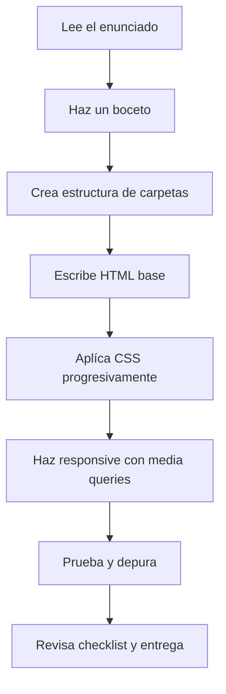

# Guía metodológica: Cómo enfrentarse a ejercicios de maquetación web

Esta guía te ayudará a abordar los ejercicios de forma sistemática y eficiente. Sigue estos pasos y consejos para resolver los problemas de manera profesional.

## Fase de análisis inicial (ANTES de escribir código)

### Analiza el enunciado detenidamente

**Lo primero que debes hacer:**

1. **Lee el enunciado completo** al menos dos veces
2. **Subraya o anota** los requisitos específicos:
   - ¿Qué elementos HTML necesito? (formularios, listas, tablas, imágenes...)
   - ¿Qué estilos CSS se mencionan? (colores, tipografías, diseño responsive...)
   - ¿Hay requisitos especiales? (flexbox, media queries, validación...)

3. **Observa las imágenes de referencia** si las hay:
   - Identifica las secciones principales (header, main, footer, sidebar...)
   - Detecta patrones de diseño (columnas, filas, tarjetas, navegación...)
   - Fíjate en colores, espaciados y alineaciones

**Ejemplo práctico:**

```
Enunciado: "Diseña una página con un formulario de reservas..."
✅ Necesito: <form>, <input>, <select>, <button>
✅ Debo usar: CSS para estilos del formulario
✅ Extra: Justificar decisiones de diseño
```

### Haz un boceto en papel

Antes de tocar el teclado:

1. **Dibuja la estructura** de la página en papel
2. **Identifica las cajas/contenedores** principales
3. **Marca las relaciones padre-hijo** entre elementos
4. **Anota qué tipo de layout** usarás en cada sección (flexbox, grid, block...)

```
┌─────────────────────────────────┐
│         HEADER                  │
├─────────────────────────────────┤
│  ┌───────────┐  ┌───────────┐   │
│  │  Columna  │  │  Columna  │   │ ← FLEXBOX
│  │     1     │  │     2     │   │
│  └───────────┘  └───────────┘   │
├─────────────────────────────────┤
│         FOOTER                  │
└─────────────────────────────────┘
```

## Preparación del entorno de trabajo

### Organiza tu estructura de archivos

Crea una estructura ordenada desde el principio:

```
ejercicio1/
├── index.html
├── css/
│   └── styles.css
└── img/
    ├── imagen1.jpg
    └── imagen2.jpg
```

**Consejos:**

- ✅ Usa nombres descriptivos: `formulario-reservas.html`, `estilos-recetas.css`
- ✅ Mantén las imágenes en una carpeta separada
- ✅ Si el proyecto crece, separa el CSS en varios archivos

### Configura las herramientas de desarrollo

**Abre las DevTools del navegador** (F12):

1. **Inspector de elementos**: Para ver la estructura HTML
2. **Consola**: Para detectar errores
3. **Modo responsive**: Para probar diferentes tamaños de pantalla
4. **Pestaña Network**: Para verificar que todos los archivos cargan

**Extensiones útiles para VS Code:**

- Live Server: Para ver cambios en tiempo real
- HTML CSS Support: Autocompletado de CSS
- Prettier: Para formatear el código automáticamente

---

## Desarrollo del HTML (estructura semántica)

### Comienza con la estructura básica

**Plantilla inicial siempre:**

```html
<!DOCTYPE html>
<html lang="es">
<head>
    <meta charset="UTF-8">
    <meta name="viewport" content="width=device-width, initial-scale=1.0">
    <title>Título descriptivo</title>
    <link rel="stylesheet" href="css/styles.css">
</head>
<body>
    <!-- Tu contenido aquí -->
</body>
</html>
```

⚠️ **NUNCA olvides:**
- `<!DOCTYPE html>` al inicio
- `<meta charset="UTF-8">` para tildes y ñ
- `<meta name="viewport"...>` para diseño responsive
- Enlazar la hoja de estilos CSS

### Construye de fuera hacia dentro

**Estrategia recomendada:**

1. **Primero**: Contenedores principales (header, main, footer)
2. **Segundo**: Secciones dentro de cada contenedor
3. **Tercero**: Elementos específicos (párrafos, imágenes, botones)

**Ejemplo paso a paso:**

```html
<!-- PASO 1: Estructura principal -->
<body>
    <header></header>
    <main></main>
    <footer></footer>
</body>

<!-- PASO 2: Añadir secciones -->
<body>
    <header>
        <nav></nav>
    </header>
    <main>
        <section class="receta"></section>
    </main>
    <footer></footer>
</body>

<!-- PASO 3: Añadir contenido -->
<body>
    <header>
        <nav>
            <ul>
                <li><a href="#">Inicio</a></li>
            </ul>
        </nav>
    </header>
    <main>
        <section class="receta">
            <h1>Sopa de cebolla</h1>
            
        </section>
    </main>
    <footer>
        <p>&copy; 2025 Mi Restaurante</p>
    </footer>
</body>
```

### Usa etiquetas semánticas

**En lugar de:**
```html
<div class="cabecera">
    <div class="menu">...</div>
</div>
```

**Usa:**
```html
<header>
    <nav>...</nav>
</header>
```

**Etiquetas semánticas importantes:**

- `<header>`: Cabecera de página o sección
- `<nav>`: Menú de navegación
- `<main>`: Contenido principal
- `<section>`: Sección temática
- `<article>`: Contenido independiente
- `<aside>`: Contenido relacionado/lateral
- `<footer>`: Pie de página

## Aplicación de estilos CSS (paso a paso)

### Metodología de trabajo con CSS

**ORDEN RECOMENDADO para escribir CSS:**

1. **Reset y estilos base** (primero)
2. **Layout general** (contenedores principales)
3. **Componentes específicos** (botones, tarjetas, formularios)
4. **Responsive design** (último)

### Paso 1: Reset y estilos base

```css
/* 1. RESET básico */
* {
    margin: 0;
    padding: 0;
    box-sizing: border-box; /* ¡MUY IMPORTANTE! */
}

/* 2. Estilos del body */
body {
    font-family: Arial, sans-serif;
    line-height: 1.6;
    color: #333;
}

/* 3. Imágenes responsive por defecto */
img {
    max-width: 100%;
    height: auto;
}
```

⚠️ **`box-sizing: border-box`** es fundamental: hace que padding y border se incluyan en el width total.

### Paso 2: Layout general

**Define primero los contenedores principales:**

```css
/* Contenedor principal con ancho máximo */
.container {
    max-width: 1200px;
    margin: 0 auto;
    padding: 0 20px;
}

/* Header */
header {
    background-color: #2c3e50;
    color: white;
    padding: 1rem 0;
}

/* Main content */
main {
    padding: 2rem 0;
}

/* Footer */
footer {
    background-color: #34495e;
    color: white;
    text-align: center;
    padding: 1rem 0;
}
```

### Paso 3: Cuándo usar Flexbox

**USA FLEXBOX cuando necesites:**

✅ **Alinear elementos en una fila o columna**
```css
.navegacion {
    display: flex;
    justify-content: space-between; /* Separar elementos */
    align-items: center; /* Centrar verticalmente */
}
```

✅ **Distribuir espacio equitativamente**
```css
.tarjetas {
    display: flex;
    gap: 20px; /* Espacio entre elementos */
}

.tarjeta {
    flex: 1; /* Todas las tarjetas mismo tamaño */
}
```

✅ **Centrar elementos (horizontal y verticalmente)**
```css
.centro {
    display: flex;
    justify-content: center;
    align-items: center;
    height: 100vh;
}
```

**PROPIEDADES CLAVE DE FLEXBOX:**

```css
/* En el CONTENEDOR (padre) */
.flex-container {
    display: flex;
    flex-direction: row;        /* row | column */
    justify-content: center;    /* flex-start | flex-end | center | space-between | space-around */
    align-items: center;        /* flex-start | flex-end | center | stretch */
    flex-wrap: wrap;           /* nowrap | wrap */
    gap: 20px;                 /* Espacio entre items */
}

/* En los ITEMS (hijos) */
.flex-item {
    flex: 1;                   /* flex-grow flex-shrink flex-basis */
    order: 2;                  /* Cambiar orden visual */
}
```

**EJEMPLO PRÁCTICO - Tarjetas de contacto:**

```css
/* Contenedor de tarjetas */
.contactos {
    display: flex;
    flex-wrap: wrap;          /* Se adaptan a varias líneas */
    gap: 20px;               /* Espacio entre tarjetas */
    justify-content: center; /* Centrar tarjetas */
}

/* Cada tarjeta */
.tarjeta {
    flex: 0 1 300px;         /* No crece, puede encogerse, base 300px */
    padding: 20px;
    border: 1px solid #ddd;
    border-radius: 8px;
}
```

### Paso 4: Estilos de componentes específicos

**Formularios:**

```css
/* Contenedor del formulario */
form {
    max-width: 600px;
    margin: 0 auto;
    padding: 2rem;
    background-color: #f9f9f9;
    border-radius: 8px;
}

/* Labels */
label {
    display: block;
    margin-bottom: 0.5rem;
    font-weight: bold;
}

/* Inputs y textareas */
input[type="text"],
input[type="email"],
input[type="tel"],
select,
textarea {
    width: 100%;
    padding: 0.75rem;
    margin-bottom: 1rem;
    border: 1px solid #ddd;
    border-radius: 4px;
    font-size: 1rem;
}

/* Focus en inputs */
input:focus,
select:focus,
textarea:focus {
    outline: none;
    border-color: #3498db;
    box-shadow: 0 0 5px rgba(52, 152, 219, 0.3);
}

/* Botones */
button {
    padding: 0.75rem 2rem;
    background-color: #3498db;
    color: white;
    border: none;
    border-radius: 4px;
    cursor: pointer;
    font-size: 1rem;
}

button:hover {
    background-color: #2980b9;
}
```

---

## Diseño Responsive (Media Queries)

### Estrategia Mobile First vs Desktop First

**Mobile First (RECOMENDADO):**

```css
/* Estilos base para móvil */
.contenedor {
    padding: 10px;
}

/* Tablet */
@media (min-width: 768px) {
    .contenedor {
        padding: 20px;
    }
}

/* Desktop */
@media (min-width: 1024px) {
    .contenedor {
        padding: 40px;
    }
}
```

**Desktop First:**

```css
/* Estilos base para desktop */
.contenedor {
    padding: 40px;
}

/* Tablet */
@media (max-width: 1024px) {
    .contenedor {
        padding: 20px;
    }
}

/* Móvil */
@media (max-width: 768px) {
    .contenedor {
        padding: 10px;
    }
}
```

#### Breakpoints comunes

```css
/* Móvil pequeño */
@media (max-width: 576px) { }

/* Móvil grande / Tablet pequeña */
@media (min-width: 577px) and (max-width: 768px) { }

/* Tablet */
@media (min-width: 769px) and (max-width: 1024px) { }

/* Desktop */
@media (min-width: 1025px) { }
```

### Ejemplo completo de diseño responsive

```css
/* MÓVIL (por defecto) */
.tarjetas {
    display: flex;
    flex-direction: column;  /* Una columna en móvil */
    gap: 15px;
}

.tarjeta {
    width: 100%;
}

/* TABLET (2 columnas) */
@media (min-width: 768px) {
    .tarjetas {
        flex-direction: row;
        flex-wrap: wrap;
    }
    
    .tarjeta {
        flex: 0 1 calc(50% - 10px);  /* 2 columnas con espacio */
    }
}

/* DESKTOP (3 columnas) */
@media (min-width: 1024px) {
    .tarjeta {
        flex: 0 1 calc(33.333% - 15px);  /* 3 columnas */
    }
}
```

### Cómo probar el diseño responsive

**Método 1: DevTools del navegador (F12)**

1. Abre las DevTools
2. Haz clic en el icono de dispositivos móviles (o Ctrl+Shift+M)
3. Selecciona diferentes dispositivos del menú desplegable
4. Prueba con: iPhone SE, iPad, Desktop HD

**Método 2: Redimensionar la ventana**

1. Reduce el ancho de la ventana del navegador
2. Observa cómo cambia el diseño
3. Verifica que no haya scroll horizontal

**Método 3: Prueba en dispositivos reales**

1. Usa tu móvil para acceder a la página
2. Comprueba que todo funciona correctamente

## Proceso iterativo de desarrollo y pruebas

### Ciclo de trabajo recomendado

**NO hagas todo de golpe.** Trabaja en pequeñas iteraciones:

```
1. Escribe un poco de HTML (una sección)
   ↓
2. Guarda (Ctrl+S)
   ↓
3. Recarga el navegador (F5)
   ↓
4. Verifica que se ve bien
   ↓
5. Añade estilos CSS para esa sección
   ↓
6. Guarda (Ctrl+S)
   ↓
7. Recarga el navegador (F5)
   ↓
8. Ajusta si es necesario
   ↓
9. REPITE con la siguiente sección
```

### Checklist de verificación continua

Después de cada cambio, comprueba:

- [ ] ¿Se ve el cambio en el navegador?
- [ ] ¿Hay errores en la consola? (F12 → Console)
- [ ] ¿Los colores son los correctos?
- [ ] ¿Los espaciados están bien?
- [ ] ¿Funciona en móvil? (DevTools → Responsive)

### Técnicas de depuración (debugging)

**Problema: "No se ven los estilos CSS"**

```css
/* Añade temporalmente colores llamativos para depurar */
.contenedor {
    background-color: red;  /* ← Temporal para ver el contenedor */
    border: 5px solid blue; /* ← Temporal para ver los bordes */
}
```

Si ves el color rojo → el CSS está funcionando
Si NO ves el color → revisa la ruta del archivo CSS

**Problema: "Los elementos no se alinean como quiero"**

```css
/* Usa outline en lugar de border para no afectar el layout */
* {
    outline: 1px solid red; /* ← Ver TODAS las cajas */
}
```

**Problema: "No sé por qué tiene ese estilo"**

1. Click derecho en el elemento → Inspeccionar
2. En la pestaña Styles verás todos los estilos aplicados
3. Los que están tachados están siendo sobrescritos

## Buenas prácticas y consejos profesionales

### Nombrado de clases (BEM - Recomendado)

```css
/* Block__Element--Modifier */

/* Block (componente) */
.tarjeta { }

/* Element (parte del componente) */
.tarjeta__titulo { }
.tarjeta__imagen { }
.tarjeta__descripcion { }

/* Modifier (variación) */
.tarjeta--destacada { }
.tarjeta--pequena { }
```

**Ejemplo HTML:**

```html
<div class="tarjeta tarjeta--destacada">
    <h2 class="tarjeta__titulo">Título</h2>
    
    <p class="tarjeta__descripcion">Descripción</p>
</div>
```

### Sistema de colores

Define variables CSS al principio:

```css
:root {
    --color-primario: #3498db;
    --color-secundario: #2c3e50;
    --color-acento: #e74c3c;
    --color-texto: #333;
    --color-fondo: #f9f9f9;
    --espacio-sm: 0.5rem;
    --espacio-md: 1rem;
    --espacio-lg: 2rem;
}

/* Usar las variables */
.boton {
    background-color: var(--color-primario);
    padding: var(--espacio-md);
}
```

### Espaciado consistente

```css
/* Sistema de espaciado con múltiplos de 8px */
.espaciado-xs { margin: 8px; }
.espaciado-sm { margin: 16px; }
.espaciado-md { margin: 24px; }
.espaciado-lg { margin: 32px; }
.espaciado-xl { margin: 40px; }
```

## Checklist final antes de entregar

### Validación y calidad del código

- [ ] **HTML válido**: Valida en [validator.w3.org](https://validator.w3.org/)
- [ ] **CSS válido**: Valida en [jigsaw.w3.org/css-validator](https://jigsaw.w3.org/css-validator/)
- [ ] **Código indentado**: Todo el código está correctamente indentado
- [ ] **Sin código comentado innecesario**: Limpia los comentarios de depuración
- [ ] **Nombres descriptivos**: Variables y clases tienen nombres claros

### ✅ Funcionalidad

- [ ] **Todos los enlaces funcionan**: Verifica cada enlace
- [ ] **Imágenes cargan**: Todas las imágenes se ven
- [ ] **Formularios validados**: Los campos requeridos funcionan
- [ ] **Sin errores en consola**: Abre DevTools y verifica

### ✅ Diseño responsive

- [ ] **Móvil (320px - 576px)**: Se ve bien en móviles pequeños
- [ ] **Tablet (577px - 1024px)**: Layout correcto en tablets
- [ ] **Desktop (1025px+)**: Aprovecha el espacio disponible
- [ ] **Sin scroll horizontal**: En ninguna resolución
- [ ] **Imágenes responsive**: Todas las imágenes se adaptan

### ✅ Estructura de archivos

- [ ] **Carpetas organizadas**: HTML, CSS e imágenes separadas
- [ ] **Nombres sin espacios**: Usa guiones o guiones bajos
- [ ] **Rutas relativas correctas**: `./css/styles.css` en lugar de rutas absolutas
- [ ] **Archivo ZIP nombrado correctamente**: `ud2_nombre_apellidos.zip`

## Recursos útiles

### Documentación y referencias

- [MDN Web Docs](https://developer.mozilla.org/es/) - Documentación HTML/CSS
- [CSS-Tricks](https://css-tricks.com/) - Guías y tutoriales CSS
- [Can I Use](https://caniuse.com/) - Compatibilidad de navegadores
- [Flexbox Froggy](https://flexboxfroggy.com/#es) - Juego para aprender Flexbox
- [Grid Garden](https://cssgridgarden.com/#es) - Juego para aprender CSS Grid

### Inspiración y herramientas

- [Dribbble](https://dribbble.com/) - Inspiración de diseño
- [Coolors](https://coolors.co/) - Generador de paletas de colores
- [Google Fonts](https://fonts.google.com/) - Tipografías gratuitas
- [Unsplash](https://unsplash.com/) - Imágenes gratuitas de alta calidad
- [FontAwesome](https://fontawesome.com/) - Iconos

## 🎯 Resumen: Flujo de trabajo paso a paso



**¡Recuerda!** La clave del éxito es trabajar **poco a poco**, **probando constantemente** y **no teniendo miedo de experimentar**. Si algo no funciona, usa las DevTools para investigar por qué. Cada error es una oportunidad de aprender.
