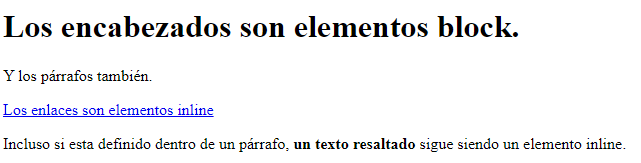

# Elementos HTML

Un elemento HTML está formado por:

* Una etiqueta de apertura.  
* Cero o más atributos.  
* Opcionalmente, un texto, encerrado entre las etiquetas de apertura y cierre. No todas las etiquetas pueden encerrar texto.  
* Una etiqueta de cierre. Para algunos elementos no hay etiqueta de cierre o es opcional.

Según el modo en que ocupan el espacio disponible en la página, los elementos pueden ser de dos tipos:

* Elementos en línea (*inline*) o lineales. Solo ocupan el espacio necesario para mostrar sus contenidos. Su contenido puede ser texto u otros elementos *inline*.  
* Elementos de bloque (*block*). Los elementos de bloque siempre empiezan en una nueva línea y ocupan todo el espacio disponible hasta el final de la línea, aunque sus contenidos no ocupen todo el ancho. Su contenido puede ser texto, elementos *inline* u otros elementos de bloque.

## **Ejemplo[​](https://mp0373-lmsxi.vercel.app/docs/unidades/02/contenidos/html/elementos/introduccion#ejemplo)**

El siguiente ejemplo muestra la diferencia entre ambos comportamientos:  

```html
<!DOCTYPE html>
<html>
  <head>
    <meta charset="utf-8" />
    <title>
      Ejemplo de la diferencia entre los elementos inline y los elementos block
    </title>
  </head>
  <body>
    <h1>Los encabezados son elementos block.</h1>
    <p>Y los párrafos también.</p>
    <a href="#">Los enlaces son elementos inline</a>
    <p>
      Incluso si esta definido dentro de un párrafo,
      <strong>un texto resaltado</strong> sigue siendo un elemento inline.
    </p>
  </body>
</html>
```

Un navegador web lo mostraría así:



Prúebalo en el navegador pulsando [aquí](/htmls/ud2_4_1.html)

## Secciones

### Elemento `<div>`

El elemento [`<div>`](https://developer.mozilla.org/es/docs/Web/HTML/Element/div) se usa para marcar divisiones y agrupar otros elementos en secciones, tanto para organizar el contenido como para posicionarlo mediante hojas de estilo CSS.  

```html
<div>  
 <div>Sección 1</div>  
 <div>Sección 2</div>  
<div>
```

### Etiquetas semánticas

En HTML5 aparecieron varias [etiquetas semánticas](https://es.wikipedia.org/wiki/HTML_sem%C3%A1ntico) para estructurar el contenido de la página y, por tanto, solo se debería usar `<div>` cuando **no haya una etiqueta más apropiada**.

Un ejemplo utilizando etiquetas semánticas:  

```html
<!DOCTYPE html>
<html>
  <head>
    <meta charset="UTF-8" />
    <title>HTML5</title>
  </head>
  <body>
    <header>
      <nav></nav>
    </header>
    <main>
      <section>
        <article></article>
      </section>
      <aside></aside>
    </main>
    <footer></footer>
  </body>
</html>
```

La siguiente imagen muestra una disposición posible para estos elementos. Para obtenerla, hay que usar CSS.

### **Elemento `<header>`[​](https://mp0373-lmsxi.vercel.app/docs/unidades/02/contenidos/html/elementos/secciones#elemento-header)**

El elemento [`<header>`](https://developer.mozilla.org/es/docs/Web/HTML/Element/header) contiene la cabecera con contenido introductorio para la sección de la página en que aparece.

Representa un grupo de ayudas introductorias o de navegación. Puede contener algunos elementos de encabezado, así como también un logo, un formulario de búsqueda, un nombre de autor y otros componentes.

Es habitual que contenga los elementos de encabezado (`<h1>` ... `<h6>`).

### **Elemento `<aside>`[​](https://mp0373-lmsxi.vercel.app/docs/unidades/02/contenidos/html/elementos/secciones#elemento-aside)**

El elemento [`<aside>`](https://developer.mozilla.org/es/docs/Web/HTML/Element/aside) se utiliza para contenido parcialmente relacionado con el contenido principal.

Estas secciones son a menudo representadas como barras laterales o como inserciones y contienen una explicación al margen como una definición de glosario, elementos relacionados indirectamente, como publicidad, la biografía del autor, o en aplicaciones web, la información de perfil o enlaces a blogs relacionados.

No tiene por qué mostrarse en un lateral.

### **Elemento `<footer>`[​](https://mp0373-lmsxi.vercel.app/docs/unidades/02/contenidos/html/elementos/secciones#elemento-footer)**

El elemento [`<footer>`](https://developer.mozilla.org/es/docs/Web/HTML/Element/footer) representa un pie de página para el contenido de sección más cercano o el elemento raíz de sección.

Un pie de página típicamente contiene información acerca del autor de la sección, datos de derechos de autor o enlaces a documentos relacionados.

No tiene por qué mostrarse al final.

### **Elemento `<section>`[​](https://mp0373-lmsxi.vercel.app/docs/unidades/02/contenidos/html/elementos/secciones#elemento-section)**

El elemento de HTML [`<section>`](https://developer.mozilla.org/es/docs/Web/HTML/Element/section) representa una sección genérica de un documento. Sirve para determinar qué contenido corresponde a qué parte de un esquema.

Pensemos en el esquema como en el índice de contenido de un libro: un tema común y subsecciones relacionadas. No se debe usar el elemento `<section>` como un mero contenedor genérico. Para esto, ya existe `<div>`, especialmente si el objetivo solamente es aplicar un estilo CSS a la sección.

### **Elemento `<article>`[​](https://mp0373-lmsxi.vercel.app/docs/unidades/02/contenidos/html/elementos/secciones#elemento-article)**

El Elemento article de HTML [`<article>`](https://developer.mozilla.org/es/docs/Web/HTML/Element/article) representa una composición autocontenida en un documento, página, una aplicación o en el sitio, que se destina a distribuir de forma independiente o reutilizable, por ejemplo, en la indicación.

Podría ser un mensaje en un foro, un artículo de una revista o un periódico, una entrada de blog, un comentario de un usuario, un widget interactivo o gadget, o cualquier otro elemento independiente del contenido.

### **Elemento `<nav>`[​](https://mp0373-lmsxi.vercel.app/docs/unidades/02/contenidos/html/elementos/secciones#elemento-nav)**

El elemento [`<nav>`](https://developer.mozilla.org/es/docs/Web/HTML/Element/nav) representa una sección de una página cuyo propósito es proporcionar enlaces de navegación, ya sea dentro del documento actual o a otros documentos.

Ejemplos comunes de secciones de navegación son: menús, tablas de contenido e índices.

* 
