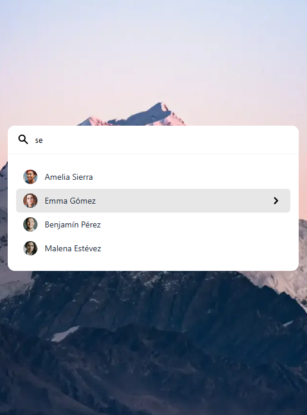

# Tarea UD2

La tarea de esta unidad didáctica contiene 3 ejercicios independientes, cuyo enunciado se detalla a continuación. Se recomienda investigar sobre el diseño a aplicar en cada ejercicio, buscando ejemplos en Internet, con el objetivo de conseguir un diseño moderno y actual.

## Ejercicio 1: página web para presentación de recetas

**Diseña una página web** para la presentación de las recetas de cocina de un restaurante y aplicarlo a receta de cocina presentada a continuación. Añade algunas imágenes apropiadas.

---

*Sopa de cebolla (4 personas)*

Ingredientes:

- 1 kg de cebollas.
- 2 l de caldo de carne.
- 100 g mantequilla.
- 1 cucharada de harina.
- 100 g de queso emmental suizo o gruyére rallado.
- Pan tostado en rebanadas.
- Tomillo.
- 1 hoja de laurel.
- Pimienta.

Proceso:

- Pelar y partir las cebollas en rodajas finas.
- Rehogarlas con la mantequilla, sal y pimienta a fuego lento hasta que estén transparentes sin dorarse.
- Añadir la harina sin dejar de remover.
- Ponerlo en una cazuela con el caldo, el tomillo y el laurel.
- Dejar cocer a fuego lento durante unos 15 minutos.
- Poner las rebanadas de pan encima, espolvorear el queso y gratinar al horno.

---

Para la **valoración** de este ejercicio, se tendrán en cuenta los siguientes aspectos:

- Utilizar la notación adecuada.
- Definir y utilizar los elementos adecuados.
- Usar adecuadamente las hojas de estilo.
- Realizar una distribución coherente de los elementos y uso de formatos.

## Ejercicio 2: formulario de reservas de restaurante

**Diseña una página web** que contenga un **formulario** que realice una petición de reserva de un restaurante con las siguientes características:

- Un campo para introducir cada uno de los siguientes datos:
  - Nombre
  - Apellidos
  - Teléfono de contacto
  - Correo electrónico
- Número de comensales (de 1 a 10).
- Tres menús desplegables para recoger la fecha de reserva (uno para el día, otro para el mes y otro para año).
- Un botón de radio para seleccionar el turno (comida o cena).
- Un campo de selección múltiple (checkbox) que permita al usuario indicar si hay comensales vegetarianos, veganos o celíacos.
- Una caja de texto donde se puedan dejar comentarios adicionales.
- Un botón para limpiar el formulario y otro para enviarlo.
  
**Aplica estilos** al formulario. Justifica las decisiones tomadas en el diseño del formulario.

Para la **valoración** de este ejercicio, se tendrán en cuenta los siguientes aspectos:

- Utilizar la notación adecuada.
- Definir y utilizar los elementos adecuados.
- Usar adecuadamente las hojas de estilo.
- Realizar una distribución coherente de los elementos y uso de formatos.

## Ejercicio 3: tarjeta de presentación de contactos

Diseña una página web que tenga el siguiente aspecto:

Además, debe ser una página web responsiva, es decir, que se adapte a diferentes tamaños de pantalla (móvil, tablet y escritorio). Para ello, utiliza media queries en CSS. En móviles, debería verse de la siguiente forma:

Utiliza **flexbox** y **media queries** durante la codificación de CSS.

Para la valoración de este ejercicio, se tendrán en cuenta los siguientes aspectos:

- Utilizar la notación adecuada.
- Definir y utilizar los elementos adecuados.
- Usar adecuadamente las hojas de estilo.
- Utilizar flexbox y media queries.
- Realizar una distribución coherente de los elementos y uso de formatos.

Para la realización de esta tarea se proporcionan los recursos básicos, que podrás encontrar en fichero zip adjunto. Puedes modificar y ampliar los recursos según consideres necesario para la realización de los ejercicios.

## Entrega

Para cada uno de los ejercicios, realiza una carpeta con el nombre del ejercicio (ejer1, ejer2 y ejer3) y dentro de cada carpeta incluye los ficheros necesarios para visualizar la página web (HTML, CSS e imágenes). Comprime todas las carpetas en un único fichero ZIP para su entrega, con el nombre **ud2_nombre_apellidos.zip**.

## Evaluación

La evaluación de esta tarea se realizará de la siguiente manera:

- Ejercicio 1: 2.5 puntos
- Ejercicio 2: 3 puntos
- Ejercicio 3: 4.5 puntos

Para cada ejercicio se valorarán los aspectos indicados en cada uno de ellos.
