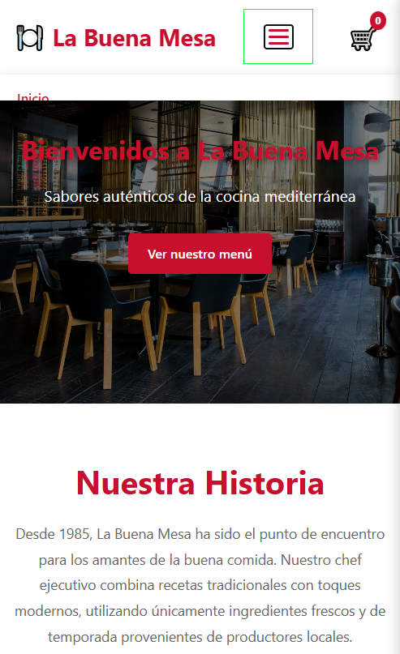

# Práctica Evaluable - Restaurante "La Buena Mesa"

## 📋 Descripción

En esta práctica deberás añadir **interactividad con JavaScript** a una página web ya diseñada de un restaurante. Se te proporciona el HTML y CSS completos, y tu tarea es implementar las funcionalidades JavaScript especificadas en los apartados siguientes.

## 🎯 Objetivos de Aprendizaje

- Manipular el DOM para crear interfaces dinámicas
- Gestionar eventos de usuario
- Validar formularios con JavaScript
- Implementar filtrado y búsqueda en tiempo real
- Crear un carrito de compras funcional
- Trabajar con LocalStorage para persistencia de datos
- Aplicar buenas prácticas de programación JavaScript

## 📁 Archivos Proporcionados

En la carpeta `practica_restaurante` encontrarás:

- `index.html` - Estructura HTML completa
- `css/styles.css` - Estilos completos del sitio
- `js/main.js` - Archivo JavaScript con comentarios guía (aquí escribirás tu código)
- `data/platos.json` - Datos de los platos del menú
- `images/` - Imágenes de los platos

## 📝 Apartados de la Práctica

### **Apartado 1: Navegación y Menú Interactivo (1.5 puntos)**

Implementa las siguientes funcionalidades en el menú de navegación:

#### 1.1 Menú *Hamburguesa* Responsive (1.5 puntos)

- Al hacer clic en el icono hamburguesa (visible solo en móvil), debe mostrarse/ocultarse el menú de navegación
- Añade una animación suave al abrir/cerrar
- Al hacer clic en cualquier enlace del menú, este debe cerrarse automáticamente

### **Apartado 2: Validación de Formulario de Reservas (2.5 puntos)**

El formulario de reservas debe validarse completamente con JavaScript antes de poder enviarse.

#### 2.1 Validación en Tiempo Real (1 punto)

Implementa validación mientras el usuario escribe (evento `input` o `blur`) para los siguientes campos:

- **Nombre completo**: Mínimo 3 caracteres, solo letras y espacios
- **Email**: Formato válido de correo electrónico
- **Teléfono**: Exactamente 9 dígitos
- **Número de personas**: Entre 1 y 10

Muestra mensajes de error específicos bajo cada campo cuando no cumple las condiciones.

#### 2.2 Validación de Fecha (0.75 puntos)

- La fecha de reserva debe ser posterior a hoy
- No se permiten reservas con más de 3 meses de antelación
- Muestra mensaje de error si no cumple las condiciones

#### 2.3 Validación Final y Prevención de Envío (0.75 puntos)

- Al hacer clic en "Reservar", valida todos los campos
- Si hay errores, previene el envío del formulario con `preventDefault()`
- Muestra un resumen de los errores en la parte superior del formulario
- Si todo es correcto, muestra un mensaje de confirmación (puedes usar `alert` o crear un modal)

**Criterios de evaluación:**

- Validaciones precisas y robustas
- Mensajes de error claros y útiles
- Prevención correcta del envío con errores
- Experiencia de usuario profesional

---

### **Apartado 3: Filtrado y Búsqueda de Platos (2.5 puntos)**

Carga dinámicamente los platos desde `platos.json` e implementa sistema de filtrado.

#### 3.1 Carga y Visualización de Platos (0.75 puntos)

- Carga los datos desde `data/platos.json` usando `fetch`
- Renderiza todos los platos en la sección correspondiente
- Crea dinámicamente las tarjetas de platos con su información (imagen, nombre, descripción, precio)

#### 3.2 Filtrado por Categorías (1 punto)

- Implementa botones de filtro para las categorías: "Todos", "Entrantes", "Principales", "Postres", "Bebidas"
- Al hacer clic en una categoría, muestra solo los platos de esa categoría
- Añade clase `active` al botón seleccionado
- Anima la transición entre filtros

#### 3.3 Búsqueda en Tiempo Real (0.75 puntos)

- Implementa un campo de búsqueda que filtre platos mientras el usuario escribe
- La búsqueda debe funcionar por nombre y descripción (case-insensitive)
- Si no hay resultados, muestra un mensaje informativo
- La búsqueda debe poder combinarse con el filtro de categorías

**Criterios de evaluación:**

- Carga correcta de datos asíncronos
- Renderizado dinámico eficiente
- Filtros funcionan correctamente solos y combinados
- Interfaz responsive y atractiva

---

### **Apartado 4: Carrito de Compras (3 puntos)**

Implementa un carrito de compras funcional con persistencia en localStorage.

#### 4.1 Añadir al Carrito (0.75 puntos)

- Cada plato debe tener un botón "Añadir al carrito"
- Al hacer clic, añade el plato al carrito
- Muestra una notificación visual confirmando la acción
- Actualiza el contador de productos del carrito en el header

#### 4.2 Visualización del Carrito (0.75 puntos)

- Crea un panel lateral que muestre el contenido del carrito
- Al hacer clic en el icono del carrito, muestra/oculta este panel
- Muestra imagen miniatura, nombre, precio y cantidad de cada producto
- Incluye botones para incrementar/decrementar cantidad y eliminar producto

#### 4.3 Cálculos Dinámicos (0.75 puntos)

- Calcula automáticamente el subtotal de cada producto (precio × cantidad)
- Calcula y muestra el total general del carrito
- Actualiza los valores en tiempo real cuando se modifican cantidades

#### 4.4 Persistencia con LocalStorage (0.75 puntos)

- Guarda el contenido del carrito en `localStorage` cada vez que se modifica
- Al cargar la página, recupera el carrito guardado
- El carrito debe mantenerse aunque se recargue la página o se cierre el navegador

**Criterios de evaluación:**

- Funcionalidad completa del carrito
- Cálculos precisos y actualizaciones en tiempo real
- Persistencia correcta de datos
- Interfaz intuitiva y profesional
- Código bien organizado con funciones reutilizables

---

## 🎨 Entrega y Evaluación

### Formato de Entrega

- Carpeta comprimida (.zip) con nombre: `Apellidos_Nombre_PracticaRestaurante.zip`
- Estructura de archivos intacta
- Archivo `js/main.js` con tu código JavaScript comentado
- Archivo `README.txt` con instrucciones y explicaciones (opcional pero valorado)

### Criterios Generales de Evaluación (10 puntos)

| Apartado | Puntuación |
|----------|-----------|
| 1. Navegación y Menú Interactivo | 2.0 |
| 2. Validación de Formulario | 2.5 |
| 3. Filtrado y Búsqueda | 2.5 |
| 4. Carrito de Compras | 3.0 |
| **TOTAL** | **10.0** |

### Aspectos Valorados

- ✅ **Funcionalidad**: Todos los requisitos implementados correctamente
- ✅ **Código limpio**: Bien indentado, comentado y estructurado
- ✅ **Buenas prácticas**: Uso de funciones, evitar código repetido, nombres descriptivos
- ✅ **Manejo de errores**: Validaciones robustas, control de casos extremos
- ✅ **Experiencia de usuario**: Interfaz intuitiva, mensajes claros, animaciones suaves

### Penalizaciones

- ❌ Código sin comentarios o mal estructurado: -0.5 puntos
- ❌ Errores en consola de JavaScript: -0.25 puntos por error
- ❌ Funcionalidad incompleta o parcial: proporcional
- ❌ Entrega fuera de plazo: según criterios del centro

---

## 💡 Consejos y Recomendaciones

1. **Lee el código HTML y CSS proporcionado** antes de empezar para entender la estructura
2. **Trabaja apartado por apartado**, no intentes hacerlo todo a la vez
3. **Prueba frecuentemente** en el navegador cada funcionalidad que implementes
4. **Usa la consola del navegador** para depurar errores
5. **Comenta tu código** para explicar la lógica compleja
6. **Organiza tu código en funciones** reutilizables
7. **Consulta la documentación** de MDN cuando tengas dudas sobre métodos o propiedades

### Recursos Útiles

- [MDN - JavaScript](https://developer.mozilla.org/es/docs/Web/JavaScript)
- [MDN - Fetch API](https://developer.mozilla.org/es/docs/Web/API/Fetch_API)
- [MDN - LocalStorage](https://developer.mozilla.org/es/docs/Web/API/Window/localStorage)
- [MDN - Validación de formularios](https://developer.mozilla.org/es/docs/Learn/Forms/Form_validation)

---

## 📅 Fecha de Entrega

**Fecha límite**: [A determinar por el profesor]

**Método de entrega**: [Plataforma Moodle / Email / Otro]

---

¡Buena suerte con la práctica! 🚀
