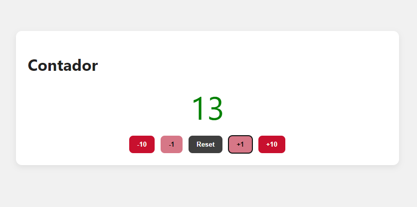
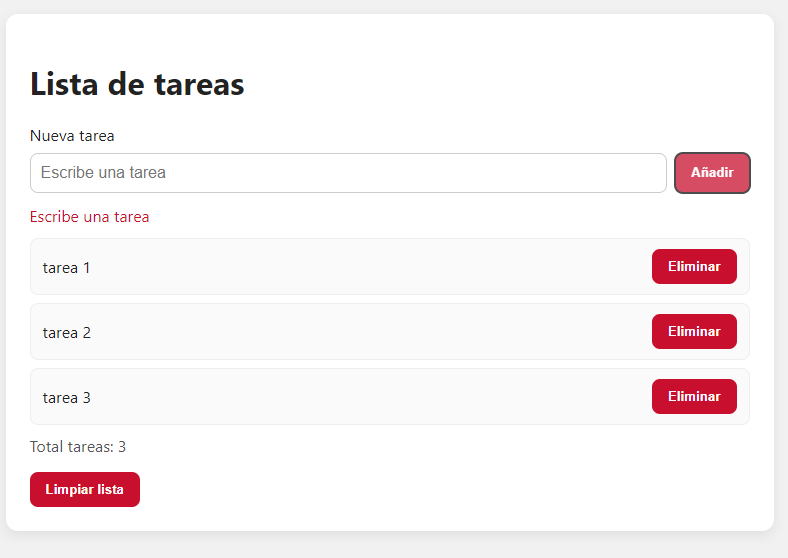
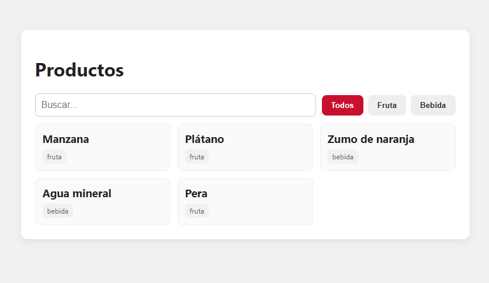
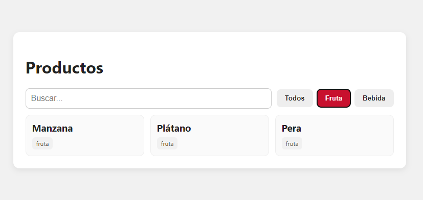
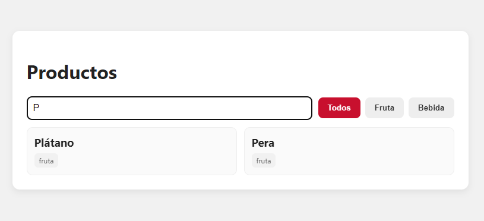

# Tarea UD3 - Lenguajes de scripting de cliente

En esta tarea tendrás que crear tres pequeñas aplicaciones web utilizando **JavaScript** para practicar los conceptos aprendidos en la unidad didáctica. Cada ejercicio se centra en diferentes aspectos de JavaScript y la manipulación del DOM. Los ejercicios son independientes entre sí, por lo que puedes realizarlos en cualquier orden.

Para cada ejercicio se proporciona un **documento html** y un **archivo CSS** básico. Deberás completar el archivo JavaScript asociado para implementar la funcionalidad requerida y dotar de interactividad a la página.

Antes de comenzar a desarrollar, familiarízate con las páginas html proporcionados, así como con sus estilos css.

Se recomienda utilizar Visual Studio Code y la extensión Live Server para probar las aplicaciones localmente.

## Ejercicio 1: Contador con botones

**Objetivo:** practicar eventos `click`, acceso al DOM (`getElementById`), actualización de `textContent` y control de límites.

**Requisitos:** deberás implementar un contador que cumpla con las siguientes características:

- Botones: "+10", "+1", "-1", "-10" suman o restan la cantidad indicada; "Reset" pone el contador a 0.
- El número se muestra centrado y empieza en 0.
- No puede bajar de 0 (si está a 0 y pulsan "-1" o "-10", no cambia).
- Si el valor es mayor que 10, poner el número en verde.



## Ejercicio 2: Lista de tareas mínima

**Objetivo:** practicar formularios, `preventDefault()`, creación de nodos (`createElement`), `appendChild`, manejo básico de errores.

**Requisitos:** deberás implementar una lista de tareas que cumpla con las siguientes características:

- Al enviar, si el input está vacío: mostrar mensaje de error debajo del campo.
- Si hay texto: crear un `<li>` dentro de la lista con un botón "Eliminar" que borre solo ese ítem.
- Mostrar un contador "Total tareas: X".
- Hacer que el botón "Limpiar lista" borre todas las tareas y actualice el contador a 0.



## Ejercicio 3: Filtro en vivo de productos (sin fetch)

**Objetivo:** practicar arrays, `filter`, `toLowerCase()`, eventos `input` y renderizado dinámico en el DOM.

**Requisitos:**

- Definir en JS un array de productos (nombre y categoría) ya en el código. Por ejemplo:

	```javascript
	const productos = [
		{ nombre: 'Manzana', categoria: 'fruta' },
		{ nombre: 'Plátano', categoria: 'fruta' },
		{ nombre: 'Zumo de naranja', categoria: 'bebida' },
		{ nombre: 'Agua mineral', categoria: 'bebida' },
		{ nombre: 'Pera', categoria: 'fruta' },
	];
	```

- Mostrar las tarjetas de productos en la página.
- Campo de búsqueda: mientras se escribe, se filtra por nombre (contiene, sin distinguir mayúsculas/minúsculas).
- Botones de categoría: "Todos", "Fruta", "Bebida", etc. que combinen con la búsqueda.
- Si no hay resultados, mostrar el mensaje "No se encontraron productos".







> Puedes crear la lista de productos con categorías que desees. Tendrás que adaptar el HTML y CSS para mostrar las tarjetas de productos según el diseño que prefieras.

## Entrega

Deberás entregar un archivo ZIP que contenga las tres carpetas de los ejercicios, cada una con su HTML, CSS y JS correspondientes:

```plaintext
tarea_ud3.zip
│
├── ejer1.html
├── ejer2.html
├── ejer3.html
├── css/
│   └── styles1.css
└── js/
    ├── script1.js
    ├── script2.js
    └── script3.js
```

Nombra el archivo ZIP como `ud3_apellidos_nombre.zip`

## Evaluación

La evaluación de esta tarea se realizará de la siguiente manera:

- Ejercicio 1: 3 puntos
- Ejercicio 2: 3.5 puntos
- Ejercicio 3: 3.5 puntos
- Total: 10 puntos
