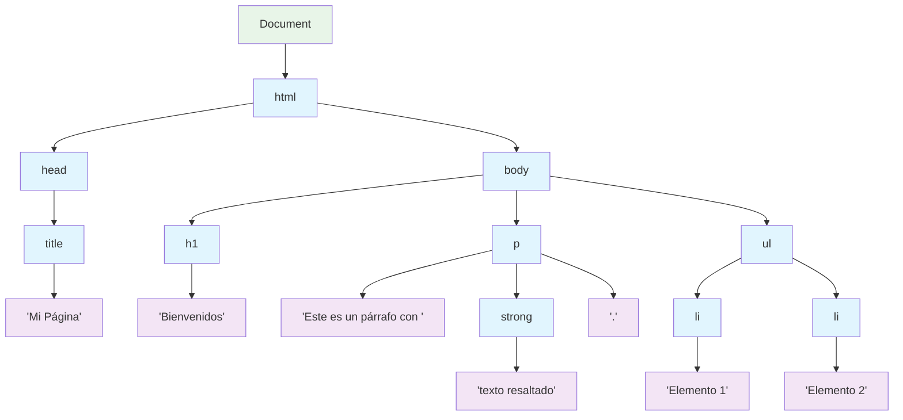

# Document Object Model (DOM)

## ¿Qué es el DOM?

El **Document Object Model (DOM)** es una representación programática de un documento HTML o XML. Es la interfaz que permite a los lenguajes de programación (como JavaScript) acceder y manipular el contenido, estructura y estilos de una página web.

### Conceptos clave

- **Representación en memoria**: El DOM es cómo el navegador "entiende" y almacena la estructura de una página web
- **Interfaz de programación**: Proporciona métodos y propiedades para interactuar con los elementos
- **Dinámico**: Permite modificar la página en tiempo real sin recargarla
- **Estándar**: Definido por el W3C (World Wide Web Consortium)

## El DOM como árbol de nodos

### Estructura jerárquica

El DOM representa un documento HTML como un **árbol de nodos**, donde cada elemento HTML es un nodo que puede tener nodos padre, hijos y hermanos.

```html
<!DOCTYPE html>
<html>
<head>
    <title>Mi Página</title>
</head>
<body>
    <h1>Bienvenidos</h1>
    <p>Este es un párrafo con <strong>texto resaltado</strong>.</p>
    <ul>
        <li>Elemento 1</li>
        <li>Elemento 2</li>
    </ul>
</body>
</html>
```

Este HTML se representa como el siguiente árbol DOM:

```
Document
└── html
    ├── head
    │   └── title
    │       └── "Mi Página"
    └── body
        ├── h1
        │   └── "Bienvenidos"
        ├── p
        │   ├── "Este es un párrafo con "
        │   ├── strong
        │   │   └── "texto resaltado"
        │   └── "."
        └── ul
            ├── li
            │   └── "Elemento 1"
            └── li
                └── "Elemento 2"
```



### Tipos de nodos

El DOM incluye diferentes tipos de nodos:

#### 1. Document Node (Nodo Documento)

- Representa el documento completo
- Punto de entrada para acceder a todos los elementos
- Solo hay uno por página

#### 2. Element Nodes (Nodos Elemento)

- Representan las etiquetas HTML (`<div>`, `<p>`, `<h1>`, etc.)
- Pueden tener atributos y elementos hijos
- Son los nodos más comunes que manipulamos

#### 3. Text Nodes (Nodos de Texto)

- Contienen el texto dentro de los elementos
- No pueden tener nodos hijos
- Incluye espacios en blanco y saltos de línea

#### 4. Attribute Nodes (Nodos Atributo)

- Representan los atributos de los elementos (`id`, `class`, `src`, etc.)
- No forman parte directa del árbol (están asociados a elementos)

#### 5. Comment Nodes (Nodos Comentario)

- Representan comentarios HTML `<!-- comentario -->`
- Generalmente ignorados en la manipulación

### Ejemplo práctico de estructura

```html
<div id="contenedor" class="principal">
    <!-- Este es un comentario -->
    <p>Párrafo con <span>texto especial</span></p>
</div>
```

**Desglose de nodos:**

- `<div>`: Element Node
  - `id="contenedor"`: Attribute Node
  - `class="principal"`: Attribute Node
  - `<!-- Este es un comentario -->`: Comment Node
  - `<p>`: Element Node (hijo de div)
    - `"Párrafo con "`: Text Node
    - `<span>`: Element Node
      - `"texto especial"`: Text Node
    - `""`: Text Node (vacío después del span)

## Propiedades fundamentales del DOM

### Navegación entre nodos

Cada nodo tiene propiedades que permiten navegar por el árbol:

- `parentNode`: Nodo padre. Nodo inmediato que contiene al nodo actual
- `childNodes`: Lista de todos los nodos hijos (incluye texto y comentarios). Llamamos nodos hijos a todos los nodos que están directamente dentro de un nodo padre
- `children`: Lista de solo los elementos hijos (excluye texto y comentarios)
- `firstChild`: Primer nodo hijo
- `lastChild`: Último nodo hijo
- `nextSibling`: Siguiente hermano. Llamamos hermanos a los nodos que están al mismo nivel, es decir, que comparten el mismo padre.
- `previousSibling`: Hermano anterior

```javascript
// Obtener un elemento
let elemento = document.getElementById('miElemento');

// Propiedades de navegación
console.log(elemento.parentNode);     // Nodo padre
console.log(elemento.childNodes);     // Todos los nodos hijos
console.log(elemento.children);       // Solo elementos hijos
console.log(elemento.firstChild);     // Primer nodo hijo
console.log(elemento.lastChild);      // Último nodo hijo
console.log(elemento.nextSibling);    // Siguiente hermano
console.log(elemento.previousSibling); // Hermano anterior
```

Ejemplo:

```html
<!DOCTYPE html>
<html>
    <head>
        <title>Ejemplo</title>
    </head>
    <body>
        <div id="contenedor">
            <p>Párrafo 1</p>
            <p>Párrafo 2</p>
        </div>
        <footer>
            <p>Pie de página</p>
        </footer>
    </body>
</html>
```

```javascript
let contenedor = document.getElementById('contenedor');

console.log('=== PROPIEDADES DE NAVEGACIÓN ===');

// Nodo padre
console.log('Padre del contenedor:', contenedor.parentNode); 
// Resultado: <body>

// Todos los nodos hijos (incluye espacios en blanco como texto)
console.log('Todos los nodos hijos:', contenedor.childNodes); 
// Resultado: NodeList(5) [text, p, text, p, text]
// Nota: Los "text" son los espacios en blanco y saltos de línea

// Solo elementos hijos (excluye texto y comentarios)
console.log('Solo elementos hijos:', contenedor.children);   
// Resultado: HTMLCollection(2) [p, p]

// Primer nodo hijo (puede ser texto)
console.log('Primer hijo:', contenedor.firstChild); 
// Resultado: text (el espacio/salto de línea antes de <p>)

// Último nodo hijo (puede ser texto)
console.log('Último hijo:', contenedor.lastChild);  
// Resultado: text (el espacio/salto de línea después de </p>)

// Siguiente hermano (nodo al mismo nivel)
console.log('Siguiente hermano:', contenedor.nextSibling); 
// Resultado: text (el espacio/salto de línea antes de <footer>)

// Hermano anterior
console.log('Hermano anterior:', contenedor.previousSibling); 
// Resultado: text (el espacio/salto de línea después de <body>)

console.log('=== ALTERNATIVAS SIN NODOS DE TEXTO ===');

// Para evitar los nodos de texto, usar estas propiedades:
console.log('Primer elemento hijo:', contenedor.firstElementChild);
// Resultado: <p>Párrafo 1</p>

console.log('Último elemento hijo:', contenedor.lastElementChild);
// Resultado: <p>Párrafo 2</p>

console.log('Siguiente elemento hermano:', contenedor.nextElementSibling);
// Resultado: <footer>

console.log('Elemento hermano anterior:', contenedor.previousElementSibling);
// Resultado: null (no hay elementos antes del div)
```

### ¿Por qué aparecen nodos de texto?

Los navegadores interpretan los **espacios en blanco** y **saltos de línea** en el HTML como nodos de texto. Por ejemplo:

```html
<div id="contenedor">
    <p>Párrafo 1</p>  ← Hay un salto de línea aquí
    <p>Párrafo 2</p>  ← Y otro aquí
</div>
```

Se interpreta como:

1. **text** (salto de línea + espacios)
2. **p** (Párrafo 1)
3. **text** (salto de línea + espacios)
4. **p** (Párrafo 2)  
5. **text** (salto de línea + espacios)

### Diferencia práctica entre propiedades

```javascript
let contenedor = document.getElementById('contenedor');

// ❌ Problemático: puede devolver texto vacío
console.log(contenedor.firstChild.textContent); // "" (texto vacío)

// ✅ Correcto: siempre devuelve un elemento
console.log(contenedor.firstElementChild.textContent); // "Párrafo 1"

// ❌ Problemático: puede ser null si el siguiente es texto
let siguiente = contenedor.nextSibling;
if (siguiente && siguiente.nodeType === 1) { // 1 = ELEMENT_NODE
    console.log('Es un elemento:', siguiente.tagName);
}

// ✅ Correcto: siempre es un elemento o null
let siguienteElemento = contenedor.nextElementSibling;
if (siguienteElemento) {
    console.log('Siguiente elemento:', siguienteElemento.tagName); // "FOOTER"
}
```

### Ejemplo práctico de navegación

```javascript
// Función para mostrar la estructura completa
function analizarEstructura(elemento, nivel = 0) {
    let indent = '  '.repeat(nivel);
    
    if (elemento.nodeType === 1) { // ELEMENT_NODE
        console.log(`${indent}ELEMENTO: <${elemento.tagName.toLowerCase()}>`);
        
        // Recorrer solo elementos hijos (sin texto)
        for (let hijo of elemento.children) {
            analizarEstructura(hijo, nivel + 1);
        }
    }
}

// Analizar desde el body
console.log('=== ESTRUCTURA DEL DOCUMENTO ===');
analizarEstructura(document.body);

// Resultado esperado:
// ELEMENTO: <body>
//   ELEMENTO: <div>
//     ELEMENTO: <p>
//     ELEMENTO: <p>
//   ELEMENTO: <footer>
//     ELEMENTO: <p>
```

### Diferencia entre childNodes y children

`childNodes` incluye todos los nodos hijos (elementos, texto, comentarios), mientras que `children` solo incluye los **elementos HTML**.

```html
<div id="contenedor">
    <p>Párrafo 1</p>
    <p>Párrafo 2</p>
</div>
```

```javascript
let contenedor = document.getElementById('contenedor');

// childNodes incluye TODOS los nodos (incluyendo texto/espacios)
console.log(contenedor.childNodes);
// NodeList: [text, p, text, p, text]

// children solo incluye elementos HTML
console.log(contenedor.children);
// HTMLCollection: [p, p]
```

### Propiedades de contenido

Estas propiedades permiten acceder y modificar el contenido de los nodos:

- `innerHTML`: Contenido HTML completo dentro de un elemento
- `textContent`: Texto sin formato (incluye todo el texto, sin HTML)
- `innerText`: Texto visible (respeta estilos CSS, no incluye texto oculto)

```javascript
let elemento = document.getElementById('miElemento');

// Contenido HTML completo
console.log(elemento.innerHTML);

// Solo el texto (sin HTML)
console.log(elemento.textContent);

// Texto visible (respeta estilos CSS)
console.log(elemento.innerText);
```

**Ejemplo:**

```html
<div id="ejemplo">
    <p>Este es un <strong>párrafo</strong> con formato</p>
</div>
```

```javascript
let div = document.getElementById('ejemplo');

console.log(div.innerHTML);
// "<p>Este es un <strong>párrafo</strong> con formato</p>"

console.log(div.textContent);
// "Este es un párrafo con formato"

console.log(div.innerText);
// "Este es un párrafo con formato"
```

## El objeto document

### ¿Qué es document?

`document` es el objeto principal que representa todo el documento HTML. Es el punto de entrada para acceder y manipular cualquier elemento de la página.

```javascript
// document es una variable global disponible siempre
console.log(document);
console.log(document.nodeType); // 9 (DOCUMENT_NODE)
console.log(document.nodeName); // "#document"
```

### Propiedades importantes de document

```javascript
// Información del documento
console.log(document.title);        // Título de la página
console.log(document.URL);          // URL completa
console.log(document.domain);       // Dominio
console.log(document.lastModified); // Última modificación

// Elementos especiales
console.log(document.documentElement); // <html>
console.log(document.head);           // <head>
console.log(document.body);           // <body>
```

### Métodos de selección básicos

```javascript
// Por ID (devuelve un elemento o null)
let elemento = document.getElementById('miId');

// Por nombre de etiqueta (devuelve una colección)
let parrafos = document.getElementsByTagName('p');

// Por clase CSS (devuelve una colección)
let elementos = document.getElementsByClassName('miClase');

// Por atributo name (devuelve una colección)
let inputs = document.getElementsByName('nombre');
```

## Colecciones del DOM

### HTMLCollection vs NodeList

#### HTMLCollection

- Solo contiene elementos HTML
- Es "viva" (se actualiza automáticamente)
- No tiene todos los métodos de arrays

```javascript
let divs = document.getElementsByTagName('div');
console.log(divs.length); // Ej: 3

// Si añadimos un div al DOM, la colección se actualiza sola
document.body.appendChild(document.createElement('div'));
console.log(divs.length); // Ahora: 4
```

#### NodeList

- Puede contener cualquier tipo de nodo
- Puede ser "viva" o estática dependiendo de cómo se obtenga
- Tiene algunos métodos de arrays (como forEach)

```javascript
let nodos = document.querySelectorAll('p');
nodos.forEach(function(parrafo) {
    console.log(parrafo.textContent);
});
```

### Conversión a array

```javascript
// HTMLCollection a array
let divs = document.getElementsByTagName('div');
let arrayDivs = Array.from(divs);
// o también: let arrayDivs = [...divs];

// Ahora podemos usar métodos de array
arrayDivs.forEach(div => {
    console.log(div.id);
});
```

## Ejemplo práctico: Analizando la estructura

```html
<!DOCTYPE html>
<html>
<head>
    <title>Ejemplo DOM</title>
</head>
<body>
    <header>
        <h1 id="titulo">Mi Sitio Web</h1>
        <nav>
            <ul class="menu">
                <li><a href="#inicio">Inicio</a></li>
                <li><a href="#sobre-mi">Sobre mí</a></li>
                <li><a href="#contacto">Contacto</a></li>
            </ul>
        </nav>
    </header>
    
    <main>
        <section id="contenido">
            <h2>Bienvenido</h2>
            <p class="destacado">Este es el contenido principal.</p>
        </section>
    </main>
    
    <script>
        // Explorando el DOM
        console.log('=== ANÁLISIS DEL DOM ===');
        
        // Documento completo
        console.log('Título del documento:', document.title);
        
        // Elemento raíz
        console.log('Elemento HTML:', document.documentElement);
        
        // Navegación básica
        let header = document.querySelector('header');
        console.log('Header encontrado:', header);
        console.log('Hijos del header:', header.children);
        
        // Análisis del menú
        let menu = document.querySelector('.menu');
        console.log('Items del menú:', menu.children.length);
        
        // Recorrer elementos
        for (let i = 0; i < menu.children.length; i++) {
            let item = menu.children[i];
            let enlace = item.querySelector('a');
            console.log(`Item ${i + 1}: ${enlace.textContent} -> ${enlace.href}`);
        }
        
        // Información de un elemento específico
        let titulo = document.getElementById('titulo');
        console.log('Título:', titulo.textContent);
        console.log('Padre del título:', titulo.parentElement.tagName);
        console.log('Siguiente hermano:', titulo.nextElementSibling.tagName);
    </script>
</body>
</html>
```

## Ventajas del modelo DOM

### 1. Interactividad dinámica

- Modificar contenido sin recargar la página
- Crear experiencias de usuario fluidas
- Responder a eventos en tiempo real

### 2. Separación de responsabilidades

- HTML: estructura
- CSS: presentación
- JavaScript: comportamiento

### 3. Accesibilidad programática

- Todo elemento es accesible desde JavaScript
- Modificación granular de cualquier aspecto
- Integración con APIs del navegador

### 4. Estándar multiplataforma

- Funciona igual en diferentes navegadores
- Especificación clara y documentada
- Evolución constante con nuevas características

## Limitaciones y consideraciones

### 1. Rendimiento

- Manipulaciones frecuentes pueden ser lentas
- Reflujo y repintado del navegador
- Mejor agrupar cambios cuando sea posible

### 2. Diferencias entre navegadores

- Algunos métodos pueden no estar disponibles en navegadores antiguos
- Necesidad de verificar compatibilidad
- Uso de polyfills cuando sea necesario

### 3. Carga del DOM

- El DOM debe estar completamente cargado antes de manipularlo
- Uso de eventos como `DOMContentLoaded`
- Diferencia entre DOM listo y recursos cargados

```javascript
// Esperar a que el DOM esté listo
document.addEventListener('DOMContentLoaded', function() {
    // Código que manipula el DOM
    console.log('DOM completamente cargado');
});

// Esperar a que TODO esté cargado (incluyendo imágenes)
window.addEventListener('load', function() {
    console.log('Página completamente cargada');
});
```

## Herramientas de desarrollo

### Inspector de elementos

- **F12** para abrir las herramientas de desarrollo
- Pestaña **Elements** muestra el DOM en tiempo real
- Permite inspeccionar y modificar elementos temporalmente

### Console para explorar el DOM

```javascript
// Comandos útiles en la consola
$0; // Elemento seleccionado en el inspector
$1, $2, $3; // Elementos previamente seleccionados

// Selección rápida
$('#miId');        // Equivale a document.getElementById('miId')
$$('.miClase');    // Equivale a document.querySelectorAll('.miClase')

// Información del elemento
dir($0); // Muestra todas las propiedades del elemento seleccionado
```

## Buenas prácticas

### 1. Verificar existencia de elementos

```javascript
let elemento = document.getElementById('miId');
if (elemento) {
    // Solo manipular si el elemento existe
    elemento.textContent = 'Nuevo texto';
}
```

### 2. Cache de elementos frecuentemente usados

```javascript
// ❌ Mal: buscar el elemento cada vez
function cambiarTexto() {
    document.getElementById('titulo').textContent = 'Nuevo título';
    document.getElementById('titulo').style.color = 'red';
}

// ✅ Bien: guardar la referencia
let titulo = document.getElementById('titulo');
function cambiarTexto() {
    titulo.textContent = 'Nuevo título';
    titulo.style.color = 'red';
}
```

### 3. Usar métodos de selección apropiados

```javascript
// Para un elemento específico
let elemento = document.getElementById('unico'); // Más rápido

// Para múltiples elementos
let elementos = document.querySelectorAll('.clase'); // Más flexible
```

## Próximos pasos

Ahora que entiendes qué es el DOM y cómo está estructurado, estás preparado para:

1. **Seleccionar elementos** específicos usando selectores avanzados
2. **Modificar contenido** y atributos de elementos
3. **Crear y eliminar** elementos dinámicamente
4. **Manejar eventos** para crear interactividad
5. **Aplicar estilos** dinámicamente

El DOM es la base de toda la interactividad web con JavaScript. Con este conocimiento fundamental, podrás crear páginas web verdaderamente dinámicas y atractivas.
