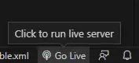

# Herramientas

En esta sección, se mencionan varias herramientas que se pueden utilizar para realizar transformaciones XSLT. De las presentadas, la mayoría son para realizar la transformación en local, pero existen también herramientas online.

## Navegador web

Un navegador web puede utilizarse para visualizar transformaciones XSLT aplicadas a documentos XML. Para hacer esto, se necesitan dos ficheros:

- El documento XML.
- La hoja XSL que se va a utilizar para la transformación.

Debemos asegurarnos de que la hoja XSL está vinculada al documento XML mediante la instrucción:

```xml
<?xml-stylesheet type="text/xsl" href="hoja.xsl"?>
```

Realizado esto, si abrimos el documento XML en el navegador web podremos ver la transformación directamente.

Para abrir el documento XML, no podemos hacerlo directamente, sino que debemos hacerlo utilizando mediante un **servidor web local**, ya que los navegadores incluyen una política de seguridad que no permite cargar otros ficheros cuando abrimos uno directamente en el navegador. Para cumplir con este requisito, lo más rápido es instalar la extensión **Live Server** en **Visual Studio Code**, pero existen muchas otras formas de hacerlo.

Es importante tener en cuenta que no todos los navegadores web admiten la transformación XSLT, y algunos navegadores pueden requerir que se habilite la función de transformación XSLT en la configuración del navegador. Además, es importante asegurarse de que la hoja XSL esté bien formada y se pueda aplicar correctamente al documento XML para obtener el resultado deseado.

### Live Server

La extensión **Live Server** de Visual Studio Code permite ejecutar un servidor web local de una forma sencilla y sin necesidad de utilizar la línea de comandos. Una vez que la extensión está instalada en Visual Studio Code, se puede activar haciendo clic en el botón Go Live ubicado en la esquina inferior derecha de la pantalla o a través del menú de comandos.



Al hacerlo, la extensión iniciará un servidor local y abrirá una pestaña del navegador web mostrando el directorio en el cual tenemos el proyecto. Podemos detener el servidor volviendo a pulsar en el mismo botón o presionando <KeyboardShortcut keys={['ctrl', 'c']} /> en la terminal.

### Alternativas a Live Server

Existen muchas formas de ejecutar un servidor web en local, pero dos de las opciones más populares son utilizando **Python** y **NodeJS**. En ambos casos, se ejecutan los servidores a través de la terminal.

En el caso de **Python**, podemos utilizar el módulo `http.server` que viene integrado en la biblioteca estándar de Python para ejecutar el servidor. Una vez instalado en el sistema, ejecutamos el siguiente comando:

```bash
python -m http.server 9000
```

Para acceder al servidor, abrimos el navegador y accedemos a `localhost:9000`.

En el caso de **NodeJS**, podemos utilizar un módulo desarrollado por la comunidad llamado `http-server`. Una vez instalado NodeJS en el sistema, ejecutamos el siguiente comando:

```bash
npx http-server
```

Para acceder al servidor, abrimos el navegador y accedemos a `localhost:8080`.

En ambos casos, para detener la ejecución del servidor, en la terminal, pulsamos <KeyboardShortcut keys={['ctrl', 'c']} />.
