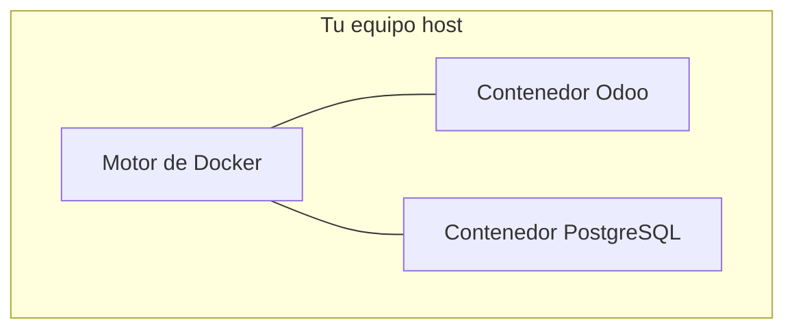

# Anexo: Introducción a Docker

## ¿Qué es Docker?

Docker es una plataforma que permite **empaquetar, distribuir y ejecutar aplicaciones en contenedores**. Un contenedor es un entorno aislado y autocontenido que incluye todo lo que una aplicación necesita para funcionar: el código, las dependencias, las bibliotecas y la configuración. Gracias a esto, la aplicación se comporta de forma idéntica en cualquier equipo, independientemente del sistema operativo o de los programas instalados.

La diferencia principal con una máquina virtual es que los contenedores **comparten el núcleo del sistema operativo** del equipo anfitrión, por lo que son mucho más ligeros y se inician en segundos.



## Conceptos clave

| Concepto | Descripción |
|---|---|
| **Imagen** | Plantilla de solo lectura que define cómo es el contenedor. Por ejemplo, `odoo:17` es la imagen oficial de Odoo 17. |
| **Contenedor** | Instancia en ejecución de una imagen. Es como encender una máquina a partir de una plantilla. |
| **Volumen** | Espacio de almacenamiento persistente gestionado por Docker. Los datos guardados en un volumen no desaparecen al eliminar un contenedor. |
| **Puerto** | Los contenedores tienen su propia red interna. Para acceder a un servicio desde el navegador, es necesario mapear un puerto del contenedor a un puerto del equipo anfitrión. Por ejemplo, `8069:8069` significa: *el puerto 8069 de tu equipo apunta al puerto 8069 del contenedor*. |
| **Docker Compose** | Herramienta que permite definir y gestionar varios contenedores a la vez mediante un archivo `docker-compose.yml`. |

## Instalación de Docker Desktop

**Docker Desktop** es la aplicación oficial para usar Docker en Windows y macOS. Incluye el motor de Docker, Docker Compose y una interfaz gráfica para gestionar contenedores e imágenes.

Pasos:

1. Descarga Docker Desktop desde [https://www.docker.com/products/docker-desktop](https://www.docker.com/products/docker-desktop).
2. Ejecuta el instalador. En Windows, asegúrate de tener activado **WSL 2** (el instalador te guiará si no lo tienes).
3. Reinicia el equipo si se solicita.
4. Abre Docker Desktop y espera a que el motor arranque.

## Comandos básicos de Docker

Los comandos de Docker se ejecutan en la terminal (PowerShell en Windows).

### Gestión de imágenes

```bash
# Descargar una imagen del registro de Docker Hub
docker pull odoo:17

# Ver las imágenes descargadas en el equipo
docker images
```

### Gestión de contenedores

```bash
# Ver los contenedores en ejecución
docker ps

# Ver todos los contenedores (incluidos los detenidos)
docker ps -a

# Detener un contenedor
docker stop <nombre_o_id>

# Iniciar un contenedor detenido
docker start <nombre_o_id>

# Eliminar un contenedor (debe estar detenido)
docker rm <nombre_o_id>
```

### Ver registros de un contenedor

```bash
docker logs <nombre_o_id>

# Seguir los logs en tiempo real
docker logs -f <nombre_o_id>
```

## Docker Compose

Docker Compose simplifica el trabajo con múltiples contenedores. En lugar de ejecutar comandos largos y recordar parámetros, toda la configuración se escribe en un archivo `docker-compose.yml` y se gestiona con comandos simples.

| Comando | Descripción |
|---|---|
| `docker compose up -d` | Crea e inicia todos los contenedores definidos en el archivo, en segundo plano. |
| `docker compose stop` | Detiene los contenedores sin eliminarlos ni sus datos. |
| `docker compose start` | Reinicia contenedores previamente detenidos. |
| `docker compose down` | Detiene y elimina los contenedores (los datos en volúmenes se conservan). |
| `docker compose down -v` | Detiene, elimina los contenedores **y también los volúmenes** (se pierden los datos). |
| `docker compose ps` | Muestra el estado de los contenedores del proyecto. |
| `docker compose logs -f` | Muestra los registros de todos los servicios en tiempo real. |

## Docker Hub

[Docker Hub](https://hub.docker.com) es el registro público oficial donde se publican las imágenes de Docker. Cuando en el archivo `docker-compose.yml` se escribe `image: odoo:17`, Docker descarga automáticamente esa imagen desde Docker Hub si no está ya en el equipo.

Las imágenes oficiales (como `odoo`, `postgres`, `nginx`, `mysql`, etc.) están mantenidas por la empresa o comunidad correspondiente y son seguras para usar en entornos de aprendizaje y desarrollo.
