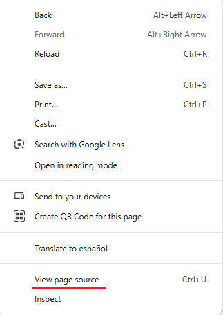

# Introducción a HTML

## HTML

HTML (*HyperText Markup Language*) es el **lenguaje de marcas** utilizado para crear la mayor parte de las **páginas web**.

**Tipos de lenguajes**

:::warning[Tipos de lenguajes]
Como ya se comentó en la UD1, no se debe confundir lenguaje de marcas con lenguaje de programación.

Un **lenguaje de marcas** o lenguaje de marcado define un conjunto de reglas para codificar documentos en un formato que es legible para las personas y también para la máquina, mientras que un **lenguaje de programación** proporciona un conjunto de comandos y sintaxis que se pueden usar para escribir programas de computadora que son entendidos por la computadora.

:::

Es un **estándar** reconocido en todos los **navegadores**, por lo tanto, todos ellos visualizan una página HTML de forma muy similar, independientemente del sistema operativo sobre el que se ejecutan.

Un documento HTML tiene el siguiente aspecto:

```html
<!DOCTYPE html>
<html>
 <head>
   <meta charset="utf-8" />
   <title>Título del documento</title>
 </head>
 <body>
   <p>LMSXI</p>
 </body>
</html>
```

## Código HTML de una página web

Podemos ver el documento HTML correspondiente a una web que estamos visualizando si pulsamos con el botón derecho del ratón y escogemos la opción *Ver código fuente de la página*. El nombre de la opción varía dependiendo del navegador.

