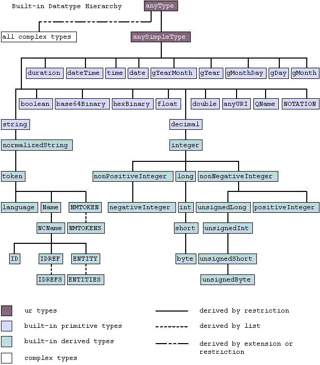

# XSD

## Introducción

**XML Schema** es un lenguaje que se utiliza para **validar documentos XML**, verificando que cumplen con unos requisitos concretos y para asegurar que el documento es válido y lo seguirá siendo en el futuro.

Su nombre técnico es **XML Schema Definition (XSD)**, pero su uso es menos frecuente. En cualquier caso, las referencias a **XML Schema** y a **XML Schema Definition (XSD)** suelen ser al mismo concepto.

Un XSD permite especificar los siguientes aspectos de un documento XML:

- La jerarquía de los elementos y los atributos permitidos.
- Las restricciones y las reglas de validación para el contenido de los elementos y atributos.
- La descripción de estructuras y tipos de datos complejos.
- La definición de relaciones entre elementos.

Al igual que ocurre con los documentos XML y los documentos DTD, los documentos XSD son **ficheros de texto plano**, es decir, se pueden crear y modificar con cualquier editor de texto. Deben tener la extensión **.xsd**.

El uso de XSD es **opcional** pero es **recomendable** para garantizar la **interoperabilidad** de los documentos XML entre diferentes sistemas y aplicaciones, ya que proporciona una forma estandarizada y más avanzada de describir la estructura de un documento XML.

## Ejemplo básico

Para entender mejor para qué nos sirve un XML Schema, consideremos el siguiente ejemplo.

Imaginemos que queremos definir un documento XML para recoger los datos de los alumnos de un centro educativo. Nos puede interesar recoger su nombre, apellidos (quizá solo el primero sea obligatorio, ya que no todas las personas tienen dos apellidos), fecha de nacimiento, y el curso en el que están matriculados. Además, en algunos casos, puede que queramos recoger la información de su tutor legal (solo en el caso de que el alumno sea menor de edad). Puede, también, que queramos almacenar su dirección postal, aunque no todas las direcciones tienen un piso, o letra, por lo que este dato no sería obligatorio. Además, la fecha de nacimiento debería tener un formato específico (por ejemplo, dd/mm/aaaa). Por último, quizá queremos recoger el número de teléfono, pero este dato no es obligatorio, y, además, podría disponer de varios teléfonos asociados; además, el teléfono debe tener un formato específico (9 dígitos) Todas estas reglas las podremos definir en un XML Schema, de manera que cualquier documento XML que queramos crear para almacenar los datos de un alumno deberá cumplirlas para ser considerado válido.

Ejemplo de un XML Schema que define las reglas anteriores:

```xml title="alumno.xsd"
<xs:schema xmlns:xs="http://www.w3.org/2001/XMLSchema">
  <xs:element name="alumno">
    <xs:complexType>
      <xs:sequence>
        <xs:element name="nombre" type="xs:string"/>
        <xs:element name="apellido1" type="xs:string"/>
        <xs:element name="apellido2" type="xs:string" minOccurs="0"/>
        <xs:element name="fechaNacimiento" type="xs:date"/>
        <xs:element name="curso" type="xs:string"/>
        <xs:element name="tutorLegal" type="xs:string" minOccurs="0"/>
        <xs:element name="direccion">
          <xs:complexType>
            <xs:sequence>
              <xs:element name="calle" type="xs:string"/>
              <xs:element name="numero" type="xs:string"/>
              <xs:element name="piso" type="xs:string" minOccurs="0"/>
              <xs:element name="letra" type="xs:string" minOccurs="0"/>
              <xs:element name="ciudad" type="xs:string"/>
              <xs:element name="codigoPostal" type="xs:string"/>
            </xs:sequence>
          </xs:complexType>
        </xs:element>
        <xs:element name="telefono" minOccurs="0" maxOccurs="unbounded">
        <xs:simpleType>
            <xs:restriction base="xs:string">
            <xs:pattern value="[0-9]{9}"/>
            </xs:restriction>
        </xs:simpleType>
        </xs:element>
      </xs:sequence>
    </xs:complexType>
  </xs:element>
</xs:schema>
```

Ejemplo de un documento XML válido según el XSD anterior:

```xml title="alumno.xml"
<alumno 
  xmlns:xs="http://www.w3.org/2001/XMLSchema-instance" 
  xs:noNamespaceSchemaLocation="alumno.xsd">
    <nombre>Abel</nombre>
    <apellido1>Estévez</apellido1>
    <fechaNacimiento>2008-05-12</fechaNacimiento>
    <curso>2º ESO</curso>
    <tutorLegal>María González</tutorLegal>
    <direccion>
        <calle>Calle Falsa</calle>
        <numero>123</numero>
        <ciudad>Vilagarcía de Arousa</ciudad>
        <codigoPostal>36600</codigoPostal>
    </direccion>
    <telefono>986112233</telefono>
    <telefono>666777888</telefono>
</alumno>
```

## Características

XML Schema proporciona una serie de **ventajas sobre DTD** debido a las siguientes características:

- En comparación con un DTD, la **sintaxis es más avanzada** y proporciona un **mayor nivel de detalle**.
- XSD permite **restringir con mucha precisión los valores** que puede tener un elemento o atributo mediante la especificación de tipos de datos y reglas de validación.
- El lenguaje utilizado en un documento XSD **es lenguaje XML**. Por lo tanto, los mismos procesadores que permiten interpretar ficheros XML permitirían procesar ficheros XSD.
- XSD permite la definición de espacios de nombres (*namespaces*).

## Declaración

Para realizar una validación de un documento XML utilizando un XSD, debemos realizar dos pasos:

- Crear el XSD y definir la estructura a validar en él.
- Vincular el XSD creado en el documento XML para que se pueda utilizar para su validación.

### Creación del XSD

La creación de un XSD también se conoce como la **creación de un esquema**. Los elementos XML que se utilizan para generar un esquema han de pertenecer al [**namespace XML Schema**](http://www.w3.org/2001/XMLSchema), el cual establece el prefijo xs: para todos ellos.

Un **fichero XSD** base tiene la siguiente estructura:

```xml
<xs:schema xmlns:xs="http://www.w3.org/2001/XMLSchema">
  <!-- El resto de elementos -->
</xs:schema>
```

:::info[Declaración XML]

Tanto en el documento XML como en el documento XSD, **opcionalmente**, podemos incluir la **declaración XML** al inicio del fichero:

```xml
<?xml version="1.0" encoding="UTF-8"?>
<xs:schema xmlns:xs="http://www.w3.org/2001/XMLSchema">
  <!-- El resto de elementos -->
</xs:schema>
```

En los ejemplos omitiremos la declaración XML por claridad, pero es recomendable incluirla.

:::

El elemento `schema` siempre será el **elemento raíz** y contiene **declaraciones para todos los elementos y atributos** que puedan aparecer en un documento XML que deseemos validar. Además, tendrá definido el **atributo xmlns:xs** con la URL al namespace de XML Schema.

Algunos elementos hijos posibles son:

- `<xs:element>`
- `<xs:attribute>`
- `<xs:simpleType>`
- `<xs:complexType>`
- `<xs:group>`
- `<xs:attributeGroup>`
  
Cada uno de estos elementos de XML Schema tiene una función específica en la definición de los tipos de datos y las restricciones de un documento XML, como veremos en los siguientes apartados.

### Vincular el XSD en el documento XML

Una vez creado el documento XSD, debemos indicar en el documento XML que queremos validarlo siguiendo el XSD definido. Para ello, debemos añadir unos atributos en el elemento raíz del documento XML:

```xml
<raiz 
  xmlns:xs="http://www.w3.org/2001/XMLSchema-instance"
  xs:noNamespaceSchemaLocation="esquema.xsd">
  <!-- ... -->
</raiz>
```

Donde:

- El atributo `xmlns:xs` **tiene siempre el valor** `http://www.w3.org/2001/XMLSchema-instance`. Es la definición de un *namespace*, el cual se utiliza para indicar que el documento está siendo validado contra un esquema XSD. El sufijo `xs` puede ser otro diferente, pero tenemos que utilizar siempre el mismo a lo largo del documento XML.
- El atributo `xs:noNamespaceSchemaLocation` referencia al **fichero XSD donde se encuentra el esquema**. En este caso, el archivo es **`esquema.xsd`**, el cual se debe encontrar en el mismo directorio que el documento XML. Se está utilizando el prefijo `xs:`, que forma parte del namespace definido en el atributo anterior. Es decir, se está definiendo un **atributo `noNamespaceSchemaLocation`** que forma parte del espacio de nombres xs.

:::info[URL de XML Schema]
Algunas aplicaciones no validan correctamente los documentos XML si indicamos las URLs en su versión HTTPS. Es decir, debemos evitar las siguientes URLs:

```text
https://www.w3.org/2001/XMLSchema
https://www.w3.org/2001/XMLSchema-instance
```

En su lugar, utilizamos las siguientes:

```text
http://www.w3.org/2001/XMLSchema
http://www.w3.org/2001/XMLSchema-instance
```

:::

:::tip[Creación de un espacio de nombres]

Los **espacios de nombres** se indican en el elemento raíz de un documento XML utilizando el prefijo `xmlns:` (XML Namespace). A continuación del prefijo, se indica un **nombre** para el namespace. El **valor del atributo es una URL** que permite identificarlos de forma única.

Para utilizar el espacio de nombres, únicamente tenemos que añadir como prefijo el nombre elegido para el namespace a un elemento o atributo.

```xml
<cartas 
  xmlns:baraja="https://www.lmsgi.com/baraja" 
  xmlns:restaurante="https://www.lmsgi.com/restaurante">
    <baraja:carta></baraja:carta>
    <restaurante:carta></restaurante:carta>
</cartas>
```

:::

Consideremos el siguiente documento XML:

```xml title="alumna.xml"
<alumna 
  xmlns:xs="http://www.w3.org/2001/XMLSchema-instance" 
  xs:noNamespaceSchemaLocation="alumna.xsd">
    Olga Velarde Cobo
</alumna>

Un XML Schema que **valida** el documento anterior sería:

```xml title="alumna.xsd"
<xs:schema xmlns:xs="http://www.w3.org/2001/XMLSchema">
  <xs:element name="alumna" type="xs:string"/>
</xs:schema>
```

El XSD anterior contiene un elemento `<xs:element>`. Este elemento indica que el documento XML debe tener un elemento con nombre `alumna` y que su contenido es una cadena de caracteres (*string*).

## Tipos de elementos XML

A la hora de trabajar con XML Schema es muy importante tener clara la diferencia entre los dos tipos de elementos que nos podemos encontrar en un documento XML:

- **Simples**: no contienen ni elementos ni atributos.
- **Complejos**: contienen elementos y/o atributos.

A continuación, se exponen varios ejemplos de cada uno de los tipos.

### Elementos simples

Un elemento simple es aquel que **solo contiene texto**, esto es, que no contiene ni elementos ni atributos. Es el tipo de elemento más sencillo que existe.

Un ejemplo de elemento simple sería el siguiente: `<titulo>Manzana</titulo>`

### Elementos complejos

Un elemento complejo es aquel que contiene uno o más elementos (elementos hijo) y/o atributos. Los elementos hijo son elementos que están dentro de otro elemento (elemento padre).

Esto permite las siguientes combinaciones de elementos hijo y atributos:

| Elementos hijo | Atributos |
|---------------|-----------|
| 0 (*)         | 1         |
| 0 (*)         | Varios    |
| 1             | 0         |
| Varios        | 0         |
| 1             | 1         |
| 1             | Varios    |
| Varios        | 1         |
| Varios        | Varios    |

\* *Un elemento que no contiene elementos puede tener contenido (texto) o no, es decir, puede ser tanto un elemento con texto como un elemento vacío.*

### Elemento con contenido con uno o varios atributos

En el momento en el cual un elemento ya tenga un **atributo**, se vuelve del tipo **complejo**, independientemente de que tenga uno o varios atributos.

**Ejemplo de elemento con contenido y 1 atributo**:

```xml
<visitante fecha="2023-01-08">Wendel Yarmouth</visitante>
```

**Ejemplo de elemento con contenido y varios atributos**:

```xml
<visitante fecha="2023-01-08" hora="14:49:12">Wendel Yarmouth</visitante>
```

### Elemento vacío con uno o varios atributos

Los elementos vacíos si tienen atributos también son complejos por el hecho de tener atributos. Los elementos vacíos son aquellos que no tienen contenido.

**Ejemplo de elemento vacío con 1 atributo**:

```xml
<visita fecha="2023-01-08"/>
```

```xml
<visita fecha="2023-01-08"></visita>
```

**Ejemplo de elemento vacío con varios atributos**:

```xml
<visita fecha="2023-01-08" hora="14:49:12"/>
```

```xml
<visita fecha="2023-01-08" hora="14:49:12"></visita>
```

### Elemento con uno o varios elementos hijos y sin atributos

**Ejemplo de elemento con 1 elemento hijo y ningún atributo**:

```xml
<visitante>
  <nombre>Wendel Yarmouth</nombre>
</visitante>
```

**Ejemplo de elemento con varios elementos hijo y ningún atributo**:

```xml
<visitante>
  <nombre>Wendel Yarmouth</nombre>
  <ip>56.251.47.97</ip>
</visitante>
```

### Elemento con uno o varios elementos hijos y con uno o varios atributos

**Ejemplo de elemento con 1 elemento hijo y 1 atributo**:

```xml
<visitante fecha="2023-01-08">
  <nombre>Wendel Yarmouth</nombre>
</visitante>
```

**Ejemplo de elemento con varios elementos hijo y 1 atributo**:

```xml
<visitante fecha="2023-01-08">
  <nombre>Wendel Yarmouth</nombre>
  <ip>56.251.47.97</ip>
</visitante>
```

**Ejemplo de elemento con 1 elemento hijo y varios atributos**:

```xml
<visitante fecha="2023-01-08" hora="14:49:12">
  <nombre>Wendel Yarmouth</nombre>
</visitante>
```

**Ejemplo de elemento con varios elementos hijo y varios atributos**:

```xml
<visitante fecha="2023-01-08" hora="14:49:12">
  <nombre>Wendel Yarmouth</nombre>
  <ip>56.251.47.97</ip>
</visitante>
```

## Elementos de XML Schema

Los elementos de XML Schema (XSD) son los **elementos utilizados para describir la estructura de un documento XML**. Estos elementos son los que permiten definir la **estructura**, **relaciones** y **restricciones** de un documento XML en un XSD.

Más concretamente, los elementos XSD permiten:

- Especificar qué ****elementos y atributos** deben aparecer en un documento.
- Definir las **restricciones** de elementos y atributos en cuanto a su contenido y orden.
- Especificar los **tipos de datos** para los elementos y atributos.
- **Crear tipos de datos personalizados** para elementos y atributos, permitiendo una validación más precisa.
- Definir **elementos y atributos opcionales y obligatorios**, así como las reglas de **validación** para cada uno de ellos.

Como mínimo, todos los elementos y atributos que se vayan a usar en el ejemplar de un documento XML tienen que declararse en el esquema.

En los siguientes apartados se presenta una lista de los elementos básicos de XSD que están definidos en el estándar de XML Schema.

:::warning[Prefijo del espacio de nombres]

Aunque los diferentes elementos se presenten por su nombre (sin prefijo), cuando se usan en un esquema, todos ellos van precedidos por el prefijo del namespace de XML Schema.

Algunos ejemplos de documento XSD:

```xml
<xs:schema xmlns:xs="http://www.w3.org/2001/XMLSchema">
  <xs:element />
</xs:schema>
```

```xml
<xsi:schema xmlns:xsi="http://www.w3.org/2001/XMLSchema">
  <xsi:element />
</xsi:schema>
```

En ambos documentos hay **dos elementos** definidos: **schema** y **element**. La estructura que se está definiendo es la misma. Lo único que cambia es el **prefijo** utilizado: en un caso es `xs` y en otro es `xsi`. Se puede utilizar el prefijo que se desee, aunque debemos asegurarnos de utilizar el mismo prefijo en todo el documento.

El la documentación se presentarán los elementos como schema y element en lugar de por xs:schema y xs:element. El motivo de esto, como se acaba de comentar, es porque el prefijo puede variar.

:::

### `schema`

El elemento `schema` es el **elemento raíz** de un XML Schema y contiene la **definición del esquema completo**. Es un elementos **obligatorio** en la definición de un XSD ya que sin él no se puede definir un XML Schema, por lo tanto, siempre será el primer elemento que se debe escribir.

```xml
<xs:schema xmlns:xs="http://www.w3.org/2001/XMLSchema">
  <!-- Elementos XSD -->
</xs:schema>
```

El elemento `schema` tiene un **atributo `xmlns:xs`**, el cual siempre tendrá como valor `http://www.w3.org/2001/XMLSchema`.

### `element

El elemento `element` se utiliza para declarar un **elemento específico** en un documento XML.

En su versión básica permite definir elementos simples, pero también permite definir **elementos complejos** mediante la combinación de `element` con otros elementos XSD.

La información que permite definir es:

- El nombre del elemento.
- Su tipo de dato.
- El valor por defecto.
- Si tiene un valor fijo y cuál es.
Supongamos un documento XML con el siguiente elemento:

```xml
<divisa>Euro</divisa>
```

El documento XSD que permite validar el código anterior es el siguiente:

```xml title="divisa.xsd"
<xs:schema xmlns:xs="http://www.w3.org/2001/XMLSchema">
  <xs:element name="divisa" type="xs:string" default="Euro" />
</xs:schema>
```

:::tip[Documento XSD]

Recordemos que todo XSD tiene como elemento raíz `schema` y que este elemento contiene todos los demás elementos XSD. En este caso, contiene un único elemento: `element`.

:::

Los atributos que se pueden definir en element son:

| Atributo | Descripción |
|----------|-------------|
| `name`   | Nombre del elemento en el documento XML. En el ejemplo anterior, `divisa`. |
| `type`   | Tipo de dato. En el ejemplo anterior, `divisa` se define como `string`, es decir, cualquier **cadena de caracteres**. En otro apartado se verán todos los tipos de datos aceptados. De momento, se utilizará siempre string para los ejemplos. |
| `default`| Valor predeterminado del elemento. |
| `fixed`  | Permite asignar un valor fijo al contenido del elemento. |

Otras opciones que podemos definir (haciendo uso de otros elementos XSD) son:

- Si es **obligatorio** u **opcional**.
- Su **cardinalidad**, es decir, si puede aparecer una o varias veces en el documento.
- Restricciones adicionales en los valores del elemento. Por ejemplo, un rango de números válidos, un patrón de caracteres, etc.

### `attribute`

El elemento `attribute` se utiliza para declarar un **atributo** de un elemento XML.

La información que permite definir es:

- El **nombre** del atributo.
- Su **tipo de dato**.
- El **valor por defecto**.
- Si tiene un **valor fijo** y cuál es.
- Si es **obligatorio** u **opcional**.

Supongamos un documento XML con el siguiente elemento y su atributo:

```xml
<ciudad provincia="Lugo">Monforte de Lemos</ciudad>
```

El elemento XSD que permite validar el código anterior es el siguiente:

```xml
<xs:attribute name="provincia" type="xs:string" default="A Coruña"/>
```

Los atributos que se pueden definir en `attribute` son:

| Atributo | Descripción |
|----------|-------------|
| `name`   | Nombre del atributo. |
| `type`   | Tipo de dato permitido como valores del atributo provincia. |
| `default`| Valor predeterminado. |
| `use`    | Con el valor `required` se indica que se trata de un atributo obligatorio. Si se indica este atributo, no se puede utilizar `default` de forma simultánea. |
| `fixed`  | Permite asignar un valor fijo al atributo. |

Adicionalmente, haciendo uso de otros elementos XSD, podemos definir **restricciones adicionales** en los valores del atributo.

### Dependencia de un elemento XML

Cada vez que se utilice el elemento `attribute` de XML Schema, se deberá incluir un `element`, ya que un atributo siempre va a depender de un elemento. Es decir, **un atributo no existe a no ser que exista previamente un elemento**.

El atributo `provincia` no puede existir si no existe `<ciudad>`:

```xml
<ciudad provincia="Lugo">Monforte de Lemos</ciudad>
```

El documento XSD que permite validar el XML sería el siguiente:

```xml title="ciudad.xsd"
<xs:schema xmlns:xs="http://www.w3.org/2001/XMLSchema">
  <xs:element name="ciudad">
    <xs:complexType>
      <xs:simpleContent>
        <xs:extension base="xs:string">
          <xs:attribute name="provincia" type="xs:string" use="required"/>
        </xs:extension>
      </xs:simpleContent>
    </xs:complexType>
  </xs:element>
</xs:schema>
```

En este punto no es necesario entender cómo funciona el código anterior, sino saber que, cuando tenemos que añadir un `attribute`, tendremos que hacer lo mismo con `element`.

## Tipos de datos

Los tipos de datos son los **diferentes valores** que puede tomar el atributo type de un elemento XSD. Este atributo representa el tipo de dato que tendrá un elemento o atributo en el documento XML.

Supongamos que tenemos un elemento en un XML Schema como el siguiente:

```xml
<xs:element name="numero" type="xs:positiveInteger"/>
```

La línea anterior está definiendo que en el documento XML a validar debe haber un elemento `<numero>` y que solo puede tener como contenido un **número entero positivo**. Es decir, el siguiente XML sería válido:

```xml
<numero>20</numero>
```

Mientras que los siguientes no serían válidos:

```xml
<numero>-5</numero>
<numero>3.14</numero>
<numero>texto</numero>
```

Todos los tipos de datos, cuando se utilizan en un elemento del XML Schema, deben ir junto con el **prefijo del espacio de nombres**. En nuestro caso, utilizamos `xs:`.

### Clasificación de tipos de datos

El estándar de XML Schema divide los tipos de datos en dos grandes grupos:

- **Primitivos**: no se definen a partir de otros tipos de datos.
- **Derivados**: se definen a partir de otros tipos de datos.

En el siguiente diagrama creado por la W3C, se puede observar la jerarquía entre los diferentes tipos. Podemos apreciar que todos los tipos derivados son creados (derivados) a partir de dos tipos primitivos: string o decimal.



### Tipos de datos personalizados

Tenemos dos posibilidades a la hora de definir un tipo de dato para un elemento o atributo:

- Utilizar un tipo de dato **predefinido**, es decir, **proporcionado por el [estándar](https://www.w3.org/TR/xmlschema-2/) de XML Schema**.
- Utilizar un tipo de dato **personalizado**, es decir, **definido por el programador o programadora**. Este tipo de datos se deben definir previamente y se crean a partir de uno predefinido (de los que se muestran en el diagrama).
  
En los siguientes apartados se estudiarán algunos de valores del primer grupo, es decir, valores definidos en el estándar que puede tomar el atributo type de los elementos XSD.

### Tipos de datos de tipo texto

Algunos de los tipos de datos predefinidos en XML Schema que representan texto son:

- `xs:string`
- `xs:anyURI`
- `xs:languaje`

Aunque, como se ve en el diagrama anterior, existen muchos tipos derivados de `xs:string` con diferentes aplicaciones:

| Tipo de dato       | Descripción                                      | Ejemplo                |
|--------------------|--------------------------------------------------|------------------------|
| `xs:normalizedString` | Cadena de caracteres sin saltos de línea, tabulaciones ni espacios múltiples. | "Hola Mundo"           |
| `xs:token`         | Cadena de caracteres sin espacios iniciales o finales, y sin espacios múltiples. | "Hola Mundo"           |
| `xs:NMTOKEN`       | Cadena de caracteres que cumple las reglas de un token XML.         | "token_1"              |
| `xs:Name`          | Nombre XML válido.                               | "nombreElemento"        |
| `xs:NCName`        | Nombre XML válido sin prefijo.                   | "nombreElemento"        |

De momento, no produndizaremos en ellos.

#### `xs:string`

El tipo de dato `xs:string` se utiliza para representar **cadenas de caracteres**. Es uno de los tipos de datos básicos en XSD y se utiliza para representar cualquier tipo de texto, incluyendo nombres, descripciones, direcciones, etc.

```xml title="titulo.xsd"
<xs:schema xmlns:xs="http://www.w3.org/2001/XMLSchema">
  <xs:element name="titulo" type="xs:string" />
</xs:schema>
```

Algunos valores válidos para un string son:

```xml
<titulo>Sofá negro</titulo>
<titulo>Colchones</titulo>
<titulo>Ordenador portátil ultraligero</titulo>
```

#### `xs:anyURI`

El tipo de dato [`xs:anyURI`](https://www.w3.org/TR/xmlschema-2/#anyURI) representa un [identificador uniforme de recursos (URI)](https://es.wikipedia.org/wiki/Localizador_de_recursos_uniforme).

Una **URI** (Uniform Resource Identifier) es una cadena de texto que sigue un formato determinado y que permite identificar un recurso de forma inequívoca (sin ambigüedades), como una página web, un archivo o un recurso en un servidor.

```xml
<xs:schema xmlns:xs="http://www.w3.org/2001/XMLSchema">
  <xs:element name="recurso" type="xs:anyURI"/>
</xs:schema>
```

Algunos valores válidos para un anyURI son:

```xml
<recurso>http://www.w3.org/2001/XMLSchema</recurso>
<recurso>https://es.wikipedia.org/wiki/Wikipedia</recurso>
<recurso>/img/logo.png</recurso>
<recurso>tel:+34666777888</recurso>
```

#### `xs:language`

El tipo de dato `xs:language` representa un **identificador de un idioma** determinado. Los identificadores vienen definidos en el [**RFC 3066**](https://www.ietf.org/rfc/rfc3066.txt).

```xml
<xs:schema xmlns:xs="http://www.w3.org/2001/XMLSchema">
  <xs:element name="idioma" type="xs:language"/>
</xs:schema>
```

Algunos valores válidos para un language son:

```xml
<idioma>es</idioma>
<idioma>en</idioma>
<idioma>gl</idioma>
<idioma>en-us</idioma>
<idioma>EN-US</idioma>
<idioma>EN-GB</idioma>
<idioma>en-GB</idioma>
<idioma>fr-ca</idioma>
```

### Tipos de datos de tipo numérico

Algunos de los tipos de datos predefinidos en XML Schema que representan números son:

- `xs:integer`
- `xs:decimal`
- `xs:float`
- `xs:double`
- `xs:nonNegativeInteger`
- `xs:positiveInteger`

Además, disponemos del tipo de dato `xs:boolean`, que representa valores lógicos (verdadero o falso). Se puede ver en el diagrama anterior todos los tipos derivados de `xs:integer`: `xs:nonPositiveInteger`, `xs:negativeInteger`, `xs:long`, `xs:int`, `xs:short`, `xs:byte`...

#### `xs:boolean`

El tipo `xs:boolean` permite representar valores **booleanos** (verdadero o falso). Es utilizado para definir elementos o atributos que solo pueden contener valores `true` o `false` (también `1`, equivalente a `true` o `0`, equivalente a `false`).

```xml
<xs:schema xmlns:xs="http://www.w3.org/2001/XMLSchema">
  <xs:element name="activo" type="xs:boolean"/>
</xs:schema>
```

Algunos valores válidos para un boolean son:

```xml
<activo>true</activo>
<activo>false</activo>
<activo>1</activo>
<activo>0</activo>
```

Algunos valores **no válidos** son:

```xml
<activo>TRUE</activo>
<activo>T</activo>
<activo>F</activo>
<activo>Si</activo>
<activo>Yes</activo>
<activo>No</activo>
```

#### `xs:integer`

El tipo `xs:integer` se utiliza para representar números **enteros**, es decir, **valores numéricos sin decimales**. Pueden ser **positivos** o **negativos**. Los valores pueden llevar un signo positivo o negativo.

```xml
<xs:schema xmlns:xs="http://www.w3.org/2001/XMLSchema">
  <xs:element name="rango" type="xs:integer"/>
</xs:schema>
```

Algunos valores válidos para un integer son:

```xml
<rango>3</rango>
<rango>57</rango>
<rango>0</rango>
<rango>-45</rango>
<rango>-1</rango>
<rango>+6</rango>
<rango>0</rango>
```

Algunos valores no válidos son:

```xml
<rango>3.</rango>
<rango>4.5</rango>
<rango>23.0</rango>
<rango>treinta</rango>
<rango>ZERO</rango>
```

#### `xs:positiveInteger`

El tipo `xs:positiveInteger` es utilizado para representar un **número entero positivo** (sin signo). Es decir, es un subtipo de integer, lo que significa que tiene las mismas propiedades y restricciones.

**El 0 NO se considera entero positivo**, sino que el valor mínimo para un positiveInteger es 1.

:::tip[Para incluir el 0]

Si queremos incluir el 0 como valor válido, debemos utilizar el tipo de dato `xs:nonNegativeInteger`.

:::

```xml
<xs:schema xmlns:xs="http://www.w3.org/2001/XMLSchema">
  <xs:element name="edad" type="xs:positiveInteger"/>
</xs:schema>
```

Algunos valores válidos para un positiveInteger son:

```xml
<edad>3</edad>
<edad>57</edad>
<edad>+6</edad>
```

Algunos valores no válidos son:

```xml
<edad>0</edad>
<edad>3.</edad>
<edad>-9</edad>
<edad>4.5</edad>
<edad>-23.0</edad>
<edad>four</edad>
<edad>dos</edad>
```

Ejemplos de uso de este tipo son:

- El número de páginas de un libro.
- El número de habitaciones en un hotel.
- El número de ruedas de un vehículo.
- El número de alumnos en una clase.

#### `xs:negativeInteger`

El tipo `xs:negativeInteger` es utilizado para representar un **número entero negativo** (signo negativo). Es decir, es un subtipo de integer, lo que significa que tiene las mismas propiedades y restricciones.

**El 0 NO se considera entero negativo.**

:::tip[Para incluir el 0]

Si queremos incluir el 0 como valor válido, debemos utilizar el tipo de dato `xs:nonPositiveInteger`.

:::

```xml
<xs:schema xmlns:xs="http://www.w3.org/2001/XMLSchema">
  <xs:element name="rango" type="xs:negativeInteger"/>
</xs:schema>
```

Algunos valores válidos para un negativeInteger son:

```xml
<rango>-33</rango>
<rango>-7</rango>
<rango>-1</rango>
<rango>-999</rango>
```

Algunos valores no válidos son:

```xml
<rango>0</rango>
<rango>3.</rango>
<rango>-4.5</rango>
<rango>6</rango>
<rango>-23.0</rango>
<rango>four</rango>
<rango>dos</rango>
```

#### `xs:decimal`

El tipo `xs:decimal` se utiliza para representar **números decimales**. Se debe utilizar `.` para la separación de decimales. Los números ser positivos o negativos y, por tanto, llevar un signo positivo o negativo (por omisión, los números son positivos).

```xml
<xs:schema xmlns:xs="http://www.w3.org/2001/XMLSchema">
  <xs:element name="temperatura" type="xs:decimal"/>
</xs:schema>
```

Algunos valores válidos para un decimal son:

```xml
<temperatura>3</temperatura>
<temperatura>57.4</temperatura>
<temperatura>8.543233</temperatura>
<temperatura>0</temperatura>
<temperatura>2</temperatura>
<temperatura>2.0</temperatura>
<temperatura>2.000</temperatura>
<temperatura>.66</temperatura>
<temperatura>+80</temperatura>
```

Algunos valores no válidos son:

<temperatura>3,7</temperatura>

:::tip[Distintos tipos de precisión]

XSD ofrece tres tipos principales para números decimales:

- **`xs:decimal`**: Tipo exacto con precisión arbitraria. Ideal para valores financieros o donde se requiere exactitud absoluta. Permite especificar el número de dígitos totales (`totalDigits`) y decimales (`fractionDigits`). No tiene límite de precisión.
  
- **`xs:float`**: Número en formato IEEE 754 de precisión simple (32 bits). Utiliza menos memoria pero tiene menor precisión (~7 dígitos significativos). Admite valores como `Infinity`, `-Infinity` y `NaN`. Útil para aplicaciones científicas o cálculos donde la pequeña pérdida de precisión es aceptable.
  
- **`xs:double`**: Número en formato IEEE 754 de precisión doble (64 bits). Mayor precisión que `float` (~15 dígitos significativos) pero más memoria. También admite `Infinity`, `-Infinity` y `NaN`. Es el tipo por defecto para números decimales en muchos lenguajes de programación.

**Recomendación**: Usa `xs:decimal` para datos financieros o contables, y `xs:float`/`xs:double` para cálculos científicos o mediciones físicas.

:::

### Tipos de datos de tiempo

Algunos de los tipos de datos predefinidos en XML Schema que representan tiempo son:

- `xs:dateTime`
- `xs:date`
- `xs:time`
- `xs:gYear`
- `xs:gMonth`
- `xs:gDay`
- `xs:gYearMonth`
- `xs:gMonthDay`
- `xs:duration`

#### `xs:dateTime`

El tipo `xs:dateTime` se utiliza para representar una **fecha y hora combinadas** en el formato [**ISO 8601**](https://es.wikipedia.org/wiki/ISO_8601). Este formato permite especificar tanto la fecha como la hora exacta del día en un solo valor.

```xml
<xs:schema xmlns:xs="http://www.w3.org/2001/XMLSchema">
  <xs:element name="fechaHora" type="xs:dateTime"/>
</xs:schema>
```

El formato es: **YYYY-MM-DDTHH:MM:SS** (donde T es el separador entre la fecha y la hora). Opcionalmente, se puede incluir la zona horaria. El número de dígitos de cada componente es fijo.

| Propiedad | Cifras | Valor |
|-----------|--------|-------|
| Año       | 4      | 0000-9999 |
| Mes       | 2      | 01-12 |
| Día       | 2      | 01-31 |
| Hora      | 2      | 00-23 |
| Minuto    | 2      | 00-59 |
| Segundo   | 2      | 00-59 |

Para definir fracciones de segundo, se puede añadir un punto decimal seguido de una o más cifras (por ejemplo, `23:59:59.999`). La fracción puede tener entre 1 y 12 cifras.

Por otra parte, para definir la zona horaria, se puede añadir una Z (para UTC) o un desplazamiento con respecto a UTC en el formato ±HH:MM (por ejemplo, `+02:00` o `-05:00`).

Algunos valores válidos para un dateTime son:

```xml
<fechaHora>2024-12-31T23:59:59</fechaHora>
<fechaHora>2023-01-15T10:30:45</fechaHora>
<fechaHora>2024-06-20T14:25:30.500</fechaHora>
<fechaHora>2024-12-31T23:59:59Z</fechaHora>
<fechaHora>2024-12-31T23:59:59+02:00</fechaHora>
<fechaHora>2024-12-31T23:59:59-05:00</fechaHora>
```

Algunos valores no válidos son:

```xml
<fechaHora>31/12/2024 23:59:59</fechaHora>
<fechaHora>2024-12-31 23:59:59</fechaHora>
<fechaHora>2024-13-31T23:59:59</fechaHora>
<fechaHora>2024-12-32T25:59:59</fechaHora>
<fechaHora>2024/12/31T23:59:59</fechaHora>
```

Ejemplos de uso de este tipo son:

- Registros de fecha y hora de eventos.
- Timestamps de logs o auditoría.
- Fechas de creación o modificación de registros.

#### `xs:date`

El tipo `xs:date` se utiliza para representar una **fecha** sin la hora. El formato es **YYYY-MM-DD** siguiendo el estándar [ISO 8601](https://es.wikipedia.org/wiki/ISO_8601).

```xml
<xs:schema xmlns:xs="http://www.w3.org/2001/XMLSchema">
  <xs:element name="fechaNacimiento" type="xs:date"/>
</xs:schema>
```

Algunos valores válidos para un date son:

```xml
<fechaNacimiento>2008-05-12</fechaNacimiento>
<fechaNacimiento>1995-01-25</fechaNacimiento>
<fechaNacimiento>2024-12-31</fechaNacimiento>
<fechaNacimiento>2000-02-29</fechaNacimiento>
<fechaNacimiento>1999-01-01</fechaNacimiento>
```

El tipo `xs:date` también admite la inclusión de una zona horaria al final del valor, utilizando una 'Z' para indicar la hora UTC o un desplazamiento con respecto a UTC en el formato ±HH:MM (por ejemplo, `+02:00` o `-05:00`).

Algunos valores no válidos son:

```xml
<fechaNacimiento>12/05/2008</fechaNacimiento>
<fechaNacimiento>05-12-2008</fechaNacimiento>
<fechaNacimiento>2008/05/12</fechaNacimiento>
<fechaNacimiento>2024-13-01</fechaNacimiento>
<fechaNacimiento>2024-12-32</fechaNacimiento>
<fechaNacimiento>2024-02-30</fechaNacimiento>
<fechaNacimiento>2008-05-12Z</fechaNacimiento>
<fechaNacimiento>1995-01-25+02:00</fechaNacimiento>
<fechaNacimiento>2024-12-31-05:00</fechaNacimiento>
```

Ejemplos de uso de este tipo son:

- Fechas de nacimiento de personas.
- Fechas de inicio o fin de proyectos.
- Fechas de vencimiento de documentos.
- Fechas de eventos especiales.

#### `xs:time`

El tipo `xs:time` se utiliza para representar una **hora del día** sin la fecha. El formato es **HH:MM:SS** (horas, minutos y segundos). Opcionalmente, se puede incluir milisegundos y zona horaria.

```xml
<xs:schema xmlns:xs="http://www.w3.org/2001/XMLSchema">
  <xs:element name="horaEntrada" type="xs:time"/>
</xs:schema>
```

Algunos valores válidos para un time son:

```xml
<horaEntrada>09:00:00</horaEntrada>
<horaEntrada>14:30:45</horaEntrada>
<horaEntrada>23:59:59</horaEntrada>
<horaEntrada>00:00:00</horaEntrada>
<horaEntrada>12:45:30.500</horaEntrada>
<horaEntrada>09:00:00Z</horaEntrada>
<horaEntrada>14:30:45+02:00</horaEntrada>
```

Algunos valores no válidos son:

```xml
<horaEntrada>9:00:00</horaEntrada>
<horaEntrada>09:00</horaEntrada>
<horaEntrada>25:00:00</horaEntrada>
<horaEntrada>12:60:30</horaEntrada>
<horaEntrada>14h 30m 45s</horaEntrada>
<horaEntrada>14.30.45</horaEntrada>
```

Ejemplos de uso de este tipo son:

- Horas de entrada o salida del trabajo.
- Horarios de clases o eventos.
- Turnos de trabajo.
- Horas de disponibilidad de servicios.

#### `xs:gYear`

El tipo `xs:gYear` se utiliza para representar un **año gregoriano**. El formato es **YYYY**, donde YYYY es un año de cuatro dígitos. Para años anteriores al 0001, se utiliza un signo negativo, pero siempre con cuatro dígitos (por ejemplo, -0500 para el año 500 a.C.).

```xml
<xs:schema xmlns:xs="http://www.w3.org/2001/XMLSchema">
  <xs:element name="anoConstitucion" type="xs:gYear"/>
</xs:schema>
```

Algunos valores válidos para un gYear son:

```xml
<anoConstitucion>2024</anoConstitucion>
<anoConstitucion>2000</anoConstitucion>
<anoConstitucion>1995</anoConstitucion>
<anoConstitucion>-0500</anoConstitucion>
```

Algunos valores no válidos son:

```xml
<anoConstitucion>24</anoConstitucion>
<anoConstitucion>20240</anoConstitucion>
<anoConstitucion>2024-12</anoConstitucion>
<anoConstitucion>año 2024</anoConstitucion>
```

Ejemplos de uso de este tipo son:

- Año de fundación de una empresa.
- Año de inicio de un proyecto.
- Año de nacimiento cuando no es importante la fecha exacta.

#### `xs:gMonth`

El tipo `xs:gMonth` se utiliza para representar un **mes gregoriano**. El formato es **--MM** (dos guiones seguidos de dos dígitos para el mes). Siempre hay que indicar los dos guiones, seguido de exactamente dos dígitos.

```xml
<xs:schema xmlns:xs="http://www.w3.org/2001/XMLSchema">
  <xs:element name="mesAniversario" type="xs:gMonth"/>
</xs:schema>
```

Algunos valores válidos para un gMonth son:

```xml
<mesAniversario>--12</mesAniversario>
<mesAniversario>--01</mesAniversario>
<mesAniversario>--06</mesAniversario>
<mesAniversario>--11</mesAniversario>
```

Algunos valores no válidos son:

```xml
<mesAniversario>12</mesAniversario>
<mesAniversario>-12</mesAniversario>
<mesAniversario>--13</mesAniversario>
<mesAniversario>--00</mesAniversario>
<mesAniversario>diciembre</mesAniversario>
```

Ejemplos de uso de este tipo son:

- Mes de aniversario.
- Mes de vencimiento de suscripción.
- Mes de celebración recurrente.

#### `xs:gDay`

El tipo `xs:gDay` se utiliza para representar un **día gregoriano del mes**. El formato es **---DD** (tres guiones seguidos de dos dígitos para el día).

```xml
<xs:schema xmlns:xs="http://www.w3.org/2001/XMLSchema">
  <xs:element name="diaFiesta" type="xs:gDay"/>
</xs:schema>
```

Algunos valores válidos para un gDay son:

```xml
<diaFiesta>---25</diaFiesta>
<diaFiesta>---01</diaFiesta>
<diaFiesta>---15</diaFiesta>
<diaFiesta>---31</diaFiesta>
```

Algunos valores no válidos son:

```xml
<diaFiesta>25</diaFiesta>
<diaFiesta>--25</diaFiesta>
<diaFiesta>---00</diaFiesta>
<diaFiesta>---32</diaFiesta>
<diaFiesta>veinticinco</diaFiesta>
```

Ejemplos de uso de este tipo son:

- Día del mes para eventos recurrentes.
- Día de la semana o mes del año.

#### `xs:gYearMonth`

El tipo `xs:gYearMonth` se utiliza para representar un **año y mes** combinados. El formato es **YYYY-MM**.

```xml
<xs:schema xmlns:xs="http://www.w3.org/2001/XMLSchema">
  <xs:element name="fechaVencimiento" type="xs:gYearMonth"/>
</xs:schema>
```

Algunos valores válidos para un gYearMonth son:

```xml
<fechaVencimiento>2024-12</fechaVencimiento>
<fechaVencimiento>2025-06</fechaVencimiento>
<fechaVencimiento>1999-01</fechaVencimiento>
<fechaVencimiento>2030-11</fechaVencimiento>
```

Algunos valores no válidos son:

```xml
<fechaVencimiento>2024-13</fechaVencimiento>
<fechaVencimiento>2024-00</fechaVencimiento>
<fechaVencimiento>24-12</fechaVencimiento>
<fechaVencimiento>2024/12</fechaVencimiento>
<fechaVencimiento>12/2024</fechaVencimiento>
```

Ejemplos de uso de este tipo son:

- Fechas de vencimiento de tarjetas de crédito.
- Períodos de validez de documentos.
- Fechas de expiración de suscripciones (por mes).

#### `xs:gMonthDay`

El tipo `xs:gMonthDay` se utiliza para representar un **mes y día** sin el año. El formato es **--MM-DD**. Es útil para eventos recurrentes anuales.

```xml
<xs:schema xmlns:xs="http://www.w3.org/2001/XMLSchema">
  <xs:element name="diaEspecial" type="xs:gMonthDay"/>
</xs:schema>
```

Algunos valores válidos para un gMonthDay son:

```xml
<diaEspecial>--12-25</diaEspecial>
<diaEspecial>--01-01</diaEspecial>
<diaEspecial>--06-15</diaEspecial>
<diaEspecial>--02-29</diaEspecial>
```

Algunos valores no válidos son:

```xml
<diaEspecial>12-25</diaEspecial>
<diaEspecial>-12-25</diaEspecial>
<diaEspecial>--13-25</diaEspecial>
<diaEspecial>--12-32</diaEspecial>
<diaEspecial>--02-30</diaEspecial>
<diaEspecial>25/12</diaEspecial>
```

Ejemplos de uso de este tipo son:

- Fechas de celebraciones (Navidad, Día del Padre, etc.).
- Aniversarios (sin el año).
- Cumpleaños (sin el año).

#### `xs:duration`

El tipo `xs:duration` se utiliza para representar una **duración** o **intervalo de tiempo**. El formato sigue el estándar ISO 8601: **P[n]Y[n]M[n]DT[n]H[n]M[n]S**, donde:

- **P** indica el inicio del período.
- **Y** años, **M** meses, **D** días (después de P).
- **T** separa la fecha de la hora.
- **H** horas, **M** minutos, **S** segundos (después de T).
- **[n]** es un número entero que indica la cantidad de cada unidad de tiempo. Ese número puedes ser un número entero o decimal, y puede ser positivo o negativo.

```xml
<xs:schema xmlns:xs="http://www.w3.org/2001/XMLSchema">
  <xs:element name="duracionProyecto" type="xs:duration"/>
</xs:schema>
```

Algunos valores válidos para un duration son:

```xml
<duracionProyecto>P1Y</duracionProyecto>
<duracionProyecto>P1M</duracionProyecto>
<duracionProyecto>P1D</duracionProyecto>
<duracionProyecto>PT1H</duracionProyecto>
<duracionProyecto>PT1M</duracionProyecto>
<duracionProyecto>PT1S</duracionProyecto>
<duracionProyecto>P1Y2M3DT4H5M6S</duracionProyecto>
<duracionProyecto>P10D</duracionProyecto>
<duracionProyecto>PT24H</duracionProyecto>
<duracionProyecto>P1Y6M</duracionProyecto>
<duracionProyecto>-P1Y</duracionProyecto>
<duracionProyecto>P-0.27Y</duracionProyecto>
```

que representarían:

- 1 año
- 1 mes
- 1 día
- 1 hora
- 1 minuto
- 1 segundo
- 1 año, 2 meses, 3 días, 4 horas, 5 minutos y 6 segundos
- 10 días
- 24 horas
- 1 año y 6 meses
- -1 año (duración negativa)
- -0.27 años (aproximadamente -3.24 meses)

Algunos valores no válidos son:

```xml
<duracionProyecto>1 year</duracionProyecto>
<duracionProyecto>1Y2M3D</duracionProyecto>
<duracionProyecto>P1 año</duracionProyecto>
<duracionProyecto>1 hora</duracionProyecto>
<duracionProyecto>P1H</duracionProyecto>
```

:::tip[Formato ISO 8601]

La duración sigue el estándar ISO 8601. Algunos ejemplos comunes:

- **P3D** - 3 días
- **PT2H** - 2 horas
- **PT30M** - 30 minutos
- **P1Y** - 1 año
- **P6M** - 6 meses
- **P1Y2M3DT4H5M6S** - 1 año, 2 meses, 3 días, 4 horas, 5 minutos y 6 segundos

:::

Ejemplos de uso de este tipo son:

- Duración de proyectos o tareas.
- Tiempos de espera o procesamiento.
- Duraciones de eventos o cursos.
- Períodos de validez o caducidad.

:::tip[Ejercicio resuelto]

Indica cómo definir las siguientes duraciones en XML Schema utilizando el tipo de dato `xs:duration`:

- 3 días
- 2 horas y 30 minutos
- 1 año, 6 meses y 15 días
- 2 años y 2 segundos

<details>
    <summary>Solución</summary>

    ```xml
    <duracion>P3D</duracion>
    <duracion>PT2H30M</duracion>
    <duracion>P1Y6M15D</duracion>
    <duracion>P2YT2S</duracion>
    ```
</details>

:::