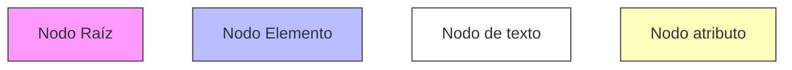
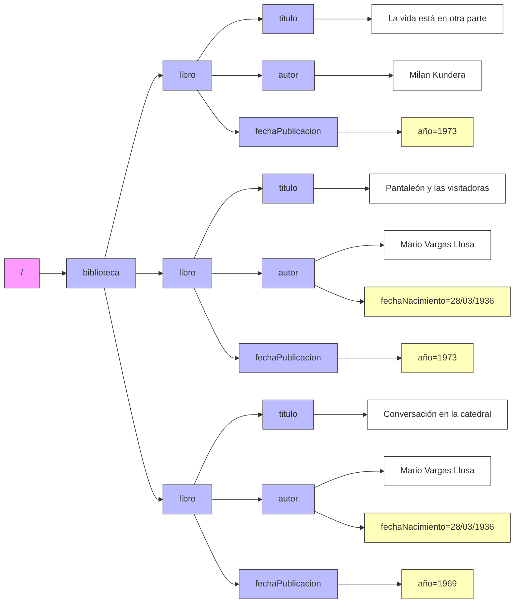
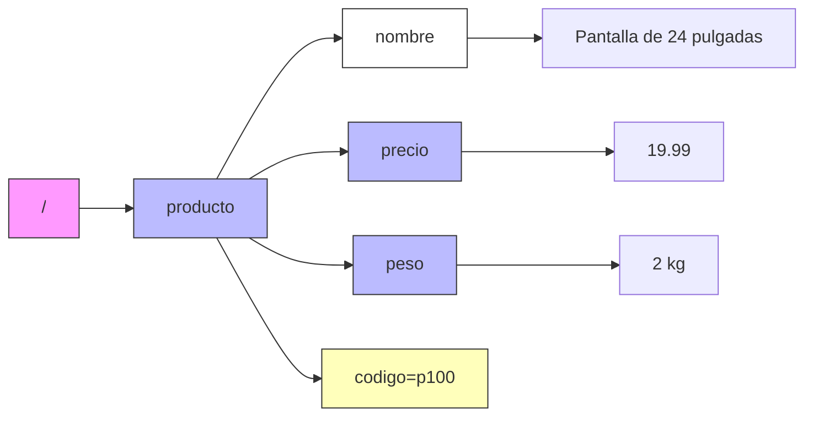
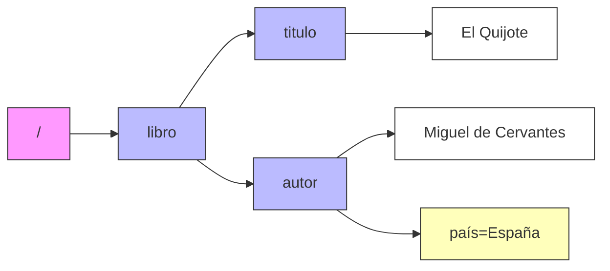
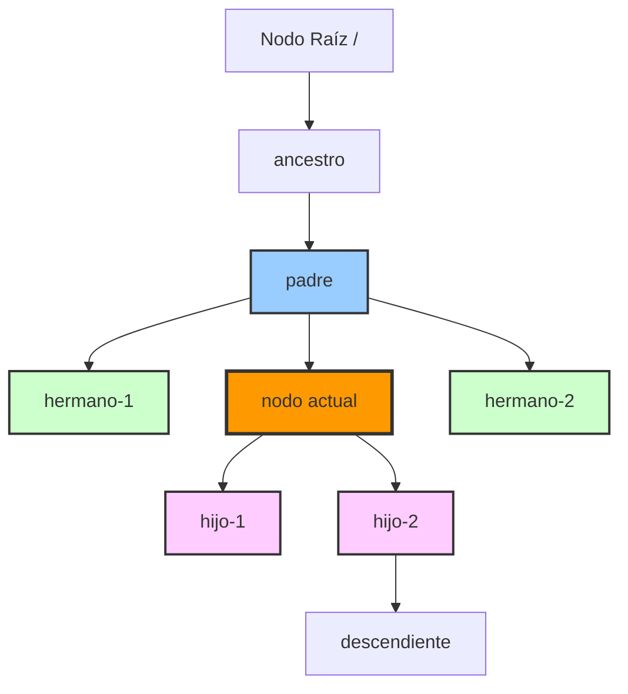

# Terminología básica de XPath

Para entender mejor XPath, es importante conocer la terminología que se utiliza en este estándar: nodo, ítem, relaciones...

## Nodos

Un documento XML tiene una estructura de **árbol**: un elemento raíz que contiene hijos que, a su vez, contienen otros hijos. A su vez, cada elemento puede tener atributos y/o contenido textual. XPath trata los documentos XML como un árbol de nodos. Dentro de este árbol, podemos diferenciar [diferentes tipos de nodos](https://www.w3.org/TR/1999/REC-xpath-19991116/#data-model) según su localización en el documento.

Consideremos el siguiente documento XML:

```xml
<?xml version="1.0" encoding="UTF-8"?>
<biblioteca>
  <libro>
    <titulo>La vida está en otra parte</titulo>
    <autor>Milan Kundera</autor>
    <fechaPublicacion año="1973"/>
  </libro>
  <libro>
    <titulo>Pantaleón y las visitadoras</titulo>
    <autor fechaNacimiento="28/03/1936">Mario Vargas Llosa</autor>
    <fechaPublicacion año="1973"/>
  </libro>
  <libro>
    <titulo>Conversación en la catedral</titulo>
    <autor fechaNacimiento="28/03/1936">Mario Vargas Llosa</autor>
    <fechaPublicacion año="1969"/>
  </libro>
</biblioteca>
```

Su representación en forma de árbol puede ser la siguiente:





Como se puede observar en el árbol, no todos los nodos son iguales. En los siguientes apartados se describen los diferentes tipos de nodos que XPath puede encontrar en un documento XML.

### Nodo raíz

El nodo raíz (root node) encapsula un documento XML. Características:

- No puede tener nodos padre.
- Puede tener cero o más nodos hijo.
- Los nodos hijo puede contener nodos de elemento, de texto, de instrucción o de comentario.
- Para ser un documento bien formado, el nodo de documento debe tener exactamente un nodo elemento hijo y ningún nodo texto hijo.

Las propiedades de un nodo raíz son:

- `children`
- `string`

Consideremos el siguiente documento XML:

```xml
<producto codigo="p100">
  <nombre>Pantalla de 24 pulgadas</nombre>
  <precio>19.99</precio>                                       
  <peso>2 kg</peso> 
</producto>
```

El documento XML anterior se podría representar de la siguiente forma:



En el árbol de nodos, el nodo raíz es el que está representado por `/`. Los valores de las propiedades del ejemplo anterior son los siguientes:

| Propiedad | |Valor | Tipo |
|-----------|-------|-------|------|
| children | <producto> | Nodo elemento |
| string | Pantalla de 24 pulgadas19.992kg | xs:string |

En este caso, los hijos directos del nodo raíz es uno solo: <producto>. Por otro lado, el valor de la propiedad string es la concatenación de todas las cadenas de caracteres de los nodos hijo.

:::warning[XPATH Y XML]

El término nodo raíz en XPath no coincide con el utilizado el XML, ya que en XML el nodo raíz sería <producto>. Sin embargo, en XPath, <producto> sería un hijo del nodo raíz.

:::

### Nodo elemento

Un nodo elemento (*element node*) representa un elemento XML. Características:

- Tiene un nombre (el nombre de la etiqueta).
- Puede tener cero o más nodos hijo (que pueden ser nodos elemento, texto, comentario o instrucción de proceso).
- Pueden tener identificadores únicos (en forma de atributo), lo que permite referenciarlos de forma mucho más directa. Para ello, es necesario que el atributo esté definido en un DTD o un XSD asociado.
- Tiene un nodo padre que puede ser el nodo raíz o un nodo elemento.

Las propiedades de un nodo elemento son:

- `name`: el nombre de la etiqueta
- `children`: los nodos hijo
- `attributes`: los atributos del elemento
- `string`: el contenido textual del elemento y sus descendientes

Consideremos el siguiente documento XML:

```xml
<libro>
  <titulo>El Quijote</titulo>
  <autor país="España">Miguel de Cervantes</autor>
</libro>
```

El árbol de nodos sería:



En este caso, `<libro>`, `<titulo>` y `<autor>` son nodos elemento. El nodo `<autor>` tiene un atributo `país`.

### Nodo atributo

Un nodo atributo (*attribute node*) representa un atributo de un elemento XML. Características:

- Tiene un **nombre** (el nombre del atributo).
- Tiene un valor de cadena.
- Tiene un nodo padre (que es siempre un nodo elemento, el que lo contiene).
- No puede tener nodos hijo.

Las propiedades de un nodo atributo son:

- `node`: el nombre del atributo
- `parent`: el nodo elemento que contiene el atributo
- `type`: el tipo de dato del atributo (si está definido en un DTD o XSD)
- `string`: el valor del atributo como cadena

Consideremos el siguiente documento XML:

```xml
<producto codigo="p100">Pantalla de 24 pulgadas</producto>
```

Los valores de las propiedades del nodo atributo `codigo` serían los siguientes:

| Propiedad | Valor |
|-----------|-------|
| node      | `codigo` |
| parent    | `<producto>` |
| type      | `xs:untypedAtomic`|
| string    | `p100`  |

Nótese que para `type`, al no estar definido en un DTD o XSD, el tipo por defecto es `xs:untypedAtomic`. En caso de estar definido, el valor sería el tipo correspondiente (por ejemplo, `xs:string`).

### Nodo de espacio de nombres

Un nodo de espacio de nombres (*namespace node*) representa una declaración de espacio de nombres en un elemento XML. Características:

- Tiene un prefijo (que puede ser vacío para el espacio de nombres por defecto).
- Tiene un URI que identifica el espacio de nombres.
- Tiene un nodo padre que es siempre un nodo elemento.
- No puede tener nodos hijo.

Las propiedades de un nodo de espacio de nombres son:

- `prefix`: el prefijo del espacio de nombres (puede ser vacío)
- `uri`: la URI del espacio de nombres

Consideremos el siguiente documento XML:

```xml
<?xml version="1.0"?>
<elemento xmlns="http://www.ejemplo.es/base"
          xmlns:xs="http://www.w3.org/2001/XMLSchema">
  <subelemento>Contenido</subelemento>
</elemento>
```

En este documento se declaran dos espacios de nombres: uno por defecto y otro con el prefijo `xs`.

### Nodo de instrucción de procesos

Un nodo de instrucción de procesos (*processing instruction node*) representa una instrucción de procesamiento en un documento XML. Características:

- Tiene un nombre objetivo (*target*) que identifica la aplicación a la que va dirigida la instrucción.
- Tiene un contenido que es una cadena de caracteres.
- Puede tener un nodo padre que es el nodo raíz o un nodo elemento.
- No puede tener nodos hijo.

Las propiedades de un nodo de instrucción de procesos son:

- `target`: el objetivo de la instrucción de procesamiento
- `content`: el contenido de la instrucción
- `string`: el contenido de la instrucción como cadena

Consideremos el siguiente documento XML:

```xml
<?xml version="1.0"?>
<?xml-stylesheet type="text/xsl" href="estilo.xsl"?>
<documento>
  <contenido>Ejemplo</contenido>
</documento>
```

La línea `<?xml-stylesheet type="text/xsl" href="estilo.xsl"?>` es una instrucción de procesamiento con objetivo `xml-stylesheet`. En este caso, las propiedades del nodo de instrucción de procesos serían:

| Propiedad | Valor |
|-----------|-------|
| target    | `xml-stylesheet` |
| content   | `type="text/xsl" href="estilo.xsl"` |
| string    | `type="text/xsl" href="estilo.xsl"` |

### Nodo de comentario

Un nodo de comentario (comment node) representa un comentario en un documento XML. Características:

- Contiene una cadena de caracteres que es el texto del comentario.
- Puede tener un nodo padre que es el nodo raíz o un nodo elemento.
- No puede tener nodos hijo.

Las propiedades de un nodo de comentario son:

- `content`: el contenido del comentario
- `parent`: el nodo padre del comentario

Consideremos el siguiente documento XML:

```xml
<?xml version="1.0"?>
<documento>
  <!-- Este es un comentario importante -->
  <contenido>Ejemplo</contenido>
</documento>
```

La línea `<!-- Este es un comentario importante -->` es un nodo de comentario. En este caso, las propiedades del nodo de comentario serían:

| Propiedad | Valor |
|-----------|-------|
| content   | `Este es un comentario importante` |
| parent    | `<documento>` |

### Nodo de texto

Un nodo de texto (*text node*) representa contenido textual en un documento XML. En un elemento, el texto es aquel contenido que está entre la etiqueta de apertura y la etiqueta de cierre. Características:

- Contiene una cadena de caracteres que puede incluir caracteres de espacios en blanco.
- Tiene un nodo padre que es siempre un nodo elemento.
- No puede tener nodos hijo.
- Dos nodos de texto consecutivos se combinan en uno solo durante el procesamiento.

Las propiedades de un nodo de texto son:

- `content`: el contenido textual del nodo
- `parent`: el nodo elemento que contiene el texto

Consideremos el siguiente documento XML:

```xml
<?xml version="1.0"?>
<libro>
  <titulo>Don Quijote</titulo>
  <autor>Miguel de Cervantes</autor>
</libro>
```

En este documento:

- "Don Quijote" es un nodo de texto hijo de `<titulo>`.
- "Miguel de Cervantes" es un nodo de texto hijo de `<autor>`. 

Para el nodo de texto "Don Quijote", las propiedades serían:

| Propiedad | Valor |
|-----------|-------|
| content   | `Don Quijote` |
| parent    | `<titulo>` |

:::info[Espacios en blanco]

Los espacios en blanco entre elementos (como saltos de línea e indentación) también son considerados nodos de texto en XPath, aunque muchas aplicaciones los ignoran dependiendo de la configuración.
:::

## Ítems

En XPath, un **ítem** (*item*) es la unidad básica de información que puede ser procesada. Existen dos tipos principales de ítems:

1. **Nodos**: Cualquiera de los siete tipos de nodos descritos anteriormente (raíz, elemento, atributo, espacio de nombres, instrucción de procesamiento, comentario y texto).

2. **Valores atómicos**: Valores simples como números, cadenas, booleanos o fechas que no son nodos.

Por ejemplo, en la expresión `count(//libro)`, el resultado es un valor atómico (un número), mientras que en la expresión `//libro`, el resultado es una secuencia de nodos elemento.

Una **secuencia** (*sequence*) es una colección ordenada de cero o más ítems. Las secuencias pueden contener nodos, valores atómicos o una combinación de ambos. Por ejemplo:

- `//libro/titulo` devuelve una secuencia de nodos elemento `<titulo>`.
- `(1, 2, 3, 4, 5)` es una secuencia de valores atómicos numéricos.
- `(//libro, "texto", 42)` es una secuencia mixta que contiene nodos, una cadena y un número.

:::tip[Diferencia entre nodo e ítem]
Todo nodo es un ítem, pero no todo ítem es un nodo. Los valores atómicos son ítems pero no son nodos.
:::

## Relaciones entre nodos

En la estructura jerárquica de un documento XML, los nodos mantienen diferentes relaciones entre sí. Comprender estas relaciones es fundamental para navegar por el documento usando XPath.

### Padre (Parent)

Un nodo **padre** es aquel que contiene directamente a otro nodo. Cada nodo (excepto el nodo raíz) tiene exactamente un nodo padre.

```xml
<biblioteca>
  <libro>
    <titulo>Don Quijote</titulo>
  </libro>
</biblioteca>
```

En este ejemplo:

- `<biblioteca>` es el padre de `<libro>`.
- `<libro>` es el padre de `<titulo>`.
- `<titulo>` es el padre del nodo de texto "Don Quijote".

### Hijo (Children)

Los **hijos** son nodos contenidos directamente por otro nodo. Un nodo puede tener cero, uno o múltiples hijos.

```xml
<libro>
  <titulo>El Quijote</titulo>
  <autor>Cervantes</autor>
  <año>1605</año>
</libro>
```

En este ejemplo, `<titulo>`, `<autor>` y `<año>` son hijos de `<libro>`.

### Hermanos (Siblings)

Los **hermanos** son nodos que comparten el mismo nodo padre. Se distinguen dos tipos:

- **Hermanos siguientes** (*following-siblings*): nodos hermanos que aparecen después en el documento.
- **Hermanos precedentes** (*preceding-siblings*): nodos hermanos que aparecen antes en el documento.

```xml
<biblioteca>
  <libro id="1">...</libro>
  <libro id="2">...</libro>
  <libro id="3">...</libro>
</biblioteca>
```

Para el `<libro id="2">`:

- `<libro id="1">` es un hermano precedente.
- `<libro id="3">` es un hermano siguiente.

### Ancestros (Ancestors)

Los **ancestros** de un nodo son su padre, el padre de su padre, y así sucesivamente hasta llegar al nodo raíz.

```xml
<biblioteca>
  <seccion>
    <libro>
      <titulo>Don Quijote</titulo>
    </libro>
  </seccion>
</biblioteca>
```

Para el nodo `<titulo>`, los ancestros son:

- `<libro>` (padre)
- `<seccion>` (abuelo)
- `<biblioteca>` (bisabuelo)
- El nodo raíz `/`

### Descendientes (Descendants)

Los **descendientes** de un nodo son sus hijos, los hijos de sus hijos, y así sucesivamente.

```xml
<biblioteca>
  <libro>
    <titulo>Don Quijote</titulo>
    <autor>
      <nombre>Miguel</nombre>
      <apellido>Cervantes</apellido>
    </autor>
  </libro>
</biblioteca>
```

Para el nodo `<biblioteca>`, los descendientes son:

- `<libro>`
- `<titulo>` y el texto "Don Quijote"
- `<autor>`
- `<nombre>` y el texto "Miguel"
- `<apellido>` y el texto "Cervantes"

### Resumen de relaciones


