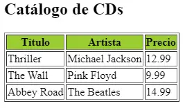
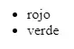

# Introducción a los elementos XSLT

Dentro de una hoja XLST podemos distinguir los siguientes tres elementos:

- **Elementos XSLT**: se utilizan para definir las **reglas de transformación XSLT**. Están precedidos del prefijo `xsl:` y pertenecen al espacio de nombres `xsl`. Están definidos en el estándar del lenguaje y son interpretados por cualquier procesador XSLT.
- **Elementos LRE (Literal Result Element)**: un elemento de resultado literal es un elemento que no pertenece a XSLT, sino que se repite literalmente en la salida.
- **Elementos de extensión**: al igual que los anteriores, no pertenecen al espacio de nombres `xsl` ya que son manejados por implementaciones concretas del procesador. Estos normalmente no son usados.

## Elemento XSLT raíz

Una hoja XSL puede tener dos tipos de elementos XSLT raíz:

- `stylesheet`
- `transform`

Ambos elementos son **equivalentes** y **no pueden aparecer simultáneamente** (ya que no es posible tener más de un elemento raíz).

## Tipos de elementos

Los elementos XSLT que aparecen dentro del elemento XSLT raíz se pueden dividir en dos tipos:

- **Elementos de nivel superior**: son hijos directos de stylesheet o transform.
- **Instrucciones**: están contenidas dentro de elementos de nivel superior.

## Elementos de Nivel Superior

### `stylesheet` / `transform`

**Categoría**: Elemento raíz

Son los elementos raíz de una hoja XSLT. Ambos son equivalentes y definen el contenedor principal de la transformación. El elemento `stylesheet` es más antiguo, mientras que `transform` es la nomenclatura moderna.

**Atributos principales**:

- `version`: versión de XSLT (obligatorio, p. ej., "1.0", "2.0")
- `xmlns:xsl`: declaración del espacio de nombres XSLT
- `exclude-result-prefixes`: prefijos a excluir del resultado

**Ejemplo**:

```xml
<xsl:stylesheet version="1.0" xmlns:xsl="http://www.w3.org/1999/XSL/Transform">
  <!-- Contenido de la hoja XSLT -->
</xsl:stylesheet>
```

Cuando un elemento `stylesheet`o `transform`está vacío, la transformación consiste en la extracción de todos los datos de los nodos del documento XML de entrada, copiándolos tal cual al documento de salida (los atributos no se copian). Por ejemplo, para el siguiente documento XML de entrada:

```xml
<libros>
  <libro>
    <titulo>Aprendiendo XSLT</titulo>
    <autor>Juan Pérez</autor>
  </libro>
  <libro>
    <titulo>XML Avanzado</titulo>
    <autor>Ana Gómez</autor>
  </libro>
</libros>
```

La transformación con una hoja XSLT vacía produciría el siguiente documento de salida:

```xml
<?xml version="1.0" encoding="UTF-8"?>
  
    Aprendiendo XSLT
    Juan Pérez
  
  
    XML Avanzado
    Ana Gómez
  
```

Como podemos ver, el documento de salida está formado por la declaración XML seguida del contenido de los nodos del documento de entrada, sin etiquetas ni atributos (se respetan incluso los espacios en blanco y saltos de línea).

### `output`

Define las características del documento de salida (formato, codificación, etc.). Controla cómo se genera el resultado de la transformación. Al ser un elemento de nivel superior, debe ir como hijo directo del elemento raíz (`stylesheet` o `transform`).

**Atributos principales**:

- `method`: tipo de salida ("xml", "html", "text"). Por defecto, el valor es `"xml"`.
- `version`: versión del formato de salida (p. ej., "1.0" para XML). solo aplicable si `method="xml"` o `method="html"`
- `encoding`: codificación del documento (p. ej., "UTF-8")
- `indent`: sangrado automático ("yes" o "no")
- `omit-xml-declaration`: omitir declaración XML ("yes" o "no" (por defecto "no"))
- `standalone`: valor del atributo `standalone` en la declaración XML de salida ("yes" o "no")
- `doctype-public` y `doctype-system`: permite establecer el valor del atributo `PUBLIC` y `SYSTEM` de la declaración DOCTYPE en el documento de salida (solo aplicable si `method="xml"` o `method="html"`)
- `cdata-section-elements`: lista de elementos cuyos contenidos deben ser tratados como secciones CDATA en la salida
- `indent`: especifica si el resultado debe estar indentado para mejorar su legibilidad ("yes" o "no")
- `media-type`: especifica el tipo MIME del documento de salida (p. ej., "text/xml", "text/html")

Todos los atributos son **opcionales**.

#### Ejemplos

Un ejemplo de uso de `xsl:output` para generar un documento XML con codificación UTF-8, con sangrado y sin omitir la declaración XML sería:

```xml
<xsl:stylesheet version="2.0" xmlns:xsl="http://www.w3.org/1999/XSL/Transform">
  <xsl:output method="xml" encoding="UTF-8" indent="yes" omit-xml-declaration="no"/>
  <!-- Resto de la hoja XSLT -->
</xsl:stylesheet>
```

Otro ejemplo para obtener un documento `HTML` con codificación `ISO-8859-1`, sin sangrado y omitiendo la declaración XML sería:

```xml
<xsl:stylesheet version="2.0" xmlns:xsl="http://www.w3.org/1999/XSL/Transform">
  <xsl:output method="html" encoding="ISO-8859-1" indent="no" omit-xml-declaration="yes"/>
  <!-- Resto de la hoja XSLT -->
</xsl:stylesheet>
```

Para obtener un documento de texto plano, se podría usar:

```xml
<xsl:stylesheet version="2.0" xmlns:xsl="http://www.w3.org/1999/XSL/Transform">
  <xsl:output method="text" encoding="UTF-8"/>
  <!-- Resto de la hoja XSLT -->
</xsl:stylesheet>
```

### `import`

Importa las reglas y definiciones de otra hoja XSLT. Las reglas importadas tienen menor prioridad que las de la hoja principal. Debe aparecer al principio de la hoja.

**Atributos principales**:

- `href`: ruta del archivo XSLT a importar

**Ejemplo**:

```xml
<xsl:import href="comunes.xsl"/>
```

:::note
Existe también `xsl:include`, que funciona de forma similar pero las reglas incluidas tienen la misma prioridad que las locales.
:::

### `template`

Define una plantilla de transformación que se aplica a nodos específicos del documento XML de entrada. Es uno de los elementos más importantes en XSLT.

La estructura básica de una plantilla es:

```xml
<xsl:template match="expresión_xpath" name="nombre_plantilla" mode="modo" priority="prioridad">
  <!-- Contenido de la plantilla -->
</xsl:template>
```

**Atributos principales**:

- `match`: expresión **XPath** para identificar los nodos (p. ej., "//libro")
- `name`: nombre de la plantilla (para llamadas directas)
- `mode`: modo para diferenciar múltiples plantillas para el mismo nodo
- `priority`: prioridad de la plantilla

**Ejemplo**:

```xml
<xsl:template match="//libro">
  <libro>
    <titulo><xsl:value-of select="titulo"/></titulo>
  </libro>
</xsl:template>
```

En este ejemplo, la plantilla se aplica a todos los nodos `<libro>` del documento de entrada y genera un nuevo elemento `<libro>` en la salida con solo el título. De esta forma, para un documento de entrada como:

```xml
<libros>
  <libro>
    <titulo>Aprendiendo XSLT</titulo>
    <autor>Juan Pérez</autor>
  </libro>
  <libro>
    <titulo>XML Avanzado</titulo>
    <autor>Ana Gómez</autor>
  </libro>
</libros>

```

La salida generada sería:

```xml
<libro>
  <titulo>Aprendiendo XSLT</titulo>
</libro>
<libro>
  <titulo>XML Avanzado</titulo>
</libro>
```

#### Seleccionar el elemento raíz

Uno de los usos más comunes de `xsl:template` es definir una plantilla para el nodo raíz del documento XML de entrada. Esto se hace utilizando la expresión XPath `/` en el atributo `match`. Por ejemplo:

```xml
<?xml version="1.0" encoding="UTF-8"?>
<xsl:stylesheet version="2.0 xmlns:xsl="http://www.w3.org/1999/XSL/Transform">
  <xsl:output method="html" encoding="UTF-8" indent="yes"/>

  <xsl:template match="/">
    <html>
      <head>
        <title>Mi Documento Transformado</title>
      </head>
      <body>
        <h1>Contenido del Documento</h1>
        <xsl:apply-templates/>
      </body>
    </html>
  </xsl:template>
</xsl:stylesheet>
```

Con esta plantilla, al procesar cualquier documento XML, se generará una estructura HTML básica con un título y un encabezado, y luego se aplicarán las plantillas a los nodos hijo del nodo raíz.

#### Seleccionar un único elemento

Veamos qué ocurre cuando creamos un template que solo selecciona un elemento (de varios) de un documento XML. Por ejemplo:

```xml
<?xml version="1.0" encoding="UTF-8"?>
<xsl:stylesheet version="2.0" xmlns:xsl="http://www.w3.org/1999/XSL/Transform">
  <xsl:output method="text"/>
  <xsl:template match="direccion"></xsl:template>
</xsl:stylesheet>
```

Consideremos que tenemos el siguiente documento XML:

```xml
<?xml version="1.0" encoding="UTF-8"?>
<?xml-stylesheet type="text/xsl" href="508.xsl"?>
<agenda>
  <persona id="p01">
    <identificadores>
      <nombre>Inés</nombre>
      <apellidos>López Pérez</apellidos>
    </identificadores>
    <direccion>
      <calle>El Ranchito 24, 6B</calle>
      <localidad>Santander</localidad>
      <cp>39006</cp>
    </direccion>
    <telefonos>
      <movil>970123123</movil>
    </telefonos>
  </persona>
</agenda>
```

En ese caso, la transformación XSLT daría como resultado un documento de texto:

```xml

  
    
      Inés
      López Pérez
    
    
    
      970123123
    
  

```

Podemos observar como solo se muestra el contenido del elemento `identificadores` y `telefonos` (con espacios en blanco). Estos se muestran porque no tienen ninguna plantilla asociada. Sin embargo, no ocurre lo mismo con `direccion`, la cual si que tiene una plantilla definida, aunque no tiene ningún elemento en su interior que permita dar formato al contenido del elemento. Es por eso que no se muestra ningún contenido.

Como podemos apreciar, si no existe ninguna plantilla a un elemento concreto, por defecto, se va a mostrar su contenido.

#### Prioridad de plantillas

Si tenemos varios `template`donde su selección uno de ellos contiene al otro, se tendrá en cuenta aquel template cuyo elemento seleccionado está más próximo al nodo raíz.

Por ejemplo, tenemos los siguientes `template`:

```xml
<?xml version="1.0" encoding="UTF-8"?>
<xsl:stylesheet version="2.0" xmlns:xsl="http://www.w3.org/1999/XSL/Transform">
  <xsl:output method="text" />
  <xsl:template match="cd">
    <xsl:value-of select="titulo"/>
    <xsl:value-of select="artista"/>
  </xsl:template>
  <xsl:template match="titulo">TÍTULO</xsl:template>
</xsl:stylesheet>
```

Considerando el siguiente documento XML:

```xml
<?xml version="1.0" encoding="UTF-8"?>
<?xml-stylesheet type="text/xsl" href="hoja.xsl"?>
<catalogo>
  <cd>
    <titulo>Thriller</titulo>
    <artista>Michael Jackson</artista>
  </cd>
  <cd>
    <titulo>The Wall</titulo>
    <artista>Pink Floyd</artista>
  </cd>
  <cd>
    <titulo>Abbey Road</titulo>
    <artista>The Beatles</artista>
  </cd>
</catalogo>
```

En este caso, la salida generada sería:

```xml

  ThrillerMichael Jackson
  The WallPink Floyd
  Abbey RoadThe Beatles

```

Podemos observar que no se incluye el texto `TÍTULO` en la salida, ya que la plantilla que selecciona el elemento `cd` tiene mayor prioridad que la plantilla que selecciona el elemento `titulo`, ya que `cd` está más próximo al nodo raíz.

### `decimal-format`

Define el formato de números decimales para la función `format-number()`. Permite personalizar separadores de miles, decimales, etc.

**Atributos principales**:

- `name`: nombre del formato
- `decimal-separator`: carácter separador decimal (defecto: ".")
- `grouping-separator`: carácter separador de miles (defecto: ",")
- `infinity`: cadena para representar infinito (defecto: "Infinity")
- `minus-sign`: carácter para el signo negativo (defecto: "-")
- `NaN`: cadena para representar "Not a Number" (defecto: "NaN")
- `percent`: carácter para el símbolo de porcentaje (defecto: "%")
- `per-mille`: carácter para el símbolo de por mil (defecto: "‰")
- `zero-digit`: carácter para el dígito cero (defecto: "0")
- `digit`: carácter comodín para dígitos (defecto: "#")
- `pattern-separator`: carácter para separar patrones positivo y negativo (defecto: ";")

**Ejemplo**:

```xml
<xsl:decimal-format 
  name="string" 
  decimal-separator="char" 
  grouping-separator="char" 
  infinity="string" 
  minus-sign="char" 
  NaN="string" 
  percent="char" 
  per-mille="char" 
  zero-digit="char" 
  digit="char"
  pattern-separator="char"
/>
```

Todos los atributos son opcionales.

#### Función `format-number()`

La función `format-number()` se utiliza para formatear números según un patrón específico y un formato decimal definido con `xsl:decimal-format`. Su sintaxis es:

```xml
format-number(number, pattern, [format-name])
```

- `number`: el número que se desea formatear.
- `pattern`: una cadena que define el formato deseado (p. ej., "#,##0.00").
- `format-name` (opcional): el nombre del formato decimal definido con `xsl:decimal-format`.
  
**Ejemplo de uso**:

```xml
<xsl:decimal-format name="miFormato" decimal-separator="," grouping-separator="."/>

<xsl:value-of select="format-number(1234567.89, '#,##0.00', 'miFormato')"/>
```

En este ejemplo, el número `1234567.89` se formatearía como `1.234.567,89` utilizando el formato decimal personalizado definido.

Más adelante veremos cómo utilizar esta función dentro de una plantilla XSLT.

### `attribute-set`

Define conjuntos de atributos reutilizables que se pueden aplicar a múltiples elementos.

**Atributos principales**:

- `name`: nombre del conjunto de atributos

**Ejemplo**:

```xml
<xsl:attribute-set name="estiloTitulo">
  <xsl:attribute name="class">titulo</xsl:attribute>
  <xsl:attribute name="style">color: blue;</xsl:attribute>
</xsl:attribute-set>
```

## Instrucciones (Elementos de Control)

Las instrucciones son elementos XSLT que controlan el flujo de la transformación y manipulan los datos. A continuación se describen las instrucciones más comunes

### `call-template`

Llama a una plantilla por nombre, pasándole parámetros. Permite reutilizar bloques de transformación. El funcionamiento de un `call-template`es similar al de una función en otros lenguajes de programación tradicionales.

La estructura básica de un `call-template` es:

```xml
<xsl:call-template name="nombre_plantilla">
  <xsl:with-param name="nombre_parametro" select="valor"/>
</xsl:call-template>
```

**Atributos principales**:

- `name`: nombre de la plantilla a llamar (obligatorio)

Cuando se utiliza `call-template`, es necesario que exista un elemento `xsl:template` definido con el mismo nombre. Además, si la plantilla acepta parámetros, estos deben ser pasados utilizando `xsl:with-param`.

Por ejemplo:

```xml
<xsl:stylesheet version="2.0" xmlns:xsl="http://www.w3.org/1999/XSL/Transform">
  <xsl:template match="/">
    <xsl:call-template name="nombre-plantilla"/>
  </xsl:template>
  <xsl:template name="nombre-plantilla">
    Contenido
  </xsl:template>
</xsl:stylesheet>
```

En cualquier caso, un `template` con un atributo `name` solo puede ser invocado mediante `call-template`, y no se aplicará automáticamente a ningún nodo del documento de entrada.

#### Atributos de `call-template`

El único atributo obligatorio de `xsl:call-template` es `name`. El uso de `with-param` es opcional y solo se incluye cuando la plantilla destino define parámetros.

**Ejemplo**:

```xml
<xsl:call-template name="formatoTitulo">
  <xsl:with-param name="texto" select="titulo"/>
</xsl:call-template>
```

Un ejemplo de uso completo de `call-template` junto con `param` y `with-param` sería:

```xml
<xsl:stylesheet version="2.0" xmlns:xsl="http://www.w3.org/1999/XSL/Transform">
  <xsl:template match="/">
    <xsl:call-template name="formatoTitulo">
      <xsl:with-param name="texto" select="/libro/titulo"/>
    </xsl:call-template>
  </xsl:template>
  <xsl:template name="formatoTitulo">
    <xsl:param name="texto"/>
    <h1><xsl:value-of select="$texto"/></h1>
  </xsl:template>
</xsl:stylesheet>
```

Dado un documento XML de entrada como:

```xml
<libro>
  <titulo>Aprendiendo XSLT</titulo>
</libro>
```

La salida generada sería:

```xml
<h1>Aprendiendo XSLT</h1>
```

### `apply-templates`

**Descripción**:

Aplica plantillas a los nodos hijo del contexto actual. Es el mecanismo principal para procesar recursivamente el árbol XML.

**Atributos principales**:

- `select`: expresión XPath para seleccionar nodos (defecto: nodos hijo). Mediante un asterisco (`*`) se seleccionan todos los nodos hijo. Si el atributo no se especifica, se aplican las plantillas a todos los nodos hijo del nodo actual.
- `mode`: modo de la plantilla a aplicar (opcional)

Podemos **especificar el orden** en el que van a **ser procesados los nodos** mediante el elemento `sort`. Si no lo hacemos de este modo, se aplicarán en el orden utilizado por el intérprete al leer el documento XML, es decir, de arriba hacia abajo.

```xml
<xsl:apply-templates select="expresion-xpath">
  <xsl:sort select="elemento">
</xsl:apply-templates>
```

Un ejemplo completo sería el siguiente:

```xml
<?xml version="1.0" encoding="UTF-8"?>
<xsl:stylesheet version="2.0" xmlns:xsl="http://www.w3.org/1999/XSL/Transform">
  <xsl:template match="/">
    <html>
      <body>
        <h2>Catálogo de CDs</h2>
        <table border="1">
          <tr bgcolor="#9acd32">
            <th>Título</th>
            <th>Artista</th>
            <th>Precio</th>
          </tr>
          <xsl:apply-templates select="catalogo/cd"/>
        </table>
      </body>
    </html>
  </xsl:template>
  <xsl:template match="cd">
    <tr>
      <td><xsl:value-of select="titulo"/></td>
      <td><xsl:value-of select="artista"/></td>
      <td><xsl:value-of select="precio"/></td>
    </tr>
  </xsl:template>
</xsl:stylesheet>
```

En este caso, podemos ver dos elementos `template`:

- Uno que tiene como `match` la raíz.
- Otro que tiene como `match` los elementos `cd`.
Por lo tanto, el documento final tendrá como base el código contenido dentro del primer `template` y los elementos `cd` se mostrarán formateados conforme al segundo `template`.

Si no se utiliza el elemento `apply-templates`, solo se mostraría el código del primer `template` ya que el primero contiene el segundo.

Consideremos que tenemos el siguiente documento XML:

```xml
<?xml version="1.0" encoding="UTF-8"?>
<?xml-stylesheet type="text/xsl" href="hoja.xsl"?>
<catalogo>
  <cd>
    <titulo>Thriller</titulo>
    <artista>Michael Jackson</artista>
    <precio>12.99</precio>
  </cd>
  <cd>
    <titulo>The Wall</titulo>
    <artista>Pink Floyd</artista>
    <precio>9.99</precio>
  </cd>
  <cd>
    <titulo>Abbey Road</titulo>
    <artista>The Beatles</artista>
    <precio>14.99</precio>
  </cd>
</catalogo>
```

En ese caso, la transformación XSLT daría como resultado un documento HTML:

```html
<!DOCTYPE html>
<html>
  <body>
    <h2>Catálogo de CDs</h2>
    <table border="1">
      <tr bgcolor="#9acd32">
        <th>Título</th>
        <th>Artista</th>
        <th>Precio</th>
      </tr>
      <tr>
        <td>Thriller</td>
        <td>Michael Jackson</td>
        <td>12.99</td>
      </tr>
      <tr>
        <td>The Wall</td>
        <td>Pink Floyd</td>
        <td>9.99</td>
      </tr>
      <tr>
        <td>Abbey Road</td>
        <td>The Beatles</td>
        <td>14.99</td>
      </tr>
    </table>
  </body>
</html>
```

El documento HTML se visualizaría de la siguiente manera:



### `value-of`

El elemento `value-of` extrae el valor de texto de un nodo y lo añade al resultado. Realiza la conversión a string automáticamente. Su estructura básica es:

```xml
<xsl:value-of select="expresión_xpath" disable-output-escaping="yes|no"/>
```

**Atributos principales**:

- `select`: expresión XPath del nodo (obligatorio)
- `disable-output-escaping`: no escapar caracteres especiales ("yes" o "no")

**Ejemplo**:

Consideremos el siguiente documento XML de entrada:

```xml
<?xml version="1.0" encoding="UTF-8"?>
<?xml-stylesheet type="text/xsl" href="hoja.xsl"?>
<catalogo>
  <cd>
    <titulo>Thriller</titulo>
    <artista>Michael Jackson</artista>
  </cd>
  <cd>
    <titulo>The Wall</titulo>
    <artista>Pink Floyd</artista>
  </cd>
  <cd>
    <titulo>Abbey Road</titulo>
    <artista>The Beatles</artista>
  </cd>
</catalogo>
```

Haciendo uso de `xsl:value-of`, podemos extraer y mostrar los títulos de los CDs:

```xml
<?xml version="1.0" encoding="UTF-8"?>
<xsl:stylesheet version="2.0" xmlns:xsl="http://www.w3.org/1999/XSL/Transform">
  <xsl:template match="/">
    <html>
      <body>
        <h2>Colección de música</h2>
        <table border="1">
          <tr bgcolor="#9acd32">
            <th>Título</th>
            <th>Artista</th>
          </tr>
          <tr>
            <td>
              <xsl:value-of select="catalogo/cd/titulo" />
            </td>
            <td>
              <xsl:value-of select="catalogo/cd/artista" />
            </td>
          </tr>
        </table>
      </body>
    </html>
  </xsl:template>
</xsl:stylesheet>
```

Aquí combinamos `xsl:value-of` con `xsl:template match="/"` para extraer y mostrar los títulos y artistas de los CDs en una tabla HTML. En este caso, la transformación daría como resultado:

```html
<!DOCTYPE html>
<html>
  <body>
    <h2>Colección de música</h2>
    <table border="1">
      <tr bgcolor="#9acd32">
        <th>Título</th>
        <th>Artista</th>
      </tr>
      <tr>
        <td>Thriller</td>
        <td>Michael Jackson</td>
      </tr>
    </table>
  </body>
</html>
```

#### Contexto de la selección

Cuando se realiza una selección con el atributo match de template, el contexto actual es el del elemento seleccionado.

Consideremos el siguiente documento XML:

```xml
<?xml version="1.0" encoding="UTF-8"?>
<?xml-stylesheet type="text/xsl" href="hoja.xsl"?>
<agenda>
  <persona id="p01">
    <datos>
      <nombre>Inés</nombre>
      <apellidos>López Pérez</apellidos>
    </datos>
  </persona>
  <persona id="p02">
    <datos>
      <nombre>Roberto</nombre>
      <apellidos>Gutiérrez Gómez</apellidos>
    </datos>
  </persona>
</agenda>
```

Consideremos, ahora, la siguiente hoja XSL:

```xml
<?xml version="1.0" encoding="UTF-8"?>
<xsl:stylesheet xmlns:xsl="http://www.w3.org/1999/XSL/Transform" version="2.0">
  <xsl:output method="text" />

  <xsl:template match="persona">
    <xsl:value-of select="datos/apellidos"/>, <xsl:value-of select="datos/nombre"/>  
  </xsl:template>
</xsl:stylesheet>
```

En ese caso, la transformación XSLT daría como resultado el siguiente documento de texto:

```xml

  López Pérez, Inés
  Gutiérrez Gómez, Roberto

```

Cuando se utiliza `match="persona"`, las dos coincidencias que se encuentran son:

```xml
<persona id="p01">
  <datos>
    <nombre>Inés</nombre>
    <apellidos>López Pérez</apellidos>
  </datos>
</persona>
```

```xml
<persona id="p02">
  <datos>
    <nombre>Roberto</nombre>
    <apellidos>Gutiérrez Gómez</apellidos>
  </datos>
</persona>
```

En ambos casos, el contexto actual es `persona` y, por lo tanto, si utilizamos una expresión XPath relativa en el atributo `select` de `value-of`, esta considerará que el contexto actual es `persona`. Es por ello que se debe utilizar `datos/nombre` para obtener el nombre de cada persona.

### `variable`

El elemento `variable` define variables locales que se pueden usar dentro del contexto actual. Se pueden asignar tanto valores estáticos como dinámicos, empleando expresiones XPath. Son inmutables una vez asignadas.

La estructura es la siguiente:

```xml
<xsl:variable name="nombre_variable" select="expresión_xpath">
  <!-- Contenido alternativo si no se usa select -->
</xsl:variable>
```

**Atributos principales**:

- `name`: nombre de la variable (obligatorio)
- `select`: expresión XPath con el valor (alternativa a contenido). Es opcional; si no se usa, el valor se define mediante el contenido del elemento.

**Ejemplo**:

```xml
<xsl:variable name="precioBase" select="100"/>
<xsl:variable name="resultado">
  <valor><xsl:value-of select="$precioBase * 1.21"/></valor>
</xsl:variable>
```

En este ejemplo, se define una variable `precioBase` con un valor numérico y otra variable `resultado` que contiene un elemento XML con el valor calculado.

#### Tipos de variable

Existen dos tipos de variables:

- Variable **global**: es declarada como un elemento de nivel superior
- Variable **local**: es declarada dentro de un elemento template.

Una vez declarado el valor de una variable, no podrá ser modificado. Es decir, aunque se denomine variable, su comportamiento es como el de una **constante**.

```xml
<?xml version="1.0" encoding="UTF-8"?>
<xsl:stylesheet version="2.0" xmlns:xsl="http://www.w3.org/1999/XSL/Transform">
  
  <xsl:variable name="color1" select="'rojo'" /> <!-- global -->
  
  <xsl:template match="/">
    <xsl:variable name="color2" select='"verde"' /> <!-- local -->
  </xsl:template>

</xsl:stylesheet>
```

#### Atributro `select` con una cadena de texto

Si el atributo select contiene una cadena de texto (string):

- El elemento `variable` **no puede tener contenido**.
- El valor de la variable debe ir entre **comillas**.

A continuación, se muestran dos formas distintas de asignar el valor rojo a la variable color:

```xml
<xsl:variable name="color" select="'rojo'"/>
<xsl:variable name="color" select='"rojo"'/>
```

Los siguientes ejemplos son incorrectos y producirán un error:

```xml
<xsl:variable name="color" select="rojo"/> <!-- Sin comillas -->
<xsl:variable name="color" select="'rojo'">Contenido</xsl:variable> <!-- Con contenido -->
```

Un ejemplo de su uso sería el siguiente:

```xml
<?xml version="1.0" encoding="UTF-8"?>
<xsl:stylesheet version="2.0" xmlns:xsl="http://www.w3.org/1999/XSL/Transform">
  <xsl:variable name="color1" select="'rojo'" />
  <xsl:variable name="color2" select='"verde"' />
  
  <xsl:template match="/">
    <html>
      <body>
        <ul>
          <li><xsl:copy-of select="$color1"/></li>
          <li><xsl:copy-of select="$color2"/></li>
        </ul>
      </body>
    </html>
  </xsl:template>
</xsl:stylesheet>
```

Consideremos que tenemos el siguiente documento XML:

```xml
<?xml version="1.0" encoding="UTF-8"?>
<?xml-stylesheet type="text/xsl" href="hoja.xsl"?>
<catalogo></catalogo>
```

En ese caso, la transformación XSLT daría como resultado un documento HTML:

```html
<!DOCTYPE html>
<html>
   <body>
      <ul>
         <li>rojo</li>
         <li>verde</li>
      </ul>
   </body>
</html>
```

El documento HTML se visualizaría de la siguiente manera:



#### Omisión de contenido y del atributo select

Si el elemento `variable` es un elemento vacío (no tiene contenido) y solo contiene el atributo name, el valor de la variable será la de una cadena de texto vacía.

El siguiente ejemplo cumple con lo descrito:

```xml
<xsl:variable name="color" />
```

El código anterior sería equivalente al siguiente:

```xml
<xsl:variable name="color" select="''"/>
```

### `copy-of`

El elemento `copy-of` copia **nodos completos** del documento de entrada al resultado, incluyendo atributos e hijos.

**Atributos principales**:

- `select`: expresión XPath de los nodos a copiar (obligatorio)

**Ejemplo**:

```xml
<xsl:copy-of select="metadatos/*"/>
```

Serán copiados de forma automática:

- Los nodos que hacen referencia a namespaces.
- Los nodos hijos.
- Los atributos.

Algunos usos son de `copy-of` son:

- Copiar un elemento completo.
- Copiar el contenido de una variable definida previamente.

Un ejemplo completo de su uso sería el siguiente:

```xml
<?xml version="1.0" encoding="UTF-8"?>
<xsl:stylesheet version="2.0" xmlns:xsl="http://www.w3.org/1999/XSL/Transform">
  <xsl:variable name="cabecera">
    <tr bgcolor="#9acd32">
      <th>Título</th>
      <th>Artista</th>
    </tr>
  </xsl:variable>
  <xsl:template match="/">
    <html>
      <body>
        <h2>Colección de música</h2>
        <table border="1">
          <xsl:copy-of select="$cabecera" />
          <tr>
            <td>
              <xsl:value-of select="catalogo/cd/titulo" />
            </td>
            <td>
              <xsl:value-of select="catalogo/cd/artista" />
            </td>
          </tr>
        </table>
      </body>
    </html>
  </xsl:template>
</xsl:stylesheet>
```

En el ejemplo, definimos una variable `cabecera` que contiene una fila de tabla HTML con los encabezados "Título" y "Artista". Luego, utilizamos `xsl:copy-of` para copiar esa fila completa dentro de la tabla en la salida HTML. De esta manera, evitamos tener que repetir el código de la cabecera cada vez que queramos usarlo.

### `param`

El elemento `param` define parámetros de entrada en plantillas o en la hoja XSLT. Pueden tener valores por defecto. La sintaxis básica es:

```xml
<xsl:param name="nombre_parametro" select="valor_por_defecto">
  <!-- template content if no select is used -->
</xsl:param>
```

**Atributos principales**:

- `name`: nombre del parámetro (obligatorio)
- `select`: valor por defecto (opcional)
- Contenido alternativo si no se usa select

El elemento `param` puede ser introducido dentro de elementos `apply-template` o elementos `call-template`.

Un ejemplo completo de su uso sería el siguiente:

```xml
<?xml version="1.0" encoding="UTF-8"?>
<xsl:stylesheet version="2.0" xmlns:xsl="http://www.w3.org/1999/XSL/Transform">
  <xsl:template name="mostrar_titulo">
    <xsl:param name="titulo"/>
    <p>Título: <xsl:value-of select="$titulo"/></p>
  </xsl:template>
</xsl:stylesheet>
```

#### Tipos de parámetros

De forma muy similar que el elemento `variable`, existen dos tipos de parámetros:

- Parámetro **global**: es declarada como un elemento de nivel superior.
- Parámetro **local**: es declarada dentro de un elemento template.

```xml
<?xml version="1.0" encoding="UTF-8"?>
<xsl:stylesheet version="2.0" xmlns:xsl="http://www.w3.org/1999/XSL/Transform">

  <xsl:param name="titulo1"/> <!-- global -->
  
  <xsl:template name="mostrar_titulo">
    <xsl:param name="titulo2"/> <!-- local -->
  </xsl:template>
  
</xsl:stylesheet>
```

### `with-param`

El elemento `with-param` se utiliza para pasar parámetros a plantillas llamadas con `call-template` o `apply-templates`. Los valores se asignan a los parámetros definidos con `param`. La sintaxis básica es:

```xml
<xsl:with-param name="nombre_parametro" select="valor"/>
```

**Atributos principales**:

- `name`: nombre del parámetro (obligatorio)
- `select`: valor a pasar

:::warning[VALORES DE ATRIBUTOS `name`]

El valor del atributo `name` tiene que coincidir con el atributo `name` de un elemento `param`. En el caso de que no exista esa asociación, el elemento `with-param` será ignorado.

:::

Un ejemplo completo de su uso sería el siguiente:

```xml
<?xml version="1.0" encoding="UTF-8"?>
<xsl:stylesheet version="2.0" xmlns:xsl="http://www.w3.org/1999/XSL/Transform">
  <xsl:template match="/">
    <html>
      <body>
        <ul>
        <xsl:for-each select="catalogo/cd">
          <xsl:call-template name="mostrar-titulo">
            <xsl:with-param name="titulo" select="titulo" />
          </xsl:call-template>
        </xsl:for-each>
        </ul>
      </body>
    </html>
  </xsl:template>
  <xsl:template name="mostrar-titulo">
    <xsl:param name="titulo" />
    <li>Título: <xsl:value-of select="$titulo"/></li>
  </xsl:template>
</xsl:stylesheet>
```

En el xslt anterior, se define una plantilla llamada `mostrar-titulo` que acepta un parámetro `titulo`. Dentro del template principal (que coincide con la raíz), se itera sobre cada elemento `cd` en el catálogo y se llama a la plantilla `mostrar-titulo`, pasando el título de cada CD como parámetro. Ahora, si consideramos el siguiente documento XML:

```xml
<?xml version="1.0" encoding="UTF-8"?>
<?xml-stylesheet type="text/xsl" href="hoja.xsl"?>
<catalogo>
  <cd>
    <titulo>Thriller</titulo>
    <artista>Michael Jackson</artista>
  </cd>
  <cd>
    <titulo>The Wall</titulo>
    <artista>Pink Floyd</artista>
  </cd>
  <cd>
    <titulo>Abbey Road</titulo>
    <artista>The Beatles</artista>
  </cd>
</catalogo>
```

La transformación XSLT daría como resultado un documento HTML:

```xml
<!DOCTYPE html>
<html>
  <body>
    <ul>
      <li>Título: Thriller</li>
      <li>Título: The Wall</li>
      <li>Título: Abbey Road</li>
    </ul>
  </body>
</html>
```

### `attribute`

El elemento `attribute` crea un atributo en el elemento de salida. Se usa para generar atributos dinámicamente. Su estructura básica es:

```xml
<xsl:attribute name="nombre_atributo" namespace="URI">
  <!-- Contenido del atributo -->
</xsl:attribute>
```

**Atributos principales**:

- `name`: nombre del atributo (obligatorio)
- `namespace`: espacio de nombres del atributo (opcional)

Por ejemplo, para añadir un atributo `color` a un elemento `<pintura>`, se utilizaría el siguiente código:

```xml
<pintura>
  <xsl:attribute name="color"/>
</pintura>
```

El valor de un atributo se define en el contenido del elemento attribute:

```xml
<pintura>
  <xsl:attribute name="color">Rojo</xsl:attribute>
</pintura>
```

Opcionalmente, se puede obtener el valor mediante el elemento value-of:

```xml
<pintura>
  <xsl:attribute name="color">
    <xsl:value-of select="valor"/>
  </xsl:attribute> 
</pintura>
```

Si se añade un atributo a un elemento que tiene contenido, el elemento attribute debe ir en primer lugar:

```xml
<pintura>
  <xsl:attribute name="color">
    <xsl:value-of select="valor-atributo"/>
  </xsl:attribute>
  <xsl:value-of select="valor-elemento"/>
</pintura>
```

Es decir, lo siguiente sería incorrecto:

```xml
<pintura>
  <xsl:value-of select="valor-elemento"/>
  <xsl:attribute name="color">
    <xsl:value-of select="valor-atributo"/>
  </xsl:attribute>
</pintura>
```

#### Plantillas de valores de atributos

Las plantillas de valores de atributos o *Attribute Value Templates* son una característica de XSLT que permiten insertar **expresiones dinámicas** dentro de los valores de los atributos utilizando llaves (*curly braces*).

La sintaxis sería la siguiente:

```xml
<pintura color="{valor-atributo}"></pintura>
```

Esta sintaxis permite simplificar las hojas XSL ya que permiten omitir el uso del elemento `attribute`. El código equivalente utilizando `attribute` sería el siguiente:

```xml
<pintura>
  <xsl:attribute name="color" select="valor-atributo"/>
</pintura>
```

### `for-each`

**Descripción**:

Itera sobre un conjunto de nodos seleccionados, aplicando el mismo procesamiento a cada uno. Útil para procesar listas de elementos.

**Atributos principales**:

- `select`: expresión XPath de los nodos a iterar (obligatorio)

**Ejemplo**:

```xml
<xsl:for-each select="libro">
  <elemento><xsl:value-of select="titulo"/></elemento>
</xsl:for-each>
```

### `if`

**Descripción**:

Evaluación condicional simple. Procesa su contenido solo si la condición es verdadera.

**Atributos principales**:

- `test`: expresión XPath que se evalúa (obligatorio)

**Ejemplo**:

```xml
<xsl:if test="precio > 20">
  <caro><xsl:value-of select="titulo"/></caro>
</xsl:if>
```

:::note
Para múltiples condiciones, usar `xsl:choose`.
:::

### `choose`

**Descripción**:

Evaluación condicional múltiple (similar a switch/case). Contiene múltiples ramas `when` y una rama `otherwise`.

**Estructura**:

- `when`: condiciones alternativas
- `otherwise`: rama por defecto (opcional)

**Ejemplo**:

```xml
<xsl:choose>
  <xsl:when test="precio > 50">Muy caro</xsl:when>
  <xsl:when test="precio > 20">Moderado</xsl:when>
  <xsl:otherwise>Barato</xsl:otherwise>
</xsl:choose>
```

### `sort`

**Descripción**:

Ordena nodos dentro de `apply-templates` o `for-each` según criterios específicos. Debe aparecer como primer hijo de estos elementos.

**Atributos principales**:

- `select`: expresión XPath a ordenar (defecto: el nodo mismo)
- `order`: "ascending" (defecto) o "descending"
- `data-type`: "text" (defecto), "number"
- `case-order`: "upper-first" o "lower-first"

**Ejemplo**:

```xml
<xsl:for-each select="libro">
  <xsl:sort select="precio" data-type="number" order="descending"/>
  <titulo><xsl:value-of select="titulo"/></titulo>
</xsl:for-each>
```


## Resumen de Clasificación

| Elemento | Tipo | Propósito |
|----------|------|----------|
| **`stylesheet`/`transform`** | Raíz | Contenedor principal de XSLT |
| **`output`** | Nivel superior | Configuración del documento de salida |
| **`import`** | Nivel superior | Importar reglas de otras hojas |
| **`template`** | Nivel superior | Definir reglas de transformación |
| **`decimal-format`** | Nivel superior | Formato de números |
| **`attribute-set`** | Nivel superior | Conjuntos de atributos reutilizables |
| **`apply-templates`** | Instrucción | Aplicar plantillas a nodos |
| **`value-of`** | Instrucción | Extraer valor de texto |
| **`copy-of`** | Instrucción | Copiar nodos |
| **`for-each`** | Instrucción | Iterar sobre nodos |
| **`if`** | Instrucción | Condicional simple |
| **`choose`** | Instrucción | Condicional múltiple |
| **`sort`** | Instrucción | Ordenar nodos |
| **`call-template`** | Instrucción | Llamar plantilla por nombre |
| **`variable`** | Instrucción | Definir variables |
| **`param`** | Instrucción | Definir parámetros |
| **`with-param`** | Instrucción | Pasar parámetros |
| **`attribute`** | Instrucción | Crear atributos dinámicos |

---

## Elementos Relacionados No Incluidos

:::tip[Información adicional]

Además de los elementos listados, existen otros elementos XSLT útiles en contextos específicos:

- **`xsl:text`**: Para incluir texto literal (útil para preservar espacios en blanco)
- **`xsl:copy`**: Copia el nodo actual sin sus hijos
- **`xsl:element`**: Crea elementos con nombres dinámicos
- **`xsl:comment`**: Genera comentarios HTML/XML
- **`xsl:processing-instruction`**: Crea instrucciones de procesamiento
- **`xsl:namespace-alias`**: Mapea espacios de nombres
- **`xsl:key`**: Define claves para búsquedas eficientes
- **`xsl:message`**: Envía mensajes (útil en depuración)

Estos elementos se cubren en secciones más avanzadas del curso.

:::