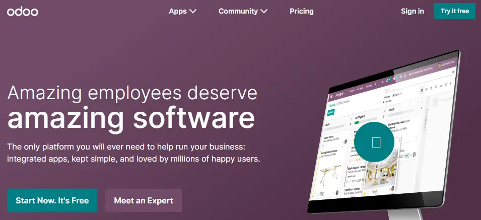
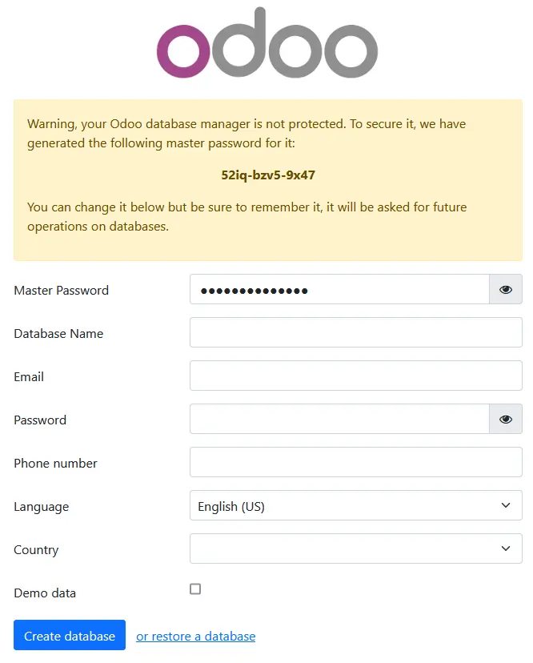
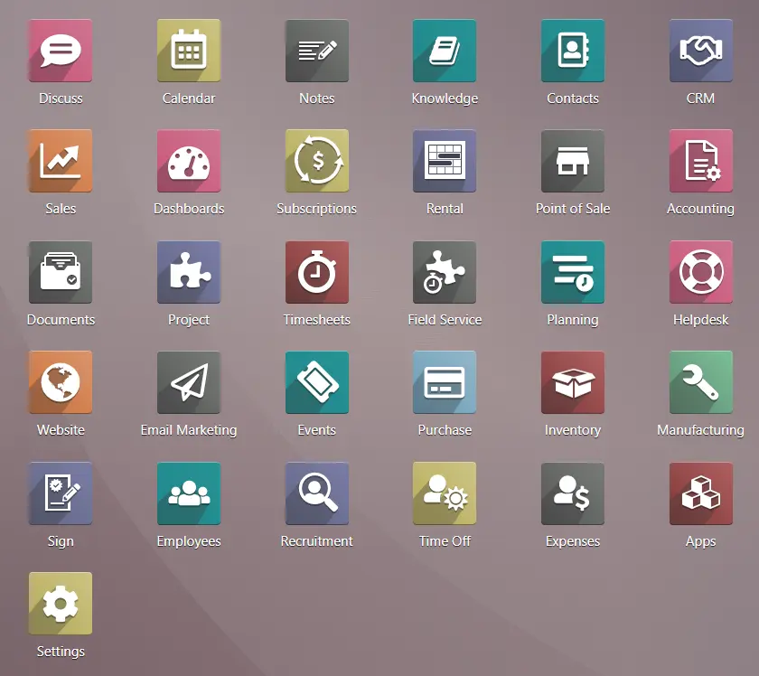

# Odoo

Odoo es un ERP completo de código abierto (open source) y sin coste de licencias (en la versión Community).



## Áreas que cubre

Este software cubre las necesidades de las áreas de:

- Contabilidad y finanzas.
- Ventas.
- Recursos humanos.
- Compras.
- Proyectos.
- Almacenes.
- Relaciones con el cliente.
- Fabricación.

## Demo

Para tener una idea rápida de cómo es Odoo, se puede acceder a una [demo](https://demo4.odoo.com/odoo). Gracias a esta demo, es posible navegar a través del software y probar las funciones sin necesidad de realizar la instalación.

## Versiones

Existen dos versiones de Odoo:

- Odoo Community.
- Odoo Enterprise.

> Importante: la disponibilidad de algunas funcionalidades (especialmente en el area financiera y en herramientas avanzadas) depende de la edición y del plan contratado.

### Odoo Community

Community es una versión de código abierto y gratuita de Odoo. La comunidad de desarrolladores de Odoo es muy activa y constantemente desarrolla nuevos módulos y funcionalidades que se pueden agregar a la plataforma.

Las características principales de Odoo Community son:

- Licencia de código abierto GPL (General Public License).
- No se incluyen todas las funcionalidades de la versión Enterprise.
- Es compatible con la mayoría de los módulos y aplicaciones de Odoo.
- No hay soporte técnico oficial de Odoo, aunque se puede acceder a la documentación y la ayuda de la comunidad de usuarios.

### Odoo Enterprise

Enterprise es una versión de pago de Odoo que incluye características adicionales y soporte técnico de Odoo, la compañía detrás de Odoo.

Las características principales de Odoo Enterprise son:

- Licencia propietaria y de pago.
- Incluye todas las funcionalidades de Odoo Community, además de algunas funcionalidades adicionales exclusivas de la versión Enterprise.
- Soporte técnico oficial de Odoo.
- Actualizaciones de seguridad y mantenimiento de la plataforma.

### Elección de la versión

La elección de una versión u otra depende de las necesidades y el presupuesto de cada empresa o usuario:

- Si se necesita una plataforma sólida y confiable con soporte técnico oficial y una amplia gama de funcionalidades, la versión Enterprise puede ser la opción más adecuada.
- Si se dispone de un presupuesto limitado y no se requieren todas las funcionalidades de la plataforma, la versión Community puede ser suficiente para cubrir las necesidades del negocio. Además, si se cuenta con conocimientos técnicos y se necesita una mayor personalización, la versión Community puede ser la opción más adecuada, ya que su código abierto permite la libre modificación y personalización de la plataforma.

## Instalación

Los pasos para instalar Odoo en un sistema varían según el sistema operativo que se utilice. A continuación, se describen los requisitos mínimos del sistema y los componentes necesarios para el correcto funcionamiento de Odoo.

### Requisitos mínimos

Antes de realizar la instalación de Odoo, es necesario tener presente los requisitos mínimos de hardware para su instalación:

- Procesador de 2 GHz o superior.
- 4 GB de RAM.
- Espacio en disco duro: 20 GB.
- Sistema operativo compatible: Debian, Ubuntu, Windows o macOS, entre otros.
- Python 3.10 o superior.
- PostgreSQL 13 o superior.
- Librerías y paquetes necesarios (se pueden instalar automáticamente durante la instalación de Odoo).

### Componentes

A partir de los requisitos mínimos, podemos extraer la necesidad de dos componentes básicos:

- La base de datos: Odoo utiliza PostgreSQL como base de datos para almacenar toda la información.
- Un intérprete de Python: Odoo está escrito en Python, por lo que se requiere Python y algunos módulos de Python para ejecutar la aplicación.

### Opciones de instalación

Según la documentación oficial de Odoo, existen varias formas de instalar Odoo:

- Instalación mediante paquetes de sistema. Esta es la forma más común de instalar Odoo en sistemas operativos Linux, ya que permite la gestión de Odoo como cualquier otro paquete del sistema operativo. Se pueden utilizar herramientas como `apt` en Debian/Ubuntu o `dnf` en Fedora/RHEL/CentOS Stream.
- Instalación mediante Docker. Odoo puede ser instalado y ejecutado dentro de un contenedor de Docker. Esto permite la creación de entornos aislados y la fácil migración de Odoo entre diferentes sistemas.
- Instalación mediante descarga del código fuente. Si se desea una instalación personalizada, se puede descargar el código fuente de Odoo desde el repositorio oficial y compilarlo e instalarlo en el sistema.

Es importante tener en cuenta que cada método de instalación tiene sus propias ventajas y desventajas, y que la elección del método de instalación adecuado dependerá de los requisitos específicos del sistema y de la experiencia del usuario en la administración de sistemas y en el uso de Odoo.

## Docker

Docker es una plataforma de software libre que permite crear, desplegar y ejecutar aplicaciones en contenedores.

Un contenedor es una unidad de software que incluye todo lo necesario para que una aplicación se ejecute de manera aislada en cualquier sistema operativo. Esto permite que una aplicación se pueda ejecutar en cualquier entorno sin tener que preocuparse por la configuración del sistema operativo o de las dependencias del software.

### Imágenes y contenedores en Docker

Los contenedores se obtienen a partir de una imagen. Una imagen es una plantilla de solo lectura que contiene un sistema de archivos con todos los componentes necesarios para ejecutar una aplicación, como bibliotecas, dependencias, código y configuración. Una imagen se utiliza como base para crear uno o varios contenedores que se ejecutan de manera aislada, cada uno con su propia copia del sistema de archivos de la imagen.

Cada imagen de Docker tiene un identificador único que se utiliza para referirse a ella y descargarla de un repositorio central de Docker, como Docker Hub.

Un contenedor, por otro lado, es una instancia en ejecución de una imagen de Docker. Los contenedores proporcionan un ambiente aislado para ejecutar aplicaciones y permiten que las aplicaciones se ejecuten de manera consistente en diferentes entornos de infraestructura. Cada contenedor tiene su propio sistema de archivos y recursos aislados, incluyendo CPU, memoria y almacenamiento.

Las imágenes y los contenedores son dos conceptos fundamentales en Docker, y ambos son esenciales para ejecutar aplicaciones en entornos aislados y portátiles. Por ello, es necesario tener claro lo siguiente:

- Una imagen de Docker es la plantilla que se utiliza para crear uno o varios contenedores que se ejecutan de manera aislada.
- Cada contenedor es una instancia en ejecución de una imagen.
- Cada contenedor tiene su propio sistema de archivos y recursos aislados.

### Instalación de Odoo con Docker

Para instalar Odoo con Docker, primero es necesario tener Docker instalado en el sistema operativo donde se desea ejecutar Odoo. Es posible instalar Docker en Linux, Windows y macOS, aunque lo más recomendable es hacerlo en alguna distribución de Linux, ya que su comportamiento es más estable en esta plataforma.

Además, se debe instalar Docker Compose, software que facilita la instalación de la aplicación y de todos los componentes desde un único archivo.

Una vez que Docker y Docker Compose estén instalados, se debe crear un fichero `docker-compose.yml` (en cualquier directorio) con el siguiente contenido:

```yaml
version: '3.1'

services:
  web:
    image: odoo:19.0
    depends_on:
      - mydb
    ports:
      - "8069:8069"
    volumes:
      - odoo-web-data:/var/lib/odoo
    environment:
      - HOST=mydb
      - USER=odoo
      - PASSWORD=myodoo
    networks:
      - odoo_network

  mydb:
    image: postgres:15
    environment:
      - POSTGRES_DB=postgres
      - POSTGRES_PASSWORD=myodoo
      - POSTGRES_USER=odoo
      - PGDATA=/var/lib/postgresql/data/pgdata
    volumes:
      - odoo-db-data:/var/lib/postgresql/data/pgdata
    networks:
      - odoo_network

volumes:
  odoo-web-data:
  odoo-db-data:

networks:
  odoo_network:
```

En este ejemplo, se utilizan volúmenes Docker para mantener la persistencia de los datos de la base de datos y de los archivos de Odoo. También se ha definido una red de Docker para conectar los contenedores de Odoo y PostgreSQL.

Para iniciar los contenedores, dentro del directorio donde se encuentra el archivo `docker-compose.yml`, se debe ejecutar el siguiente comando:

```bash
docker compose up -d
```

Una vez ejecutado, se arranca un servidor web. Si hemos instalado Odoo en la propia máquina, se puede acceder a través de `http://localhost`. Al acceder a esa URL, se podrá visualizar una pantalla similar a la siguiente:



En este apartado, como mínimo, debemos rellenar los siguientes datos:

- `Database name`: nombre de la base de datos. Se debe indicar uno diferente a `postgres`, como por ejemplo `odoo`.
- `Email`: correo electrónico del administrador.
- `Password`: contraseña del administrador.

## Módulos

Odoo es un software modular, lo que significa que está compuesto por varios módulos que se pueden activar o desactivar según las necesidades de cada empresa o usuario.



Algunos de los módulos de Odoo son:

- **Ventas (sales)**: permite gestionar el proceso de venta desde la cotización hasta la facturación, incluyendo la gestión de clientes, productos y precios.
- **Compras (purchase)**: permite gestionar el proceso de compra desde la solicitud de presupuestos hasta la recepción de facturas, incluyendo la gestión de proveedores, productos y precios.
- **Inventario (inventory)**: permite gestionar el inventario de productos, incluyendo el seguimiento de las existencias, las entradas y salidas de productos, la valoración de inventario y la gestión de ubicaciones.
- **Contabilidad (accounting)**: permite gestionar la contabilidad financiera y analítica, incluyendo la gestión de cuentas, asientos contables, impuestos y presupuestos.
- **Recursos humanos (human resources)**: permite gestionar los recursos humanos, incluyendo la gestión de empleados, contratos, nóminas, ausencias y evaluaciones.
- **Proyectos (project)**: permite gestionar proyectos y tareas, incluyendo la planificación, asignación de tareas, seguimiento de tiempos y facturación.
- **CRM**: permite gestionar la relación con los clientes, incluyendo la gestión de oportunidades de venta, seguimiento de clientes potenciales y automatización de campañas de marketing.
- **Punto de venta (point of sale)**: permite gestionar la venta en tiendas físicas, incluyendo la gestión de cajas, ventas, devoluciones y pagos.

Cada módulo de Odoo proporciona funcionalidades específicas que se pueden utilizar para automatizar procesos de negocio y mejorar la eficiencia de la empresa. Además, los módulos de Odoo están diseñados para trabajar juntos de forma integrada, lo que permite gestionar la mayoría de los procesos de negocio de una empresa con una sola plataforma.