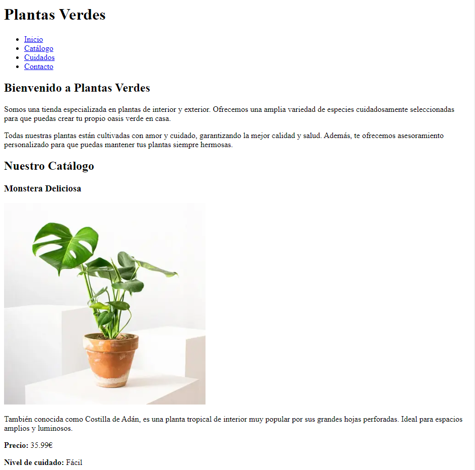
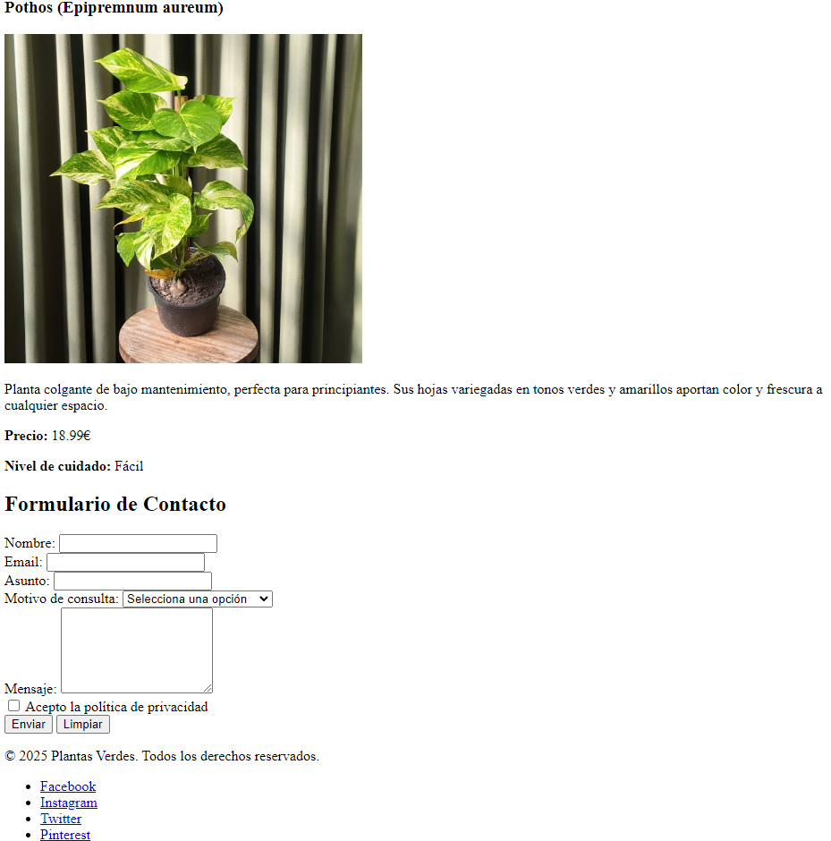
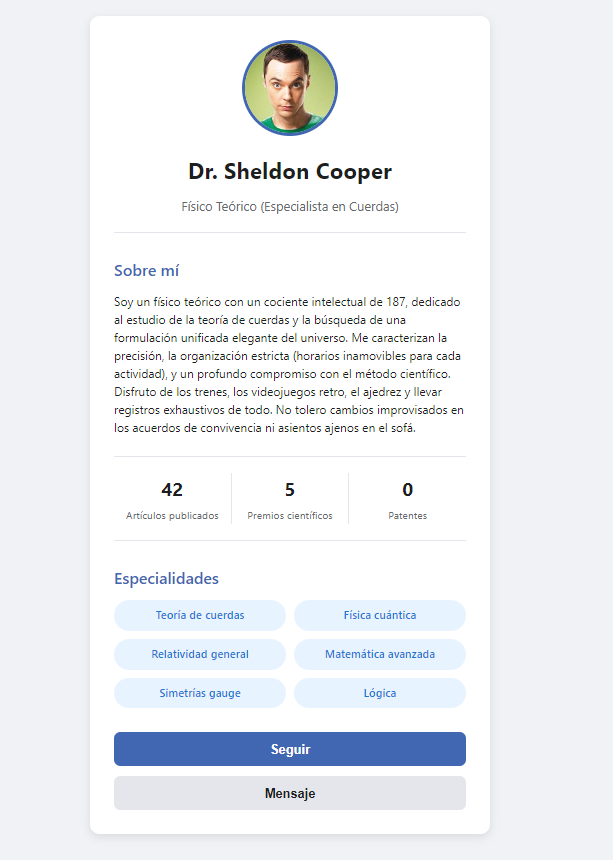
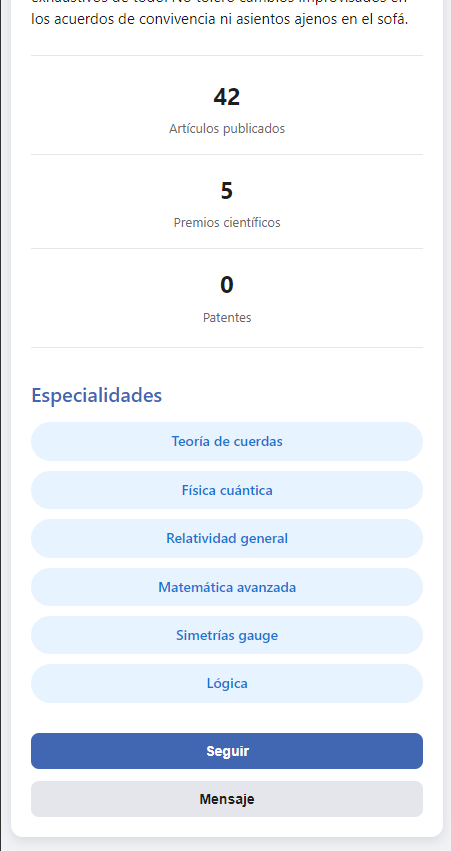

# Examen Práctico T1 - Lenguajes de Marcas

**Módulo:** Lenguajes de Marcas y Sistemas de Gestión de Información  
**Unidades evaluadas:** UD1 (Introducción a los lenguajes de marcas) y UD2 (Lenguajes de marcas en entornos web)  
**Duración:** 2 horas y 15 minutos  
**Puntuación total:** 10 puntos

## Instrucciones generales

- Lee detenidamente cada ejercicio antes de comenzar.
- Organiza tu tiempo: se recomienda dedicar aproximadamente 40 minutos al ejercicio 1, 50 minutos al ejercicio 2 y 45 minutos al ejercicio 3.
- Entrega todos los archivos en una carpeta comprimida ZIP con el nombre: `examen_T1_nombre_apellidos.zip`
- Puedes ver la estructura de carpetas requerida al final del examen.
- Asegúrate de que todos los archivos estén correctamente nombrados y organizados.
- Se valorará la corrección sintáctica, la estructura semántica, el diseño visual y la organización del código.

---

## Antes de comenzar

Para la realización de este examen, dispones de algunos recursos necesarios, como imágenes y archivos base. Descarga y descomprime el archivo `recursos_examen_T1.zip` que encontrarás en la plataforma.

Podrás utilizar cualquier editor de texto o IDE de tu preferencia para la creación y edición de los archivos, aunque se recomienda el uso de Visual Studio Code. Tienes 5 minutos antes de comenzar el examen para preparar tu entorno de trabajo, instalando las extensiones necesarias para trabajar con XML, HTML y CSS. Se recomiendan:

- XML Tools
- HTML CSS Support
- Live Server

Puedes instalar cualquier otra extensión que consideres útil para la realización del examen. Ten en cuenta que el uso de completadores automáticos (tipo Copilot) está **terminantemente prohibido**.

---

## Ejercicio 1: Creación de un documento XML (3 puntos)

*Tiempo recomendado: 40 minutos*

Escribe un documento **XML bien formado** que permita estructurar la información de una **biblioteca digital de videojuegos**.

### Requisitos del documento

La biblioteca debe contener información sobre videojuegos, incluyendo:

- **Título del videojuego** (obligatorio)
- **Desarrolladora** (puede haber más de una)
- **Año de lanzamiento**
- **Plataformas disponibles** (PC, PlayStation, Xbox, Nintendo Switch, etc.) - puede estar disponible en múltiples plataformas
- **Género** (acción, aventura, RPG, estrategia, etc.)
- **Clasificación por edad** (PEGI 3, 7, 12, 16, 18)
- **Precio** (en euros)
- **Valoración de usuarios** (puntuación de 0 a 10 con un decimal)
- **Descripción breve** del videojuego

### Consideraciones

- El documento debe incluir **al menos 3 videojuegos** con toda la información posible. Puedes usar la información proporcionada en la siguiente tabla:

| Característica | Juego 1 | Juego 2 | Juego 3 | Juego 4 |
|----------------|---------|---------|---------|---------|
| Título               | The Last of Us Part II | Elder Ring | New Super Mario Bros. U Deluxe | Civilization VI |
| Desarrolladora       | Naughty Dog         | FromSoftware        | Nintendo            | Firaxis Games, Aspyr Media |
| Año                 | 2020                | 2022               | 2019                | 2016                |
| Plataformas         | PlayStation 4, Playstation 5, PC | PC, PlayStation 5, Xbox Series X/S | Nintendo Switch | PC,  Nintendo Switch, PlayStation 4, Xbox One |
| Género              | Acción-Aventura     | RPG                | Plataforma         | Estrategia     |
| Clasificación       | PEGI 16            | PEGI 18           | PEGI 3           | PEGI 12        |
| Precio             | 59.99              | 69.99             | 49.99             | 39.99          |
| Valoración         | 9.5                | 9.7               | 8.9               | 8.5            |
| Descripción        | Secuela aclamada de The Last of Us. Cinco años después de su peligroso viaje a través de una América post-pandémica, Ellie y Joel se han asentado en Jackson, Wyoming. Vivir entre una próspera comunidad de supervivientes les ha brindado paz y estabilidad, a pesar de la amenaza constante de los infectados y de otros supervivientes más desesperados. | Un RPG de acción y fantasía épica. Levántate, Sinluz, y que la gracia te guíe para esgrimir el poder del Círculo de Elden y convertirte en un Señor del Círculo en las Tierras Intermedias. En las Tierras Intermedias gobernadas por la Reina Márika la Eterna, el Círculo de Elden, origen del Árbol Áureo, ha sido destruido. | New Super Mario Bros. U Deluxe incluye el juego original New Super Mario Bros. U y su expansión New Super Luigi U. Juega como Mario, Luigi, Toad, Toadette o Nabbit mientras atraviesas el Reino Champiñón para rescatar a la Princesa Peach de Bowser y sus secuaces. | Civilization VI ofrece nuevas formas de interactuar con tu mundo, expandir tu imperio por el mapa, mejorar tu cultura y competir contra los mejores líderes de la historia para crear una civilización que resista el paso del tiempo. Juega como uno de los 20 líderes históricos, incluyendo a Roosevelt (América) y Victoria (Inglaterra). |

- Utiliza **atributos** donde sea apropiado.
- Asegúrate de que el documento esté **bien estructurado** y sea fácilmente **procesable** por un sistema informático que necesite hacer búsquedas por género, plataforma o rango de precio.
- Incluye la **declaración XML** correcta al inicio del documento.
- Usa **nombres** de etiquetas **descriptivos** y **coherentes**.

### Entrega

- Guarda el archivo con el nombre: `ejer1_biblioteca_videojuegos.xml`
- Colócalo en la carpeta `ejer1/` de tu entrega.

### Criterios de evaluación

- **Sintaxis XML correcta** (1 punto): declaración XML, estructura bien formada, elementos correctamente cerrados.
- **Estructura semántica adecuada** (1 punto): uso apropiado de elementos y atributos, jerarquía lógica.
- **Completitud de la información** (0.75 puntos): inclusión de todos los datos requeridos para los 3 videojuegos.
- **Organización y legibilidad** (0.25 puntos): indentación correcta, nombres de etiquetas descriptivos.

## Ejercicio 2: Creación de una página web completa en HTML (3.5 puntos)

**Tiempo recomendado: 50 minutos**

Crea una página web HTML para una **tienda online de plantas** que incluya los siguientes elementos:

### Requisitos de la página

1. **Estructura HTML5 semántica:**
   - Declaración `<!DOCTYPE html>`
   - Uso de etiquetas semánticas: `<header>`, `<nav>`, `<main>`, `<section>`, `<article>`, `<aside>`, `<footer>`
   - Metadatos correctos: `charset`, `viewport`, título descriptivo
2. **Cabecera (`<header>`):**
   - Nombre de la tienda (título `<h1>`)
   - Menú de navegación (`<nav>`) con al menos 4 enlaces: Inicio, Catálogo, Cuidados, Contacto
3. **Contenido principal (`<main>`):**
   - **Sección de presentación:** Breve texto de bienvenida e información sobre la tienda
   - **Catálogo de productos** (al menos 2 plantas): cada planta debe incluir:
     - Nombre (encabezado `<h3>`)
     - Imagen. Puedes usar las imágenes proporcionadas.
     - Descripción breve
     - Precio
     - Nivel de cuidado (fácil, medio, difícil)
   - **Formulario de contacto:**
      - Campos de texto: Nombre, Email, Asunto
      - Campo de selección (`<select>`) para "Motivo de consulta": Información de producto, Pedido, Sugerencia, Otro
      - Área de texto (`<textarea>`) para el mensaje
      - Checkbox para aceptar política de privacidad
      - Botón de envío y botón de limpiar
4. **Pie de página (`<footer>`):**
   - Información de copyright
   - Enlaces a redes sociales (al menos 3)

### Consideraciones

- **NO** es necesario aplicar estilos CSS en este ejercicio (se evaluará solo el HTML).
- Utiliza etiquetas semánticas apropiadas en todo momento.
- Todos los formularios deben tener labels asociados correctamente.
- Las imágenes deben tener atributo `alt` descriptivo.
- La tabla debe estar correctamente estructurada.

La estructura creada debe generar una web similar a la siguiente imagen de referencia (sin estilos CSS aplicados):

---





---

### Entrega

- Guarda el archivo con el nombre: `ejer2_tienda_plantas.html`
- Coloca todo en la carpeta `ejer2/` de tu entrega, incluyendo las imágenes en una subcarpeta `img/`.

### Criterios de evaluación:

- **Estructura HTML5 semántica** (1 punto): uso correcto de etiquetas semánticas, declaración DOCTYPE.
- **Elementos completos y correctos** (1.5 puntos): formulario completo con labels, tabla estructurada, listas, navegación.
- **Accesibilidad y buenas prácticas** (0.5 puntos): atributos alt, labels asociados, jerarquía de encabezados.
- **Completitud de requisitos** (0.5 puntos): inclusión de todos los elementos solicitados.

## Ejercicio 3: Aplicación de estilos CSS a un HTML dado (3.5 puntos)

**Tiempo recomendado: 45 minutos**

Se te proporciona un archivo HTML con la estructura de una **página de perfil de usuario**. Tu tarea es crear un archivo CSS externo para que la página tenga una apariencia similar a la imagen de referencia proporcionada.

### Archivo HTML proporcionado

```html
<!DOCTYPE html>
<html lang="es">
<head>
    <meta charset="UTF-8">
    <meta name="viewport" content="width=device-width, initial-scale=1.0">
    <title>Perfil de Usuario</title>
    <link rel="stylesheet" href="solucion_ejer3_styles.css">
</head>
<body>
    <div class="container">
        <header class="profile-header">
            
            <h1 class="profile-name">Dr. Sheldon Cooper</h1>
            <p class="profile-title">Físico Teórico (Especialista en Cuerdas)</p>
        </header>

        <section class="about">
            <h2>Sobre mí</h2>
            <p>Soy un físico teórico con un cociente intelectual de 187, dedicado al estudio de la teoría de cuerdas y la búsqueda de una formulación unificada elegante del universo. Me caracterizan la precisión, la organización estricta (horarios inamovibles para cada actividad), y un profundo compromiso con el método científico. Disfruto de los trenes, los videojuegos retro, el ajedrez y llevar registros exhaustivos de todo. No tolero cambios improvisados en los acuerdos de convivencia ni asientos ajenos en el sofá.</p>
        </section>

        <section class="stats">
            <div class="stat-item">
                <h3>42</h3>
                <p>Artículos publicados</p>
            </div>
            <div class="stat-item">
                <h3>5</h3>
                <p>Premios científicos</p>
            </div>
            <div class="stat-item">
                <h3>0</h3>
                <p>Patentes</p>
            </div>
        </section>

        <section class="skills">
            <h2>Especialidades</h2>
            <ul class="skills-list">
                <li class="skill-item">Teoría de cuerdas</li>
                <li class="skill-item">Física cuántica</li>
                <li class="skill-item">Relatividad general</li>
                <li class="skill-item">Matemática avanzada</li>
                <li class="skill-item">Simetrías gauge</li>
                <li class="skill-item">Lógica</li>
            </ul>
        </section>

        <footer class="profile-footer">
            <button class="btn btn-primary">Seguir</button>
            <button class="btn btn-secondary">Mensaje</button>
        </footer>
    </div>
</body>
</html>
```

### Resultado esperado

Una vez definidos los estilos, el resultado esperado debe ser similar a la siguiente imagen de referencia:

<div style="text-align: center;">
    
</div>

### Requisitos de diseño CSS

Para conseguir un diseño similar al de la imagen de referencia, debes aplicar los siguientes estilos CSS:

1. **Contenedor principal (`.container`):**
   - Ancho máximo de 500px
   - Centrado en la página
   - Fondo blanco
   - Sombra sutil alrededor
   - Bordes redondeados (12px)
   - Padding interno de 30px

2. **Fondo del body:**
   - Color de fondo: gris claro (`#f0f2f5`)
   - Padding de 40px

3. **Cabecera del perfil (`.profile-header`):**
   - Centrado (texto e imagen)
   - Imagen de perfil circular (120x120px)
   - Nombre en negrita, tamaño grande
   - Título/cargo en color gris y tamaño menor
   - Margen inferior de 30px

4. **Secciones (`.about`, `.skills`):**
   - Margen inferior entre secciones
   - Títulos `<h2>` con color principal (`#4267B2`) y margen inferior

5. **Estadísticas (`.stats`):**
   - Disposición horizontal en 3 columnas (usa Flexbox)
   - Cada estadística centrada
   - Número grande y destacado
   - Descripción en gris y tamaño pequeño
   - Bordes entre estadísticas

6. **Lista de habilidades (`.skills-list`):**
   - Sin estilos de lista por defecto
   - Disposición en 2 columnas (usa Flexbox con wrap)
   - Cada habilidad (`.skill-item`):
     - Fondo azul claro (#e7f3ff)
     - Texto centrado y color azul oscuro (#4267B2)
     - Bordes redondeados
     - Padding interno
     - Margen entre elementos

7. **Botones (`.btn`):**
   - Ancho completo (100%)
   - Padding de 12px
   - Bordes redondeados (8px)
   - Sin borde
   - Cursor pointer
   - Margen entre botones
   - **Botón primario (`.btn-primary`):**
     - Fondo azul (#4267B2)
     - Texto blanco
   - **Botón secundario (`.btn-secondary`):**
     - Fondo gris claro (#e4e6eb)
     - Texto oscuro (#1c1e21)

8. **Responsive:**
   - En pantallas menores a 600px:
     - Container con padding reducido (20px)
     - Habilidades y estadísticas en 1 columna

<div style="text-align: center;">
    
</div>

### Consideraciones

- Deberás editar el archivo `styles.css` dentro del directorio `ejer3/styles/`.
- Puedes ajustar colores y tamaños para mejorar el diseño, pero debe parecerse a la referencia
- Usa Flexbox para layouts horizontales
- Incluye efectos hover en botones
- Asegúrate de que sea responsive con media queries

### Entrega

- Crea tu archivo CSS como `styles.css` dentro del directorio `ejer3/styles/`.

### Criterios de evaluación

- **Estructura y organización del CSS** (0.75 puntos): selectores apropiados, código organizado.
- **Layout y disposición** (1.25 punto): uso correcto de Flexbox, centrado, espaciados.
- **Estilos visuales** (1 punto): colores, tipografía, bordes, sombras acordes a la referencia.
- **Responsive design** (0.5 puntos): media queries correctas, adaptación a móviles.

---

## Entrega final

Comprime las 3 carpetas (`ejer1`, `ejer2`, `ejer3`) en un único archivo ZIP, con el nombre `examen_T1_nombre_apellidos.zip`, y asegúrate de que la estructura interna sea la siguiente:

```plaintext
examen_T1_nombre_apellidos.zip
├── ejer1/
│   └── ejer1_biblioteca_videojuegos.xml
├── ejer2/
│   ├── ejer2_tienda_plantas.html
│   └── img/
└── ejer3/
    ├── ejer3_perfil.html
    └── /styles
        └── styles.css
    └── /img
        └── perfil_referencia.png
```

**¡Mucha suerte!**
