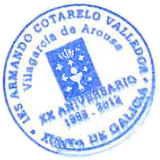

    
DEPARTAMENTO DE INFORMÁTICA

    
CICLO DAW

    
MODALIDAD A DISTANCIA

## CERTIFICADO DE ASISTENCIA A EXAMEN

Dº. **Daniel Martiñán Otero**, profesor responsable del módulo **Lenguajes de Marcas y Sistemas de Gestión de la Información**, que se imparte en el 1º curso del **Ciclo Superior de Desarrollo de Aplicaciones Web** en la modalidad de Distancia en el curso 2025-2026, en el IES Armando Cotarelo Valedor.

CERTIFICA QUE:

El/la alumno/a Sloan Rey Pereira, matriculado/a en dicha asignatura, con DNI 35479996N, ha asistido en la tarde de hoy a la realización del examen presencial correspondiente al primer parcial liberador de materia, que se ha realizado desde las 18:45 hasta las 21:45 horas, en el aula S02 del citado centro.

Para que así conste, a petición de la persona interesada y a los efectos oportunos, firmo la presente en  

Vilagarcía de Arousa, a 11 de diciembre de 2025.

    Fdo. Daniel Martiñán Otero

