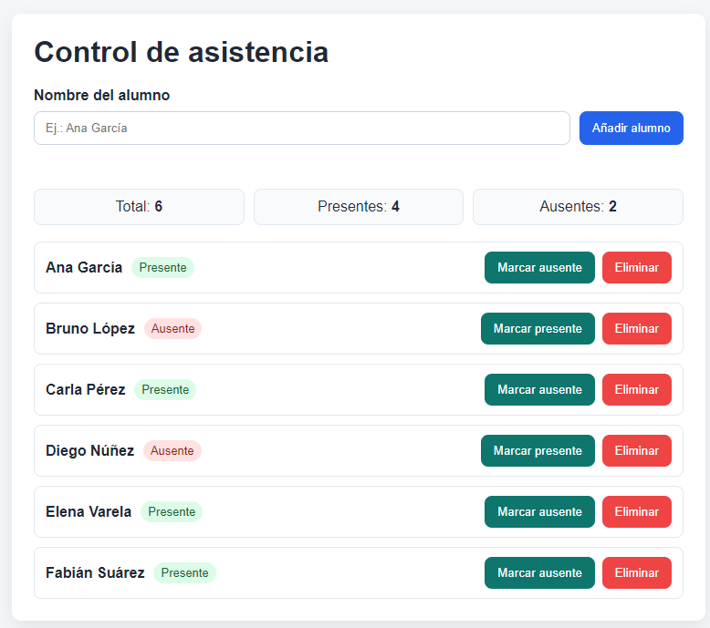
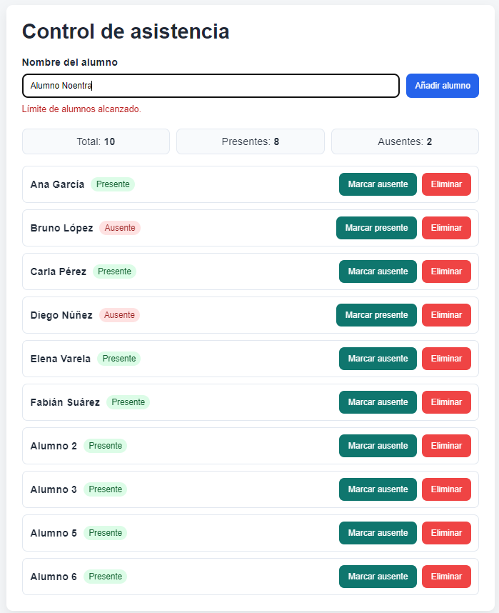

# Examen Práctico T2 - Lenguajes de Marcas

**Módulo:** Lenguajes de Marcas y Sistemas de Gestión de Información  
**Unidades evaluadas:** UD3 (JavaScript y DOM) y UD4 (Definición de esquemas y vocabularios en XML - XSD)  
**Duración máxima:** 2 horas y 15 minutos  
**Puntuación total:** 10 puntos

## Instrucciones generales

- Lee detenidamente cada ejercicio antes de comenzar.
- Organiza tu tiempo: se recomienda dedicar aproximadamente 1h al ejercicio 1 y 1:15h al ejercicio 2.
- Entrega todos los archivos en una carpeta comprimida ZIP con el nombre: `examen_T2_nombre_apellidos.zip`
- Puedes ver la estructura de carpetas requerida al final del examen.
- Asegúrate de que todos los archivos estén correctamente nombrados y organizados.
- Se valorará la corrección técnica, la estructura del código, la validación y la claridad de la solución.

## Antes de comenzar

Para la realización de este examen, dispones de un archivo base con la estructura inicial de trabajo (`recursos_examen_T2.zip`) en la plataforma.

Podrás utilizar cualquier editor de texto o IDE de tu preferencia para la creación y edición de los archivos, aunque se recomienda el uso de **Visual Studio Code**. Tienes 5 minutos antes de comenzar el examen para preparar tu entorno de trabajo. Se recomiendan estas extensiones:

- XML Tools
- JavaScript (ES6) code snippets
- Live Server
- Error Lens
- Prettier

Puedes instalar cualquier otra extensión que consideres útil para la realización del examen. Ten en cuenta que el uso de completadores automáticos (tipo Copilot) está **terminantemente prohibido**.

<div style="page-break-after: always;"></div>

## Ejercicio 1: Interactividad con JavaScript y DOM (5 puntos)

Desarrolla una pequeña aplicación web de **control de asistencia** usando JavaScript en cliente y manipulación del DOM.

Se recomienda analizar detalladamente el HTML base proporcionado en `ejer1/` antes de comenzar a programar, para entender la estructura y los elementos disponibles. **No está permitido modificar el HTML base** (excepto para añadir clases o atributos necesarios para la funcionalidad).

### Requisitos funcionales

Partiendo del HTML base proporcionado en `ejer1/`, implementa en JavaScript lo siguiente:

1. **Listado inicial de alumnado**
   - Carga una lista inicial de entre 6 y 8 alumnos desde un array en JavaScript.
   - Muestra cada alumno en una lista visible con su estado de asistencia.

2. **Marcado de asistencia**
   - Cada alumno debe poder marcarse como `presente` o `ausente`.
   - El cambio de estado se realizará con un clic (comportamiento toggle). Si el alumno está marcado como presente, el botón mostrará "Marcar ausente" y viceversa.
   - El estado debe reflejarse visualmente en la interfaz:

      

3. **Alta de alumno**
   - Incluye un campo de texto y un botón "Añadir alumno".
   - No se permitirá añadir nombres vacíos ni duplicados exactos. Se mostrará un mensaje de error en caso de incumplir estas condiciones (*Introduce un nombre válido* o *El alumno ya existe*).

    

    

   - Al añadir un nuevo alumno, este se mostrará automáticamente en la lista con estado inicial `presente`.

    

   - No se podrán añadir más de 10 alumnos en total. Si se intenta superar este límite, se mostrará un mensaje de error (*Límite de alumnos alcanzado*).

    

4. **Eliminación de alumno**
   - Cada alumno debe disponer de un botón "Eliminar".
   - Al pulsarlo, se elimina únicamente ese alumno de la lista.

5. **Resumen dinámico**
   - Muestra en pantalla los contadores de:
     - total de alumnos,
     - alumnos presentes,
     - alumnos ausentes.
   - Los contadores deben actualizarse tras cada cambio (añadir, eliminar o marcar asistencia).

### Restricciones técnicas

- Usa `addEventListener` (no eventos inline en HTML).
- Organiza el código en funciones claras y reutilizables.
- Debes trabajar únicamente con HTML + CSS + JavaScript nativo.

### Entrega del ejercicio 1

Entregarás la carpeta `ejer1/` con los siguientes archivos:

- `ejer1_asistencia.html`: el HTML base (proporcionado, no modificar excepto para añadir clases o atributos necesarios). Si añades algo, indícalo claramente en la memoria de tu solución.
- `ejer1_asistencia.css`: estilos (ya proporcionados). No modificar.
- `ejer1_asistencia.js`: tu código JavaScript con la implementación de la funcionalidad.

Se evaluará solamente el código JavaScript.

<div style="page-break-after: always;"></div>

## Ejercicio 2: Diseño de un esquema XSD y validación XML (5 puntos)

Debes definir un esquema XSD para validar un documento XML que almacena información de una **temporada de Fórmula 1**.

### Requisitos del XML a validar

El XML debe contener información sobre las escuderías participantes y los circuitos habituales de la temporada.

Cada escudería debe incluir:

- **Nombre de escudería** (obligatorio)
- **Código** de escudería (atributo obligatorio, único)
- **País base** (obligatorio)
- **Jefe de equipo** (obligatorio, con nombre y nacionalidad)
- **Pilotos** (al menos 2 pilotos titulares, opcionalmente pilotos reserva)
- Para cada piloto:
  - **Nombre** (obligatorio)
  - **Dorsal** (entero entre 1 y 99)
  - **Nacionalidad** (obligatorio)
  - **Rol**: a elegir entre `titular` o `reserva`
- **Motor**: a elegir entre `Ferrari`, `Mercedes`, `Honda` o `Ford`
- **Presupuesto** (decimal mayor o igual a 0)
- **Circuitos habituales** (0 o más)

Cada circuito debe incluir:

- **Nombre** (obligatorio)
- **País** (obligatorio)
- **LongitudKm** (decimal positivo)
- **Tipo**: a elegir entre `urbano`, `permanente` o `semiurbano`

### Requisitos del esquema XSD

Tu archivo `formula1.xsd` debe contemplar, como mínimo:

1. **Estructura general**
   - Elemento raíz `temporadaF1`.
   - Repetición de elementos `escuderia` y `circuito`.

2. **Tipos y restricciones**
   - Uso de tipos simples y complejos.
   - Restricciones y enumeraciones cuando proceda.

3. **Atributos y unicidad**
   - El `codigo` debe declararse como atributo obligatorio de `escuderia`.
   - Debe garantizarse que no haya dos escuderías con el mismo `codigo`.
   - Debe garantizarse que no haya dos pilotos con el mismo `dorsal`.

    > **Nota**: Para garantizar la unicidad de `codigo` y `dorsal`, puedes usar elementos `<xs:unique>` dentro de tu esquema XSD:
    >
    >```xml
    ><xs:unique name="codigoEscuderiaUnico">
    >  <xs:selector xpath="escuderia"/>
    >  <xs:field xpath="@codigo"/>
    ></xs:unique>
    >
    ><xs:unique name="dorsalPilotoUnico">
    >  <xs:selector xpath="escuderia/pilotos/piloto"/>
    >  <xs:field xpath="dorsal"/>
    ></xs:unique>
    >```

4. **Cardinalidades**
   - `jefeEquipo` debe aparecer exactamente una vez por escudería.

### XML de ejemplo

A continuación se muestra un ejemplo de XML válido, que debe ser validado correctamente por tu esquema XSD:

```xml
<?xml version="1.0" encoding="UTF-8"?>
<temporadaF1>
  <escuderia codigo="MER">
    <nombre>Mercedes-AMG Petronas</nombre>
    <paisBase>Alemania</paisBase>
    <jefeEquipo>
      <nombre>Toto Wolff</nombre>
      <nacionalidad>Austriaco</nacionalidad>
    </jefeEquipo>
    <pilotos>
      <piloto>
        <nombre>Kimi Antonelli</nombre>
        <dorsal>12</dorsal>
        <nacionalidad>Italiano</nacionalidad>
        <rol>titular</rol>
      </piloto>
      <piloto>
        <nombre>George Russell</nombre>
        <dorsal>63</dorsal>
        <nacionalidad>Británico</nacionalidad>
        <rol>titular</rol>
      </piloto>
    </pilotos>
    <motor>Mercedes</motor>
    <presupuesto>450.5</presupuesto>
    <circuitosHabituales>
      <circuitoHabitual>
        <nombre>Silverstone</nombre>
        <pais>Reino Unido</pais>
        <longitudKm>5.891</longitudKm>
        <tipo>permanente</tipo>
      </circuitoHabitual>
      <!-- Más circuitos habituales -->
    </circuitosHabituales>
  </escuderia>

  <escuderia codigo="FER">
    <nombre>Scuderia Ferrari</nombre>
    <paisBase>Italia</paisBase>
    <jefeEquipo>
      <nombre>Frederic Vasseur</nombre>
      <nacionalidad>Francés</nacionalidad>
    </jefeEquipo>
    <pilotos>
      <piloto>
        <nombre>Charles Leclerc</nombre>
        <dorsal>16</dorsal>
        <nacionalidad>Monegasco</nacionalidad>
        <rol>titular</rol>
      </piloto>
      <piloto>
        <nombre>Lewis Hamilton</nombre>
        <dorsal>44</dorsal>
        <nacionalidad>Británico</nacionalidad>
        <rol>titular</rol>
      </piloto>
    </pilotos>
    <motor>Ferrari</motor>
    <presupuesto>400.0</presupuesto>
    <circuitosHabituales>
      <circuitoHabitual>
        <nombre>Monza</nombre>
        <pais>Italia</pais>
        <longitudKm>5.793</longitudKm>
        <tipo>permanente</tipo>
      </circuitoHabitual>
    </circuitosHabituales>
  </escuderia>

  <escuderia codigo="MCL">
    <nombre>McLaren Formula 1 Team</nombre>
    <paisBase>Reino Unido</paisBase>
    <jefeEquipo>
      <nombre>Andrea Stella</nombre>
      <nacionalidad>Italiano</nacionalidad>
    </jefeEquipo>
    <pilotos>
      <piloto>
        <nombre>Lando Norris</nombre>
        <dorsal>4</dorsal>
        <nacionalidad>Británico</nacionalidad>
        <rol>titular</rol>
      </piloto>
      <piloto>
        <nombre>Oscar Piastri</nombre>
        <dorsal>81</dorsal>
        <nacionalidad>Australiano</nacionalidad>
        <rol>titular</rol>
      </piloto>
      <piloto>
        <nombre>Leonardo Fornaroli</nombre>
        <dorsal>20</dorsal>
        <nacionalidad>Italiano</nacionalidad>
        <rol>reserva</rol>
      </piloto>
      <piloto>
        <nombre>Patricio 'Pato' O'Ward</nombre>
        <dorsal>5</dorsal>
        <nacionalidad>Mexicano</nacionalidad>
        <rol>reserva</rol>
      </piloto>
    </pilotos>
    <motor>Mercedes</motor>
    <presupuesto>420.0</presupuesto>
    <circuitosHabituales>
      <circuitoHabitual>
        <nombre>Suzuka</nombre>
        <pais>Japón</pais>
        <longitudKm>5.807</longitudKm>
        <tipo>permanente</tipo>
      </circuitoHabitual>
    </circuitosHabituales>
  </escuderia>

  <circuito>
    <nombre>Bahrain International Circuit</nombre>
    <pais>Baréin</pais>
    <longitudKm>5.412</longitudKm>
    <tipo>permanente</tipo>
  </circuito>
  <circuito>
    <nombre>Circuit de Monaco</nombre>
    <pais>Mónaco</pais>
    <longitudKm>3.337</longitudKm>
    <tipo>urbano</tipo>
  </circuito>
  <circuito>
    <nombre>Yas Marina Circuit</nombre>
    <pais>Emiratos Árabes Unidos</pais>
    <longitudKm>5.281</longitudKm>
    <tipo>semiurbano</tipo>
  </circuito>
</temporadaF1>
```

### Entrega del ejercicio 2

Entregarás la carpeta `ejer2/` con los siguientes archivos:

- Guarda el esquema como: `formula1.xsd`
- `formula1.xml` ya proporcionado (para validación).

<div style="page-break-after: always;"></div>

## Criterios de calificación

A continuación se detallan los criterios de evaluación para cada ejercicio:

### Ejercicio 1 (5 puntos)

Se recomienda aplicar la siguiente rúbrica orientativa:

| Bloque | Criterio | Puntos |
|---|---|---:|
| Listado inicial y renderizado | Carga inicial correcta (6 a 8 alumnos) desde array JavaScript | 0,35 |
| Listado inicial y renderizado | Representación en DOM del nombre y estado de cada alumno | 0,40 |
| Marcado de asistencia (toggle) | Cambio de estado funcional por clic con `addEventListener` | 0,55 |
| Marcado de asistencia (toggle) | Actualización del texto del botón según estado | 0,35 |
| Marcado de asistencia (toggle) | Reflejo visual coherente del estado en interfaz | 0,35 |
| Alta de alumno con validaciones | Alta correcta con estado inicial `presente` | 0,45 |
| Alta de alumno con validaciones | Validación de nombre vacío + mensaje de error | 0,25 |
| Alta de alumno con validaciones | Validación de duplicado exacto + mensaje de error | 0,25 |
| Alta de alumno con validaciones | Límite máximo de 10 alumnos + mensaje de error | 0,30 |
| Eliminación de alumno | Eliminación individual correcta del alumno seleccionado | 0,50 |
| Resumen dinámico | Cálculo y actualización de total, presentes y ausentes tras cada operación | 0,75 |
| Calidad técnica del código | Uso de funciones claras y reutilizables, sin eventos inline | 0,25 |
| Calidad técnica del código | Sintaxis correcta, nombres legibles, limpieza/orden del código | 0,25 |
|  | **Total Ejercicio 1** | **5,00** |

**Corrección parcial y penalizaciones orientativas (Ejer. 1)**

| Concepto | Aplicación |
|---|---|
| Corrección parcial | Si una funcionalidad está incompleta pero parcialmente operativa, se podrá asignar entre el 25% y el 75% de su apartado. |
| Penalización por bloqueo global JS | Errores de JavaScript que bloqueen la ejecución global: hasta **-0,50** puntos. |
| Penalización por modificar HTML/CSS fuera de lo permitido | Incumplir la restricción puede suponer hasta **-0,50** puntos. |

### Ejercicio 2 (5 puntos)

Se recomienda aplicar la siguiente rúbrica orientativa:

| Bloque | Criterio | Puntos |
|---|---|---:|
| Estructura general del esquema | Definición de elemento raíz `temporadaF1` | 0,30 |
| Estructura general del esquema | Inclusión y cardinalidad base de `escuderia` y `circuito` | 0,60 |
| Modelado de tipos y reutilización | Uso correcto de tipos complejos para persona/piloto/circuito/escudería | 0,60 |
| Modelado de tipos y reutilización | Uso de tipos simples cuando proceda (o diseño equivalente correctamente justificado) | 0,40 |
| Restricciones de valores | `rol` con valores válidos (`titular`/`reserva`) | 0,30 |
| Restricciones de valores | `motor` y `tipo` con valores cerrados válidos | 0,35 |
| Restricciones de valores | `dorsal` entre 1 y 99 | 0,25 |
| Restricciones de valores | `presupuesto` >= 0 y `longitudKm` > 0 | 0,30 |
| Cardinalidades y obligatoriedad | `jefeEquipo` exactamente una vez por escudería | 0,25 |
| Cardinalidades y obligatoriedad | Modelado correcto de pilotos (2 titulares y 0 o más reserva, o equivalente validable) | 0,45 |
| Cardinalidades y obligatoriedad | `circuitosHabituales` (0 o más) correctamente resuelto | 0,20 |
| Atributos y unicidad | Atributo `codigo` obligatorio en `escuderia` | 0,20 |
| Atributos y unicidad | Unicidad de `codigo` entre escuderías | 0,25 |
| Atributos y unicidad | Unicidad global de `dorsal` en pilotos | 0,25 |
| Validación y calidad formal | XML de ejemplo valida correctamente contra el XSD | 0,20 |
| Validación y calidad formal | Sintaxis XML/XSD limpia (indentación, etiquetas y estructura coherentes) | 0,10 |
|  | **Total Ejercicio 2** | **5,00** |

**Corrección parcial y penalizaciones orientativas (Ejer. 2)**

| Concepto | Aplicación |
|---|---|
| Corrección parcial por bloques | Si el esquema valida parcialmente pero contiene errores puntuales en restricciones, se evaluará por bloques según esta rúbrica. |
| Penalización por error de sintaxis XSD | Un XSD con errores de sintaxis que impida validar podrá penalizar hasta **-1,00** punto adicional. |
| Sin puntuación del subapartado de unicidad | Si no se garantiza alguna unicidad pedida (`codigo` o `dorsal`), no se otorgará la puntuación de ese subapartado. |

## Entrega final

Comprime las 2 carpetas (`ejer1`, `ejer2`) en un único archivo ZIP, con el nombre `examen_T2_nombre_apellidos.zip`, y asegúrate de que la estructura interna sea la siguiente:

```plaintext
examen_T2_nombre_apellidos.zip
├── ejer1/
│   ├── ejer1_asistencia.html
│   ├── ejer1_asistencia.js
│   └── ejer1_asistencia.css
└── ejer2/
    ├── formula1.xsd
    └── formula1.xml
```
