# Examen Final Práctico - Lenguajes de Marcas y Sistemas de Gestión de Información

**Unidades evaluadas:** Bloque 1: UD1, UD2; Bloque 2: UD3, UD4; Bloque 3: UD5, UD6
**Duración total:** 2 horas y 30 minutos  
**Estructura:** 3 bloques de 50 minutos  
**Puntuación:** 10 puntos por bloque

**Herramientas permitidas:** Visual Studio Code, navegador web y BaseX.  
**Herramienta obligatoria para el bloque 3:** **BaseX**.

**IMPORTANTE**: Cada bloque se evaluará de forma independiente. Es obligatorio aprobar cada bloque realizado para superar la asignatura. Cada alumno tendrá que realizar sólo los bloques pendientes de superar, disponiendo de 50 minutos para cada 1.

## Instrucciones generales

- Lee completamente cada bloque antes de comenzar.
- Organiza el tiempo: cada bloque está diseñado para resolverse en **50 minutos**.
- Entrega todos los archivos en una carpeta comprimida ZIP con el nombre: `examen_final_nombre_apellidos.zip`.
- Respeta los nombres de archivo y la estructura de carpetas indicada.
- Se valorará la corrección técnica, la claridad de la solución y la organización del trabajo.
- El uso de asistentes automáticos de código (por ejemplo, Copilot) está prohibido durante la prueba.

## Antes de comenzar

Descarga y descomprime `recursos_examen_final.zip`. Ese paquete incluye los materiales de partida para los tres bloques:

- Archivos base HTML y CSS para los ejercicios web.
- Recursos XML y XSD para validación.
- Archivos XML y una plantilla XSL para el bloque de BaseX.
- Imágenes y documentos auxiliares cuando proceda.

Los bloques son **independientes** entre sí. Puedes resolverlos en el orden que prefieras.

---

## Bloque 1: Marcado y publicación web (UD1 y UD2) - 10 puntos - 50 minutos

### Ejercicio 1.1: XML bien formado de catálogo cultural (3 puntos)

Escribe un documento XML llamado `ejer1_catalogo_cultural.xml` para almacenar información de un **catálogo de actividades culturales**.

#### Requisitos

Debes incluir **2 actividades**, y cada una debe contener:

- Título de la actividad.
- Tipo (`teatro`, `cine`, `concierto` o `exposicion`).
- Fecha.
- Precio.
- Lugar.

#### Consideraciones

- El XML debe estar bien formado y ser fácil de procesar.
- Incluye la declaración XML.
- Utiliza nombres de etiquetas claros y coherentes.

#### Entrega 1.1

- Archivo: `bloque1/ejer1_catalogo_cultural.xml`

### Ejercicio 1.2: Página HTML semántica de jornadas técnicas (3,5 puntos)

Se proporciona un archivo HTML base llamado `ejer2_jornadas_tecnicas.html` ya estructurado. Debes **completar únicamente una parte del contenido** para anunciar unas **jornadas tecnológicas**.

#### Requisitos 1.2

Partiendo del HTML preconfigurado, debes añadir solo estos elementos en la zona indicada del documento:

1. Dos `article` de ponencias o talleres, cada uno con:
   - Título.
   - Breve descripción.
   - Ponente.
2. Una tabla simple con horario de **3 actividades**.
3. Un botón o enlace de inscripción dentro de la sección principal.

El resultado esperado es el que se muestra a continuación:

---

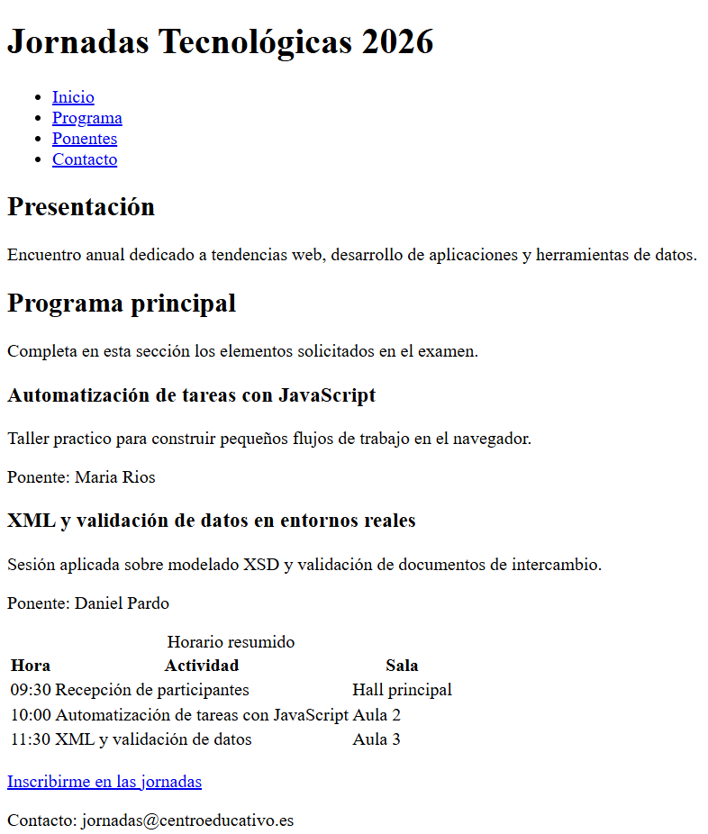

---

#### Consideraciones 1.2

- No debes rehacer la página completa.
- No es necesario aplicar CSS en este ejercicio.
- Debes respetar la estructura semántica ya proporcionada y utilizar etiquetas adecuadas para cada tipo de contenido.

#### Entrega 1.2

- Archivo completado: `bloque1/ejer2_jornadas_tecnicas.html`

### Ejercicio 1.3: CSS de una tarjeta informativa responsive (3,5 puntos)

Se proporcionan un HTML base `ejer3_tarjeta_evento.html` y una hoja `styles.css` ya iniciada. Debes **añadir únicamente los estilos que faltan** para completar la presentación de una **tarjeta informativa de evento**.

#### Requisitos de diseño

En la hoja CSS preconfigurada debes completar estos apartados:

- Estilos de la cabecera de la tarjeta.
  - Borde inferior de color `--border` y grosor de 1px.
  - Padding y margin de 18px
- Distribución en Flexbox de la zona de detalles.
  - Gap de 12px entre detalles.
  - Margen inferior de 22px
  - Alineación vertical de los detalles.
- Apariencia de cada detalle
  - Color de fondo de cada item `--accent-soft`,
  - Borde redondeado de 10px y padding de 12px.
  - Títulos de cada detalle (`detail-label`)
    - Transformación a mayúsculas
    - Tamaño de la fuente: 0.82rem
    - Peso de la fuente: 700
    - Color `--accent`
    - Margen inferior de 6px
- Apariencia de los botones de acción.
  - Eliminar decoración del texto
  - Alineación central del texto
  - Padding de 11px vertical y 16px horizontal
  - Radio de bordes de 10px
  - Color `ffffff` para el texto del botón primario y `102a43` para el secundario
- Ajuste responsive para móvil en pantallas menores de 600px.
  - Cambiar el tamaño de fuente del título principal (Foro de Innovación y Datos) a 1.55rem
  - Cambiar la dirección `flex` de los eventos a columna (clases .event-details y .event-actions)

#### Consideraciones 1.3

- Solo se evalúa el CSS.
- Debes trabajar sobre el HTML y el CSS proporcionados, sin rehacerlos desde cero.

#### Entrega 1.3

- Archivo completado: `bloque1/styles/styles.css`

---

## Bloque 2: Interactividad y validación de documentos (UD3 y UD4) - 10 puntos - 50 minutos

### Ejercicio 2.1: JavaScript DOM - Conversor de color RGB (6 puntos)

Partiendo del HTML base proporcionado en `bloque2/ejer1/`, desarrolla la funcionalidad de un **conversor de color RGB**.

#### Requisitos funcionales 2.1

1. Leer un valor introducido en un campo de texto con el formato `r, g, b` (por ejemplo: `255, 128, 0`).
2. Al pulsar el botón **Aplicar**:
   - Si el valor es válido (tres enteros entre 0 y 255), aplicar el color al panel de vista previa y mostrar el valor equivalente hexadecimal.

    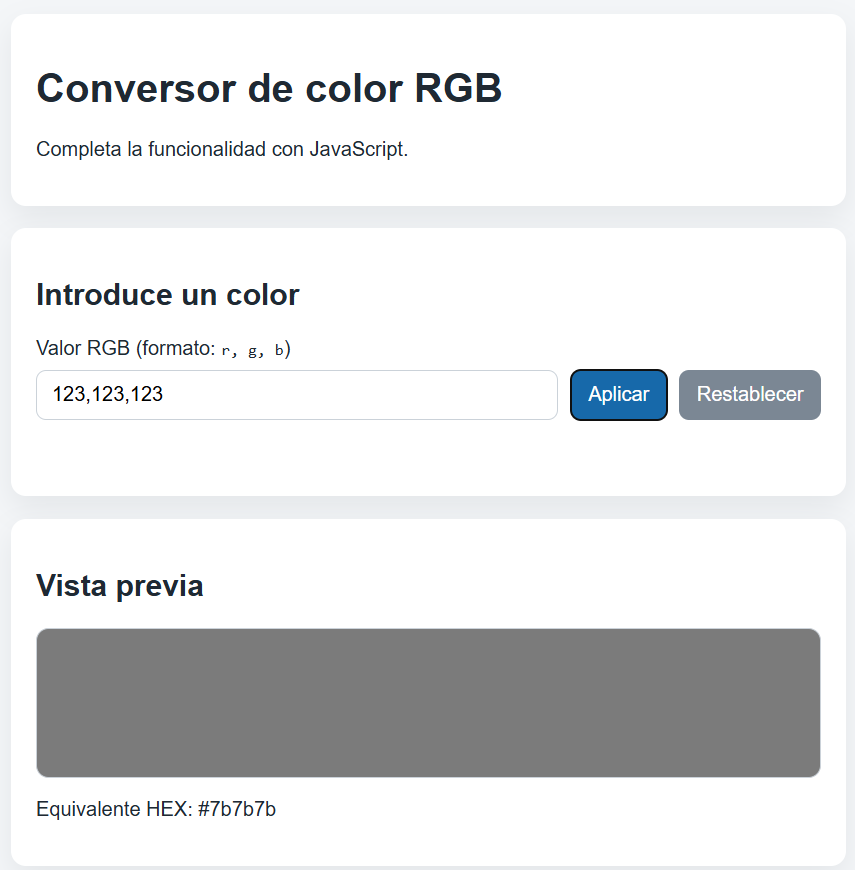

   - Si el valor no es válido, mostrar un mensaje de error descriptivo.

    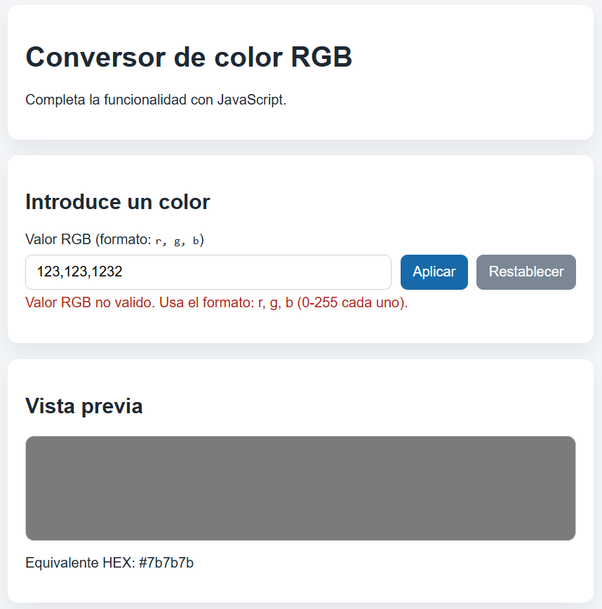

3. Incluir un botón **Restablecer** que devuelva el panel al color por defecto y limpie el campo de información hexadecimal.

  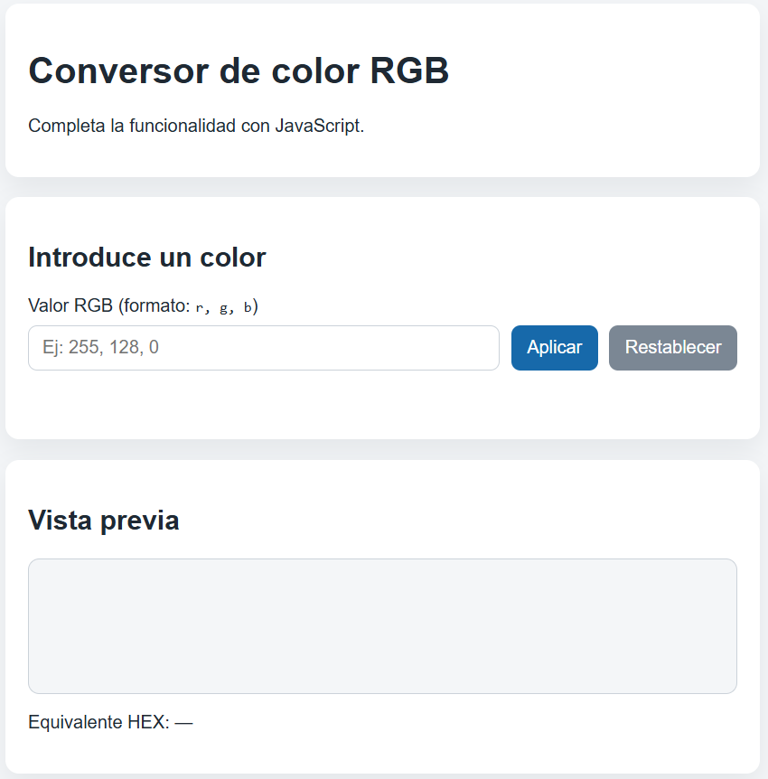

#### Requisitos técnicos 2.1

- El archivo **HTML base está completo** (no modificar estructura).
- El archivo **CSS está completo** (no modificar estilos).
- En JavaScript debes completar estas funciones:
  - **`parseRGB(value)`**: Valida y parsea el string "r, g, b" devolviendo array `[r, g, b]` o `null` si es inválido.
  - **`applyColor()`**: Usa `parseRGB()`, valida valores 0-255, aplica color a `colorPreview` y actualiza `hexLabel`.
  - **`resetColor()`**: Restaura panel al color por defecto y limpia campos.
  - **Event listeners**: Vincula clicks en botones a las funciones correspondientes (sin inline).
- Usa `addEventListener` para manejar eventos.

#### Entrega 2.1

- `bloque2/ejer1/ejer1_rgb.html`
- `bloque2/ejer1/ejer1_rgb.css` (proporcionado, no modificar)
- `bloque2/ejer1/ejer1_rgb.js`

#### Criterios de evaluación 2.1

- Parsing y validación (parseRGB): **1,50 puntos**.
- Conversión a HEX y aplicación de color (applyColor): **1,50 puntos**.
- Restablecimiento de valores (resetColor): **1,50 puntos**.
- Manejo de eventos y UX: **1,50 puntos**.

### Ejercicio 2.2: Esquema XSD para un inventario de laboratorio (4 puntos)

Debes completar el esquema `inventario_laboratorio.xsd` proporcionado para validar un XML con información de **equipos de laboratorio**.

#### Requisitos del XML 2.2

Cada `equipo` debe incluir:

- Atributo obligatorio `codigo`.
- Nombre, Categoría, Estado, Fecha de compra, Coste, Responsable (todos obligatorios).

El documento incluye además una lista de `sala` (ya modelada en el XSD base):

- Identificador, Nombre, Capacidad.

#### Partes a completar del esquema 2.2

El archivo base contiene una estructura incompleta. Debes completarla para que valide correctamente un XML con estas características:

1. **Estado del equipo** (0,7 puntos):
   - Puede tomar solo uno de estos valores: `operativo`, `revision` o `baja`.

2. **Capacidad de una sala** (0,3 puntos):
   - Debe ser un número entero mayor que 0.

3. **Información de un equipo** (1,5 puntos):
   - Cada equipo tiene un código (atributo obligatorio).
   - Contiene nombre, categoría, estado, fecha de compra, coste y responsable (todos obligatorios).
   - El coste debe ser un número decimal >= 0.
   - La fecha de compra sigue el formato de fecha estándar.

4. **Estructura raíz del inventario** (1,5 puntos):
   - El elemento raíz es `inventario`.
   - Contiene una colección de equipos (al menos uno).
   - Puede contener opcionalmente una colección de salas.
   - El código de cada equipo debe ser único en el documento.

#### Entrega 2.2

- `bloque2/ejer2/inventario_laboratorio.xsd`

#### Criterios de evaluación 2.2

- Correctitud sintáctica y tipos definidos: **2,00 puntos**.
- Restricciones y atributos: **1,50 puntos**.
- Estructura y legibilidad: **0,50 puntos**.

---

## Bloque 3: Consulta y transformación de datos (UD5, UD6) - 10 puntos - 50 minutos

Dispones de BaseX en tu equipo para probar tus soluciones. Asegúrate de cargar los XML en BaseX para validar tus consultas y transformaciones.

## Comprobación con BaseX (paso a paso)

1. Abre BaseX: en el explorador de archivos, navega hasta `C:/Archivos de programa (x86)/BaseX` y haz doble click en `BaseX.jar`

   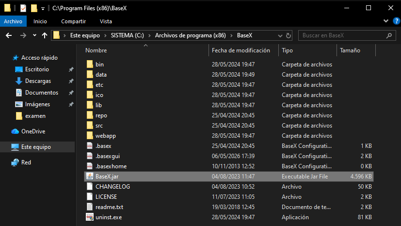

2. Carga el archivo xml correspondiente. Para ello, haz click en `Database>New` y selecciona el archivo deseado.

    <div style="width: 300px">
        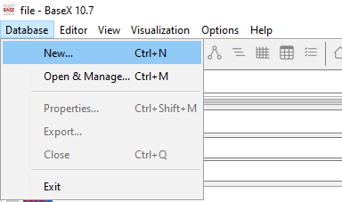
    </div>

   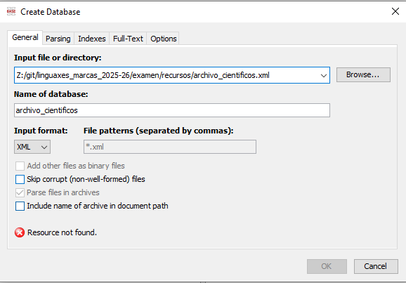

3. Una vez cargado el xml, ya puedes crear consultas.  Para comprobar una expresión XPath del ejercicio 1, ejecuta una consulta de este tipo:

    ```xquery
    doc('C:/RUTA/AL/PROYECTO/recursos/archivo.xml')/cientificos/cientifico
    ```

    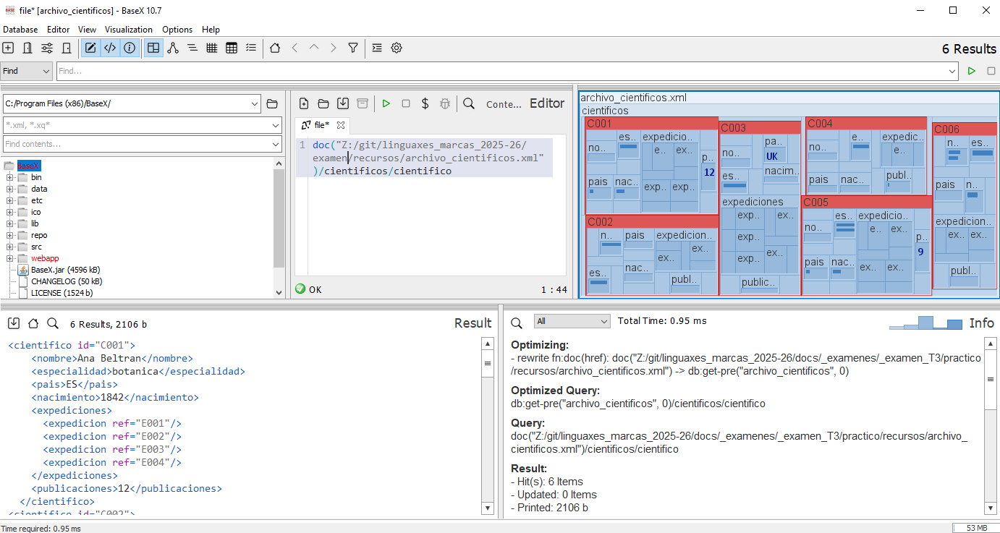

4. Para comprobar el ejercicio 2 (XSLT), ejecuta esta consulta XQuery en BaseX:

    ```xquery
    import module namespace xslt = "http://basex.org/modules/xslt";
    xslt:transform(
        doc("C:/RUTA/AL/PROYECTO/recursos/misiones.xml"),
        "C:/RUTA/AL/PROYECTO/recursos/ejer2_transformacion.xsl"
    )
    ```

    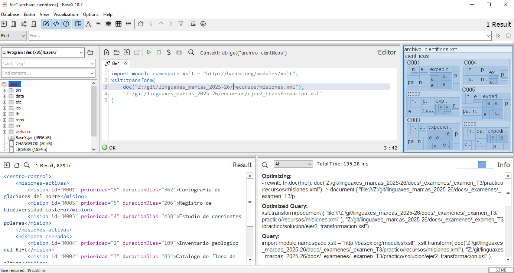

5. Para comprobar cada consulta del ejercicio 3, abre cada fichero `.xq`, ejecútalo en BaseX y verifica el resultado.

    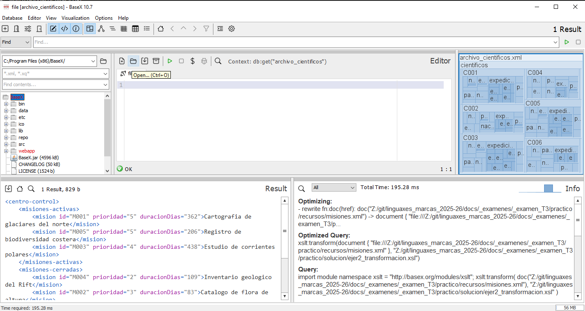

    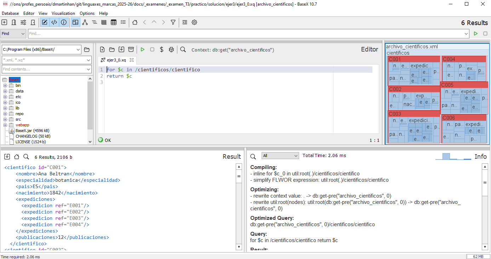

6. Genera las capturas requeridas y guárdalas en `ejer1_capturas.pdf`, `ejer2_capturas.pdf` y `ejer3_capturas.pdf`.

> Nota: Sustituye `C:/RUTA/AL/PROYECTO` por la ruta real de tu equipo.

## Evidencias de ejecución en BaseX (capturas)

En cada captura debe verse claramente:

1. Editor de consultas: consulta XPath/XQuery o llamada a `xslt:transform(...)`.
2. Acción de ejecución: botón de ejecutar (`Run`) o ejecución equivalente.
3. Panel de resultados: salida obtenida.
4. Panel de información/mensajes: confirmación de ejecución sin errores.
5. Navegador de base de datos/proyecto: archivo de entrada correspondiente al ejercicio.

<div style="height: 250px;"></div>

### Ejercicio 3.1: XPath sobre pedidos (2,5 puntos)

Dispones del documento `pedidos.xml`.

Escribe expresiones XPath que devuelvan:

1. Los pedidos con importe superior a 500. **(0,75 puntos)**
2. Los productos de la categoría `hardware`. **(0,75 puntos)**
3. El pedido con mayor importe. **(1 punto)**

#### Entrega 3.1

- Archivo: `bloque3/ejer1_xpath.txt`
- Debe contener **3 líneas exactas**, una expresión por línea.

### Ejercicio 3.2: XSLT de resumen operativo (4 puntos)

Dispones de `pedidos.xml` y de una plantilla parcial `ejer2_base.xsl`.

Debes completar la transformación para generar `resumen_pedidos.xml` con esta estructura:

- Raíz `resumen-pedidos`.
- Sección `pendientes` con los pedidos pendientes.
- Sección `completados` con los pedidos completados.
- Sección `totales` con:
  - `totalPedidos`
  - `totalPendientes`
  - `totalCompletados`

Cada elemento `pedido` del resultado debe incluir atributo `codigo` y texto con el nombre del cliente.

#### Entrega 3.2

- `bloque3/ejer2_transformacion.xsl`
- `bloque3/ejer2_resultado.xml`

#### Criterios de evaluación 3.2

- Estructura del resultado correcta: **2 puntos**.
- Selección de nodos y recuentos: **1..75 puntos**.
- Claridad mínima de la XSLT: **0,25 puntos**.

### Ejercicio 3.3: XQuery de explotación de datos (3 puntos)

Escribe tres consultas XQuery independientes sobre `pedidos.xml`:

1. Obtener los elementos `<pedido>` del cliente `C002`. **(1 punto)**
2. Obtener nombre de cliente e importe de los pedidos `pendientes`. **(1 punto)**
3. Obtener cuántos pedidos hay por estado. **(1 punto)**

#### Consideraciones 3.3

- Cada consulta debe guardarse en un archivo distinto.
- **No se permite filtrar directamente en la cláusula `for`** con predicados tipo `for $x in ...[...]`. Ejemplo de consulta no permitida:

    ```xquery
    for $c in doc('archivo_cientificos.xml')/cientificos/cientifico[count(expediciones/expedicion) > 3]
    return $c
    ```

- Cada consulta debe ser independiente.


#### Entrega 3.3

- `bloque3/ejer3_1.xq`
- `bloque3/ejer3_2.xq`
- `bloque3/ejer3_3.xq`

---

## Entrega final

Comprime todo en un único archivo ZIP llamado `examen_final_nombre_apellidos.zip`, con una estructura similar a la siguiente:

```plaintext
examen_final_nombre_apellidos.zip
├── bloque1/
│   ├── ejer1_catalogo_cultural.xml
│   ├── ejer2_jornadas_tecnicas.html
│   └── styles/
│       └── styles.css
├── bloque2/
│   ├── ejer1/
│   │   ├── ejer1_rgb.html
│   │   ├── ejer1_rgb.css
│   │   └── ejer1_rgb.js
│   └── ejer2/
│       └── inventario_laboratorio.xsd
└── bloque3/
   ├── ejer1_xpath.txt
   ├── ejer2_transformacion.xsl
   ├── ejer2_resultado.xml
   ├── ejer3_1.xq
   ├── ejer3_2.xq
   ├── ejer3_3.xq
   ├── pedido_importacion.xml
   └── bloque3_capturas.pdf
```

(Añade sólamente los bloques de los que te examines).
